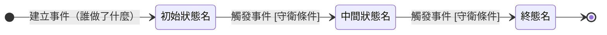

## 概述

<哪個實體的狀態機（wiki link 指實體卡）＋英文識別名＋這段生命週期從哪到哪>

<2-3 句營運背景：狀態為什麼分這幾格（跨角色交接／把關點）＋規則正本歸屬聲明（規則怎麼定的正本在哪張規則卡，本卡只引用不重述）。來路用開放措辭（「現階段支援」）條列，不寫死數量；不寫上游實體的流程>

## 狀態列舉（正本）

> 本段是<實體名>狀態的唯一正本。狀態的新增與修改是商業決策，直接在此卡維護。

| 狀態 | 說明 | 對應營運需求 |
|------|------|------------|
| <狀態名（名詞或完成式：已Ｘ／待Ｘ／Ｘ中）> | <初始；／終態；起頭標注＋這一格是什麼處境> | <這一格為什麼要存在（營運上誰靠它做事）> |

## 狀態機圖（UML）

<圖前說明：一小段交代記法與分組語意——實心圓為初始點、雙圈為終止點、轉換標籤採「觸發事件 [守衛條件]」格式；有分段複合狀態／圖面分組／群組型轉換／歸納型轉換時在此交代其語意>

## 轉換條件與觸發事件

<!-- 與上方 mermaid 圖雙表徵互核：圖上每條轉換在此表有對應列，反之亦然 -->

| 轉換 | 觸發事件 | 條件 |
|------|---------|------|
| <來源狀態> → <目標狀態> | <「〔角色〕做〔動作〕」或「系統於〔業務事件〕自動推進」> | <守衛條件；無則填 —> |

> <轉換背後的規則 wiki link 指規則卡，不複寫規則本體與計算公式>

## 關鍵轉換的營運動機

<!-- 只挑不顯然的轉換，每條停在「轉換 → 動機一句 → 1 個例子」三件套；三態以下無分支的簡單狀態機可整段刪除、動機併入列舉表 -->
- <轉換> → 動機：<為什麼這樣設計> → 例子：<用真實業務格式的一個例子>

## 與其他狀態機的關係

- <上下游互動與閘門：誰接手、誰驅動本卡前進，wiki link 指過去不複寫對方內部轉換>

## 範圍外

- <明列本卡不涵蓋什麼、屬於誰；容易被實作腦補的主題點名「存在但不在本卡」>

## 相關卡

- 規則：[[]]
- 流程：[[]]
- 實體：[[]]
- 狀態機：[[]]
- 角色：[[]]

<!-- 起手提醒（填完刪除本註解）：分段式與雙維度變體的段落調整（列舉／圖／轉換表分子節）見 06-state-machines/_template-state-machine § 七；撰寫規則與稽核維度見 06-state-machines/_template-state-machine（狀態機卡撰寫規範）；合規樣貌對照 06-state-machines/範例 - 狀態機；共用治理（流程／停下鐵則／紀律）見 00-meta/卡片撰寫共用規範 -->
