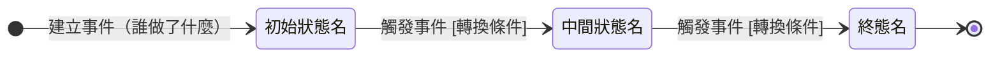

讀完這張卡，你會知道：

- <這是哪個實體的狀態機（wiki link 指實體卡）、涵蓋哪段生命週期>
- <有哪些狀態、各自是什麼處境>
- <狀態之間怎麼轉、誰觸發、要滿足什麼條件>
- <為什麼分這幾格（跨角色交接或把關點）>

<!-- 3 到 5 條，動詞開頭、一條一行，禁寫成段落。下列內容不寫：正本歸屬宣告、規則怎麼定的（指規則卡）、上游實體的流程。理由見 00-meta/卡片撰寫共用規範 § 一之二。來路用開放措辭（「現階段支援」），不寫死數量 -->

## 狀態列舉（正本）

> 本段是<實體名>狀態的唯一正本。狀態的新增與修改是商業決策，直接在此卡維護。

| 狀態 | 說明 | 對應營運需求 |
|------|------|------------|
| <狀態名（名詞或完成式：已Ｘ／待Ｘ／Ｘ中）> | <初始；／終態；起頭標注＋這一格是什麼處境> | <這一格為什麼要存在（營運上誰靠它做事）> |

## 狀態機圖（UML）

<!-- 圖前說明限 2-3 條列點，一條一個主張，不寫成散文段 -->

- <記法：實心圓為初始點、雙圈為終止點、轉換標籤採「觸發事件 [轉換條件]」格式>
- <分組語意：有分段複合狀態／圖面分組／群組型轉換／歸納型轉換時在此交代>
- <與其他狀態機的銜接：接手或觸發哪張卡，wiki link 指過去。無則刪本條>

## 轉換條件與觸發事件

<!-- 與上方 mermaid 圖雙表徵互核：圖上每條轉換在此表有對應列，反之亦然 -->

| 轉換 | 觸發事件 | 條件 |
|------|---------|------|
| <來源狀態> → <目標狀態> | <「〔角色〕做〔動作〕」或「系統於〔業務事件〕自動推進」> | <轉換條件；無則填 —> |

> <轉換背後的規則 wiki link 指規則卡，不複寫規則本體與計算公式>

## 關鍵轉換的營運動機

<!-- 只挑不顯然的轉換，每條停在「轉換 → 動機一句 → 1 個例子」三件套。三態以下無分支的簡單狀態機可整段刪除，動機併入列舉表 -->
- <轉換> → 動機：<為什麼這樣設計> → 例子：<用真實業務格式的一個例子>

## 與其他狀態機的關係

- <上下游互動與把關：誰接手、誰驅動本卡前進。wiki link 指過去，不複寫對方內部轉換>

## 範圍外

- <明列本卡不涵蓋什麼、屬於誰。容易被實作腦補的主題點名「存在但不在本卡」>

## 相關卡

- 規則：[[]]
- 流程：[[]]
- 實體：[[]]
- 狀態機：[[]]
- 角色：[[]]

<!-- 起手提醒（填完刪除本註解）：
- 分段式與雙維度變體的段落調整（列舉／圖／轉換表分子節）：見 06-state-machines/規範 - 狀態機 § 七
- 撰寫規則與稽核維度：見 06-state-machines/規範 - 狀態機（狀態機卡撰寫規範）
- 合規樣貌對照：06-state-machines/範例 - 狀態機
- 共用治理（流程／停下鐵則／紀律）：見 00-meta/卡片撰寫共用規範
-->
