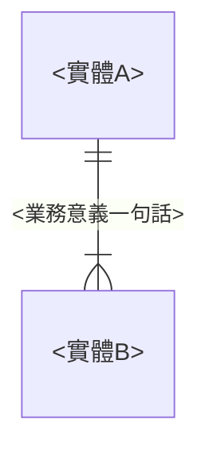
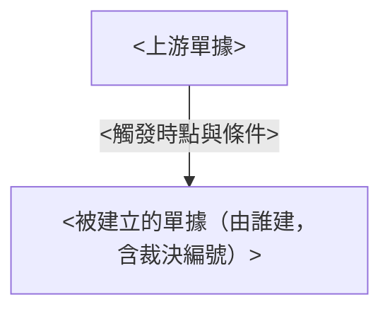
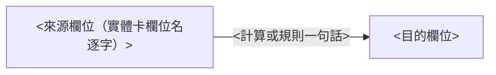

讀完這張卡，你會知道：

- <領域名>每個實體跟誰相連、基數是什麼（**關聯的唯一正本**。各實體卡的「關鍵關聯」段是視角摘要，基數與方向以本卡為準）
- 一筆生意跑到這個領域時，單據依什麼順序產生、誰觸發誰建立
- 數量與金額的值怎麼從一個欄位流到下一個欄位，在哪裡收斂
- 本卡不放什麼：實體定義（各卡一句話定位）、欄位表（各實體卡）、狀態列舉與轉換（各狀態機卡）。接縫處只標狀態名＋連結，不重畫

## 一、結構視圖（ER 圖＋基數）

<!-- 中文實體名一律加雙引號。每條關聯標基數記法（||--|{ 等正規 crow's foot）。主檔層可在圖上省略，改於圖下一段文字交代 -->

## 二、單據流視圖（產生順序與觸發）

- <獨立資料流宣告：哪些單據各走各的、交會點只有哪幾個>
- <特殊建立路徑（重做、補開、售後回流）各一行，附規則卡連結>
- 各單據的狀態怎麼轉不在本卡：<逐一列狀態機卡 wiki link>。

## 三、資料流視圖（值的推導鏈）

### <量的鏈名，如：數量鏈（下行規劃 → 上行收斂）>

- 守恆底線（正本 <規則卡 wiki link>）：<不等式或等式，逐欄點名、禁「N 個」彙稱>。
- 排除規則（哪些量不計入哪些彙總）正本在 <規則卡 wiki link>，本卡不複寫。

### <金額的鏈名，如：成本鏈>

<!-- 預估與實際分開畫。每個節點寫「哪張單據的哪個欄位」，欄位名與實體卡逐字一致 -->

## 四、關聯明細表（正本）

> 每行一條關聯。「建立時機」欄回答這條連結何時成立。實體卡關聯段與本表不一致時以本表為準，並回頭修卡。

| 實體 A | 實體 B | 基數 | 業務意義 | 建立時機 |
|--------|--------|------|---------|---------|
| <實體卡名逐字> | <實體卡名逐字；子表要標（子表）／明細行要標（明細行）> | <1:N／N:1／N:M／1:1；as-is 關聯標（as-is）> | <一句話；含裁決編號時附上> | <何時成立、由誰> |

## 五、跨領域接口

| 邊界實體 | 方向 | 說明 |
|---------|------|------|
| <鄰域實體> | <甲領域 → 乙領域> | <只寫邊界與方向，不畫鄰域內部。鄰域有總覽卡時連過去> |

## 六、維護規則

- 本卡是<領域名>**關聯與資料流的唯一正本**。動任何實體的關聯時先改本卡，實體卡只改視角摘要（`wiki-amend` 落點表強制檢查）。
- 領域內新增實體或關聯經 `plan-design` 設計時，必含段①附「總覽差異」。`plan-audit` 5-2 以本卡為比對基準。
- 名詞與基數紀律：實體名與欄位名與各卡完全一致，禁簡稱。禁「N 個」式彙稱（[[稽核誤判記錄]] § 一）。

## 範圍外

- <本卡不承載什麼、正本在 [[<哪張卡>]]，逐條標歸屬。本段必填，內容依規範的不收清單挑本領域實際會被誤放的項目>

## 相關卡

- 規則正本：<本領域規則卡逐一 wiki link>
- 狀態機：<本領域狀態機卡逐一 wiki link>
- 檢索入口：[[erp_index]]、[[business-domain-taxonomy]]

<!-- 起手提醒（填完刪除本註解）：
- 撰寫規則與稽核維度：見 05-entities/規範 - 資料結構總覽（三源抽取前提／三視圖職責／不收清單／評分標準）
- 合規樣貌對照：05-entities/範例 - 資料結構總覽
- 共用治理：見 00-meta/卡片撰寫共用規範
-->
