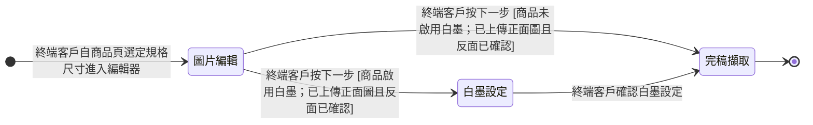

讀完這張卡，你會知道：

- 這是 [[自訂刀模設計稿]] 從開始編輯到完稿輸出的階段狀態機
- 現階段有哪些編輯階段、各自在做什麼
- 階段之間怎麼推進、要滿足什麼條件才能往下走
- 為什麼白墨設定只有部分商品會經過

## 狀態列舉（正本）

> 本段是自訂刀模設計稿編輯階段的唯一正本。狀態的新增與修改是商業決策，直接在此卡維護。

| 狀態 | 說明 | 對應營運需求 |
|------|------|------------|
| 圖片編輯 | 初始；終端客戶上傳正面圖與反面圖、調整外框間距、孔洞尺寸與孔洞位置，刀模線在本階段即時產生與更新 | 終端客戶完成設計決策的主要工作區 |
| 白墨設定 | 深色或透明材質商品加印白色底層的確認階段，僅商品啟用白墨時經過 | 讓終端客戶在出稿前確認白墨覆蓋範圍，避免印出色偏 |
| 完稿擷取 | 終態；系統產出稿件圖與刀模線檔並存檔 | 產生後續印製與裁切要用的完稿 |

## 狀態機圖（UML）

圖前說明：實心圓為初始點、雙圈為終止點，轉換標籤採「觸發事件〔守衛條件〕」格式；「圖片編輯」有兩條出路，依商品是否啟用白墨分流。

## 轉換條件與觸發事件

| 轉換 | 觸發事件 | 條件 |
|------|---------|------|
| （建立）→ 圖片編輯 | 終端客戶自商品頁選定規格尺寸進入編輯器 | — |
| 圖片編輯 → 白墨設定 | 終端客戶按下一步 | 商品啟用白墨；已上傳正面圖且反面已確認 |
| 圖片編輯 → 完稿擷取 | 終端客戶按下一步 | 商品未啟用白墨；已上傳正面圖且反面已確認 |
| 白墨設定 → 完稿擷取 | 終端客戶確認白墨設定 | — |

> 「反面已確認」指商品支援反面印刷時，終端客戶已上傳反面圖、或已設定反面（鏡射或白墨底）、或已切到反面檢視過——三者任一成立。上傳與解析度關卡的規則見 [[自訂刀模圖片上傳限制]]。

## 關鍵轉換的營運動機

- 圖片編輯 → 完稿擷取（反面已確認才放行）→ 動機：反面是終端客戶最容易漏掉的部分，出稿後才發現反面空白的重印成本高，所以用「至少看過一眼」當放行條件 → 例子：終端客戶上傳正面圖後直接按下一步，系統擋下並提示確認反面；終端客戶切到反面檢視後即可通過。

## 與其他狀態機的關係

- 現階段自訂刀模編輯階段是編輯器主題內獨立的狀態機；完稿輸出後的印製與出貨流程由 ERP 側承接，不在編輯器 wiki 範圍。

## 範圍外

- 各階段內的操作細節與畫面 → [[自訂刀模稿件完成]]（過程）與實作層（畫面）
- 正反面切換、存檔提示視窗等介面行為 → 屬實作規格，存在但不在本卡
- 完稿檔的輸出格式與尺寸驗證 → [[自訂刀模成品尺寸與安全範圍]]

## 相關卡

- 規則：[[自訂刀模成品尺寸與安全範圍]]、[[自訂刀模圖片上傳限制]]
- 實體：[[自訂刀模設計稿]]
- 情境：[[自訂刀模稿件完成]]
