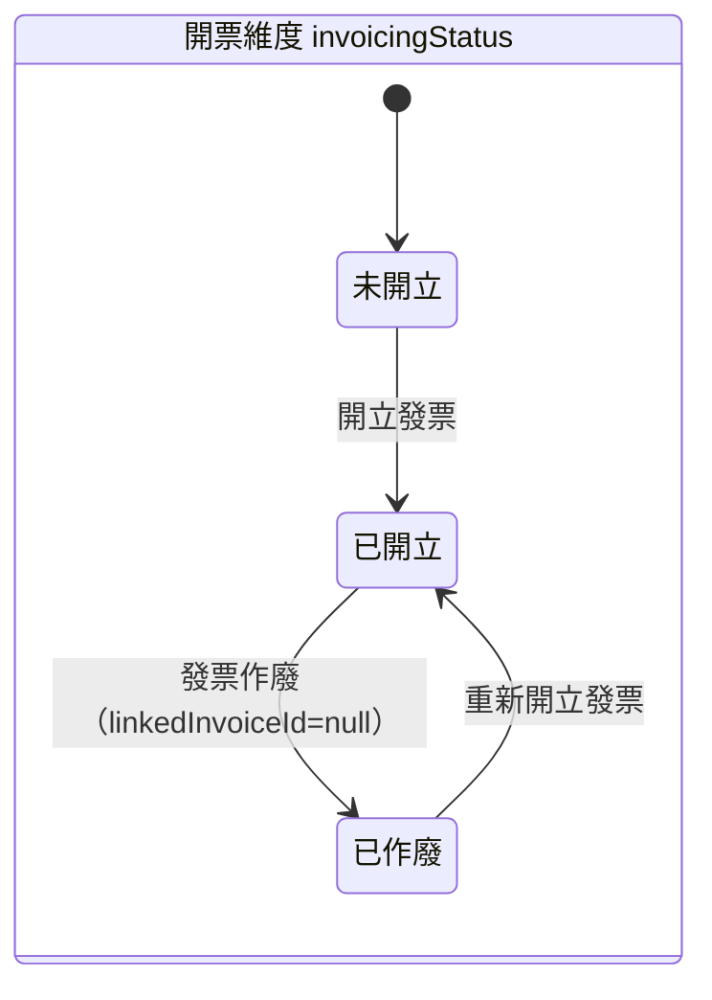
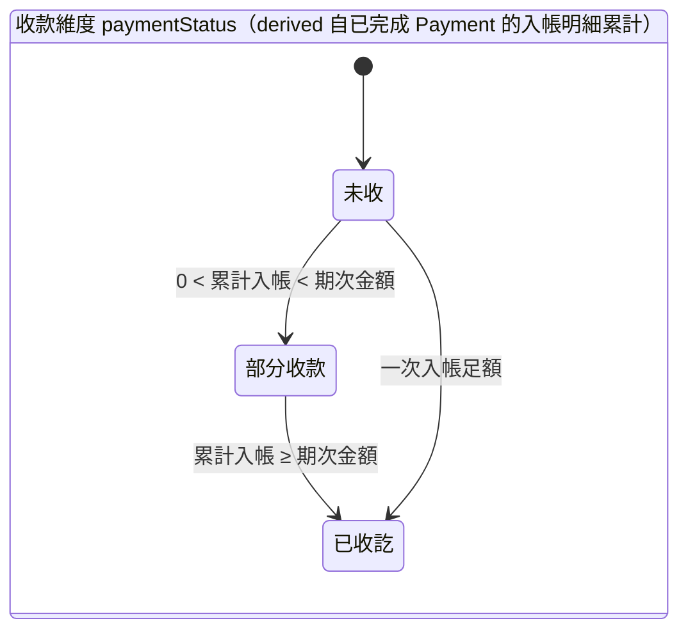
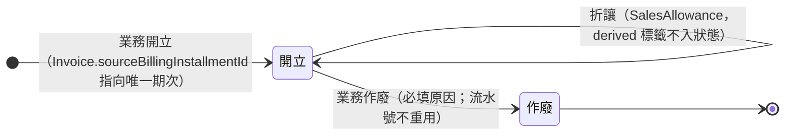
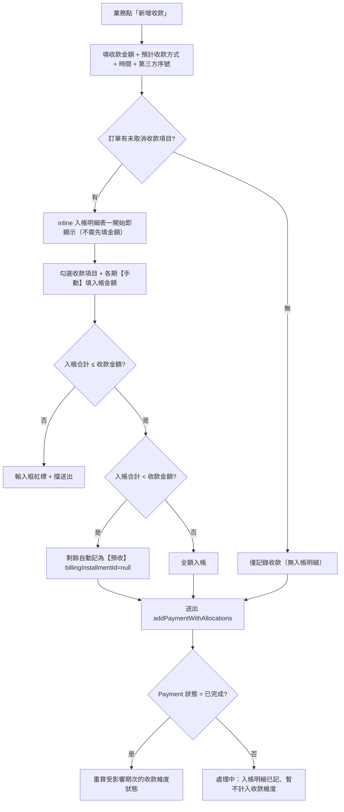
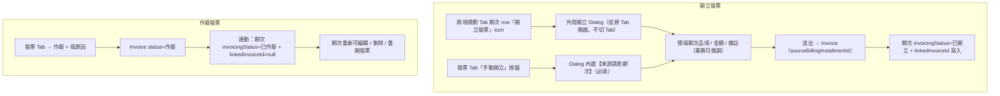
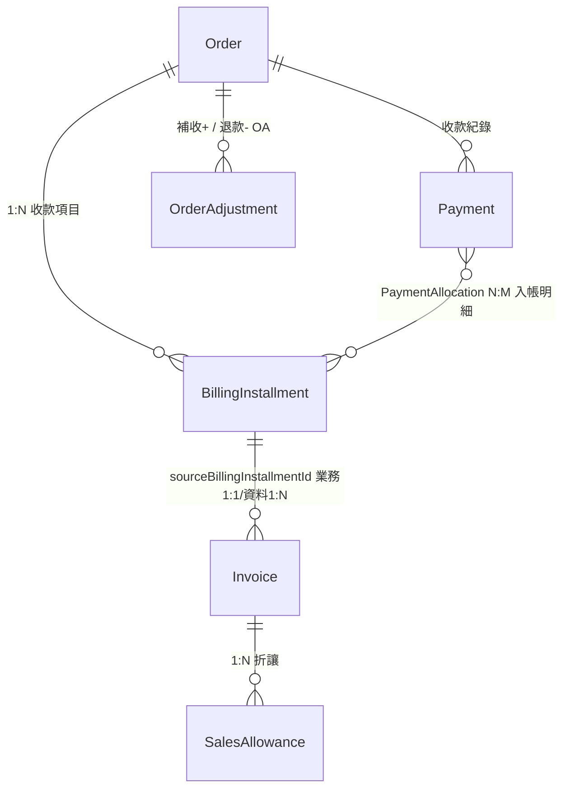

# 款項 / 發票流程：as-built（Prototype）vs 四來源一致性

> 用途：以 **Prototype 現況（as-built）** 為基準畫出訂單款項（收款）+ 發票操作流程，並標出與「商業邏輯（BL）/ 使用者故事（US）/ 規格（spec）」三者的差異與矛盾。
> 結論先講：**目前四來源不一致，分三層漂移**。Prototype 是最新（Miles N1-N8 迭代），spec 新舊模型並存且未清舊，BL 兩張卡停在舊詞，US 新舊混用。
> 製作日 2026-05-29（commit 4a3b0e6 歸檔後）。

---

## 0. 三層漂移總覽（先看這張）

| 層 | 漂移 | 根因 |
|----|------|------|
| **A. 規格內部新舊並存** | order-management / state-machines / business-processes 三份主 spec **同時保留舊模型（PaymentPlan / PlannedInvoice / PaymentInvoice junction）Requirement 本體 + 新模型（BillingInstallment / PaymentAllocation）Requirement**，且舊本體以 SHALL 活躍語氣存在（13 處互斥）| `unify-billing-installment`（v1.14）以「ADDED 新 + 文字宣告廢止舊」方式合進 main，舊 Requirement 本體 / Scenario / Data Model 從未刪；follow-up `remove-legacy-...`（2026-05-29 歸檔）**無 specs delta**，只清 prototype dead code、未清 spec |
| **B. 商業邏輯 / US 落後一個世代** | `付款發票邏輯.md` + `payment-invoice-scenarios.md` 全程用舊詞（付款計畫 / 預計發票 / PaymentInvoice 手動配對）；US-CR-005/006 用已廢止的 invoice_option + 全額退費；US-ORD-010 補收訂單模式 vs US-ORD-026 補收 OA 模式並存 | 兩張 BL 卡 last-reviewed 標 2026-05-28 但內文未隨 v1.14 改詞；諮詢 US 停在 2026-05-22 |
| **C. Prototype 連「新模型 spec」都漂移** | 入帳分配機制（手動 vs 自動依序填滿）、發票狀態 enum（已作廢 vs 已作廢回未開立）、入帳 UI 元件（inline 表 vs PaymentAllocationDialog）、收款 Dialog 校驗（sum≤金額+溢收 vs sum=金額+回填）、新增=編輯共用 Dialog、paymentMethod 欄位 | Miles N1-N8 迭代直接 commit prototype（51c10ff / 6330e9e / 8bb30c3），**無對應 spec delta** |

---

## 1. 收款項目（BillingInstallment）雙維度狀態機 — as-built

> 漂移 C-1：Prototype 開票維度終態為「**已作廢**」（N5）；spec（prototype-data-store:538 + order-management:3315）為「**已作廢回未開立**」。enum 值不一致。

---

## 2. 發票（Invoice）生命週期 — as-built

> 作廢連動：Invoice 作廢 → 來源期次 invoicingStatus=已作廢 + linkedInvoiceId=null → 期次可重新編輯 / 刪除 / 重開發票（Prototype N3 修此 bug）。
> 期次↔發票：**業務 1:1**（期次同時最多一張開立中）、**資料 1:N**（作廢重開累積歷史）。

---

## 3. 新增收款 → 入帳明細流程 — as-built

> 漂移 C-2（最嚴重）：Prototype 是**業務全手動勾選 + 填金額**、防呆 **sum ≤ 收款金額**（允許溢收→預收桶）；spec（order-management:3341 + prototype-data-store:594 + US-ORD-023）是**系統「依序填滿」自動分配**（auto_allocated=true）+「自動回填差額」按鈕 + 校驗 **sum = Payment.amount（強制相等）**。**機制完全相反**。這是 Miles 明確否決 auto-fill 後的設計。

---

## 4. 開立 / 作廢發票流程 — as-built

> 漂移 A-2：spec 同時保留「從 PlannedInvoice 一鍵開立」（order-management:3037 SHALL）與「從 BillingInstallment 一鍵開立、PlannedInvoice 入口廢止」（order-management:3264）。Prototype 已只走 BillingInstallment。

---

## 5. 實體關係 — as-built

> 漂移 A-3：spec § Data Model **完全沒有 BillingInstallment / PaymentAllocation 的 Data Model section**（欄位只散見 Requirement 內文）；舊的 PlannedInvoice Data Model 表（order-management:3865）反而完整保留。

---

## 6. 四來源逐項對照（核心）

| 主題 | 商業邏輯（BL 卡）| 使用者故事（US）| 規格（spec）| 實作（Prototype as-built）| 矛盾 |
|------|------|------|------|------|------|
| 收款規劃單位 | 付款計畫 PaymentPlan（舊詞）| US-ORD-020+ 請款期次（新）/ 舊 US 仍付款計畫 | **新舊並存**：PaymentPlan(915) + BillingInstallment(3243) | 收款項目 BillingInstallment（新）| 四方詞彙不統一；spec 內部互斥 |
| 一筆收款入帳多期 | PaymentInvoice 手動配對（舊）| US-ORD-023 依序填滿自動（新）| 依序填滿自動分配(3341)| **業務手動勾選 + 填金額**（無自動）| **機制相反**（C-2）|
| 入帳校驗 | — | sum=Payment.amount（隱含）| sum = Payment.amount 強制 + 自動回填差額(3341)| **sum ≤ 金額 + 溢收→預收桶** | 校驗規則相反 |
| 入帳 UI 元件 | — | — | PaymentAllocationDialog 另開(841)| **inline BillingInstallmentAllocationTable**（PaymentAllocationDialog 變 dead code）| 元件不一致 |
| 開立發票來源 | PlannedInvoice（舊）| US-ORD-021 期次一鍵（新）| **並存** PlannedInvoice(3037) + 期次(3264)| 期次（新）| spec 互斥 |
| 期次↔發票關係 | — | US-ORD-021 NOT NULL UNIQUE 1:1 | **並存** 1:1(3262) + PaymentInvoice N:M(1146)| 業務1:1 / 資料1:N（作廢重開）| spec 互斥 |
| 發票狀態 enum | — | — | 已作廢回未開立(538/3315)| **已作廢**（N5）| enum 值不一致（C-1）|
| 收款紀錄編輯 | — | — | PaymentEditDialog 切已完成(1065)| **新增=編輯共用 Dialog**（N8、updatePaymentWithAllocations）| 流程 / store action 不一致 |
| store action | — | — | setPaymentAllocations + allocatePaymentSequentially | **addPaymentWithAllocations / updatePaymentWithAllocations / cancelPaymentWithAllocations** | action 不一致 |
| paymentMethod（預計收款方式）| — | — | BillingInstallment 欄位無此項 | **BillingInstallment.paymentMethod**（N2）| 欄位不一致 |
| 對帳檔案上傳 | — | — | MockFileUploadDialog | **共用 OrderFileUploadDialog** | 元件不一致（次要）|
| 諮詢三情境收尾 | — | US-CR-005/006 invoice_option + 全額退（舊）| 自動建 PlannedInvoice(1770) / state-machines:269,281 | 自動建 BillingInstallment + source_type 三值 | spec 主檔仍 PlannedInvoice / US 半額退規則已變 |
| 補收路徑 | — | US-ORD-010 補收訂單 vs US-ORD-026 補收 OA | 補收 OA 免審直達已執行(新)| OA 模式 | US 兩模式並存未交代取捨 |
| 三方對帳 | 應收=發票淨額=收款淨額(136)| US-ORD-029 含已執行 OA | business-processes:812 舊口徑 + 1321 新 invariant | 對帳檢視 + CSV 14 欄 | 公式口徑兩套 |

---

## 7. 待 Miles 決策（收斂方向）

依「Prototype 是最新真實」為前提，建議三步收斂（先後相依）：

1. **先清 spec 舊模型**：補一個含 `## REMOVED Requirements` delta 的 change，把 order-management(915/957/1055/1146/1770/3017/3865) + state-machines(839/1011/1086) + business-processes(618/812) 舊 PaymentPlan / PlannedInvoice / PaymentInvoice 段移除（root cause 是 follow-up archive 無 specs delta）。
2. **再把 Prototype N1-N8 漂移收進新模型 spec**：決定「入帳分配 = 手動（Prototype）還是自動依序填滿（spec）」二選一（**Miles 已選手動**，故應改 spec 3341 + US-ORD-023 + prototype-shared-ui:841 PaymentAllocationDialog → BillingInstallmentAllocationTable）；發票狀態 enum 改「已作廢」；補 addPayment/updatePayment/cancelPaymentWithAllocations + paymentMethod 欄位 + BillingInstallment/PaymentAllocation Data Model section。
3. **最後更新 BL 卡 + 諮詢 US**：`付款發票邏輯.md` § 五實體表改新模型詞；`payment-invoice-scenarios.md` 13 情境機制改依序/手動入帳；US-CR-005/006 改半額退 + 去 invoice_option；US-ORD-010 標註被 OA 模式取代或刪。

> 相關 open OQ：BI-2 / BI-3 / BI-4 / BI-6 / BI-7 / BI-8 / BI-9 / BI-10 / BI-11 / BI-13（折讓後已收訖基準 / 溢收後續 / 補收閾值 / CSV 收款日 / 合期 / 月結觸發 / 不對稱 invariant 表述 / 作廢發票 CSV 篩選 / 對帳 banner 觸發 / Billing 領域稽核缺漏）。
