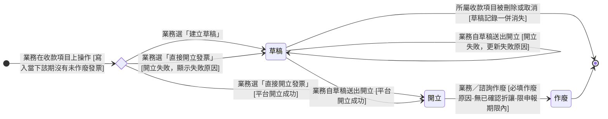
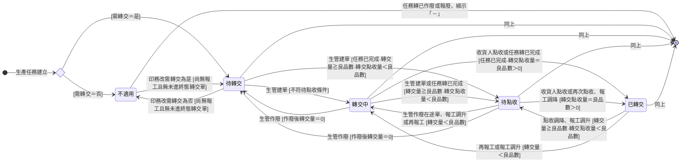
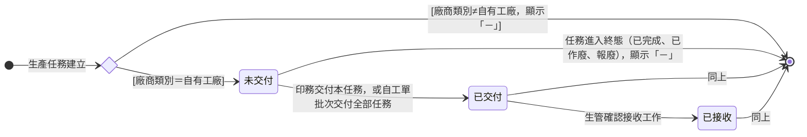

# 訂單與工單商業情境迭代 設計方案（BRD 層，2026-10-04，第二輪簡化版）

> 本檔是 plan-design 產出，送 plan-audit 稽核。拍板正本：`memory/erp/wiki-iteration-20261004/grill-decisions.md`（以下簡稱「拍板」）。拍板「第二輪裁決」（§ 五至 § 八）取代前文衝突處。
> 本版依第二輪裁決全面簡化：凍結量、結案、補點收、代補點收、數量異常標記、「貨已在現場」、多收、發票「處理中」全部移除。
> 段落標示：MODIFIED（改寫既有正本）、ADDED（正本原本沒有的段落或規則）、NEW（新建卡）、RENAME（改名卡）。新名詞一律標「新增」並附依據。
> 第二輪裁決後仍未裁的點標「待裁決 En」，選項與建議見附錄乙。矛盾編號 Cn，清單見附錄丁，只列不調和。
> 以「> 理由：」開頭的引言是設計論證，去論證版（design-blind.md）會整段拿掉。
> 第 3 輪稽核（`audit-round3.md`）各項的回應位置見附錄庚。

## 〇、範圍與變動分級

| 項目 | 內容 |
|------|------|
| 範圍 | 拍板第 1 至 7 條＋第二輪裁決 § 五至 § 八＋讓流程走得通的最小配套 |
| 變動分級（設計者判定，待主對話亮給 Miles） | 結構性變更。理由：新增兩張狀態機卡、印件狀態機拆卡、發票狀態機新增狀態、收款項目對發票的基數改寫、新建全系統資料結構總覽卡 |
| 涉及領域 | 訂單管理、款項與發票、生產執行；連帶履約與售後（出貨單草稿明細）、全域（狀態機卡規範、全系統總覽） |
| 設計紀律 | 不加新流程、不加新把關、沿用既有機制、先不做；開放修改的風險以留痕承擔（拍板 § 七） |

本案明定不做的機制（拍板 § 五、§ 六）：

| 機制 | 拍板處 |
|------|--------|
| 凍結量、生管結案（列為損耗、更正點收、多收結案）、補點收、代補點收、數量異常標記、生管異常清單 | § 五 |
| 建單時勾「貨已在現場」 | § 五 |
| 點收量超過設定量（多收） | § 五：超過擋下 |
| 發票「處理中」 | § 五 |
| 審核當下的快照 | § 六 |
| 短少多收互抵、點收二次確認、待驗量扣短少、單條明細作廢、良品 0 觸發通知 | § 六 |
| 發票草稿單獨刪除 | 拍板第 3 條 |
| 轉交可申請上限的新回補路徑 | 拍板第 4 條 |
| 設備所屬產線的任何改動 | § 六 |

## 〇之二、資料結構總覽基準

背景：資料結構總覽卡是「什麼連什麼、單據依什麼順序產生」的唯一正本。設計要拿它比對，才知道有沒有改壞關聯。

| 項目 | 內容 |
|------|------|
| 比對基準 | [[ERP 資料結構總覽]]（拍板 § 八新建的全系統正本；目前狀態為草稿，待獨立稽核後轉為生效） |
| 領域視角 | [[訂單領域資料結構總覽]]、[[生產領域資料結構總覽]]、[[履約與售後資料結構總覽]] 保留為領域視角，改為引用全系統總覽 |
| 款項與發票 | 由 [[ERP 資料結構總覽]] § 一 1-2、§ 二 2-2、§ 三 3-1、§ 四 4-2 補齊；第一輪的「款項與發票領域總覽建卡為前置」由本卡取代 |
| 本案總覽差異 | 見必含段 ①-3 |

---

## 一、訂單側

### 1.1 線下單送審門檻與核准重檢（拍板第 1 條、§ 六）

**MODIFIED [[訂單狀態]] 轉換表「草稿 → 待業務主管審核」與「待業務主管審核 → 審核通過」的條件欄。**

| 條件項 | 規則 |
|--------|------|
| 適用範圍 | 訂單類型＝線下。線上單與諮詢訂單不經送審，不受影響 |
| 備註 | 訂單須知、交貨備註、付款備註、收款條件備註，四格皆有值 |
| 收款項目 | 至少一筆未取消的收款項目存在 |
| 印件 | 不要求。線下單允許零件印件送審 |
| 收款項目合計 | 不檢核。合計與應收總額不一致時，沿用 [[收款項目規劃]] 既有提示「收款項目合計與應收總額不一致」，提示不擋送審 |
| 送審擋點 | 「送主管審核」按鈕。條件不齊時按鈕停用，畫面列出缺項 |
| 核准重檢（新增，依據：拍板 § 六） | 業務主管按「核准訂單」時，系統以當下內容重檢上列門檻；不符時擋下核准並列出缺項 |
| 快照 | 不存審核當下的快照。既有「上次核准備註快照」欄不動 |
| 待審態 | 收款項目與四格備註在「草稿」「待業務主管審核」兩態業務皆可編輯 |
| 核准後 | 收款條件備註鎖定（既有）；收款項目依既有規則可改；訂單須知、交貨備註、付款備註依既有規則可改 |

**MODIFIED 業務主管的審核對象**（[[訂單狀態]] 狀態列舉「待業務主管審核」的對應營運需求欄、[[業務主管]] 主要職責 1、[[訂單成立確認]] 主流程第 2 步）：

| 審核對象 | 內容 |
|---------|------|
| 四格備註 | 訂單須知、交貨備註、付款備註、收款條件備註 |
| 各期收款項目 | 預計金額、預計收款日、預計開發票日 |
| 應收總額 | 既有 |
| 客戶資料 | 既有 |

[[業務主管]] 主要職責 1 的「逐印件確認印件預計交期是否合理」刪除（拍板 § 五）。業務主管只看收款相關事項。

### 1.2 收款項目規劃時點（拍板第 1 條）

**MODIFIED [[收款項目規劃]]、[[帳務流程]] 第 1 段、[[付款發票邏輯]] § 五E 步驟 1、[[線下訂單流程]] 階段 3 與 4。**

| 訂單類型 | 收款項目規劃時點 |
|---------|----------------|
| 線下 | 草稿態，送主管審核前至少建一期；待審態可續改；核准後依既有規則可改 |
| 線上 | 不變（訂單成立後） |
| 諮詢 | 不變（諮詢收尾時依 [[付款發票邏輯]] § 5B.1 自動建立） |

| 連帶規則 | 內容 |
|---------|------|
| 原始預計收款日、原始預計開發票日 | 維持首次儲存凍結（拍板 § 六） |
| 變更次數 | 維持自首次儲存起累加（拍板 § 六）；核准後取消重建不另做監督口徑 |
| 一期拆兩期 | 不查合計，依 [[付款發票邏輯]] § 五F（拍板 § 八）；[[收款項目規劃]] 副流程「拆期須過合計關卡」改寫 |
| 複製建單 | 不帶收款項目，新單重新規劃（拍板 § 六） |
| [[收款項目狀態]] 與訂單狀態的關係 | 線下單送審需至少一期；除此之外，收款項目規劃與調整不阻擋、不回退訂單狀態 |

### 1.3 回簽前刪除印件（拍板第 2 條、§ 五）

**ADDED [[明細時點分界]] 階段一的子分界；MODIFIED [[訂單印件規格維護]] 新增副流程「刪除印件」。**

| 項目 | 規則 |
|------|------|
| 適用訂單類型 | 線下單（含諮詢負責的線下單） |
| 線上單等待付款期間 | 不提供刪除（拍板 § 六） |
| 分界 | 以「訂單成立」為界。成立時點＝線下單首次進入「已回簽」 |
| 成立前 | 印件可真刪除：記錄消失，訂單活動紀錄留一筆「刪除印件 X」；這筆紀錄要不要帶被刪印件的購買數量、單價、小計，見待裁決 E14 |
| 成立後 | 不提供刪除。不再製作走 [[印件印製狀態]] 既有的「已棄用」 |
| 訂單取消連鎖 | 不變。成立前取消訂單，印件仍轉「已棄用」 |
| 其他費用 | 不受此分界影響，終態前皆可直接新增與刪除（既有） |
| 操作者 | [[業務]]；[[諮詢]] 負責的訂單由諮詢操作。[[印務主管]] 不參與訂單維護（拍板 § 五） |
| 下限 | 可刪到零件 |
| 金額 | 刪除當下商品小計、未稅總額、訂單稅額、應收總額依 [[訂單]] 金額組成重算 |
| 連帶 | 無。成立前沒有稿件與審稿輪次；工單草稿要到審稿合格後才產生（拍板 § 五） |
| 收款項目合計對不上 | 沿用既有差額提示；[[收款項目規劃]] 的應收總額下降來源補「成立前刪除印件」 |
| 已收款多於新應收總額 | 走既有退款路徑（拍板 § 六）。刪除印件屬明細調降，適用 [[訂單異動規則]] § 款項紀錄直接建退款：業務直接在款項紀錄建退款款項，不開退款訂單異動、不需主管核可。該段適用範圍列點補「含訂單成立前刪除印件」 |
| 需求單 | 不回寫（既有：需求單是留存參考） |
| 出貨單草稿的預計出貨印件已含被刪印件 | 待裁決 E2 |

> 理由：[[訂單異動規則]] 把「對得上具體項目的錢」歸明細增減，刪除印件就是拿掉一個項目，所以落在款項紀錄直接退款那條。該路徑免主管核可的前提是「主管事後在活動紀錄看得到調降」；記錄消失後這個前提成不成立，取決於 E14。

兩條分界並存（寫進 [[明細時點分界]]）：

| 分界 | 切點 | 管什麼 |
|------|------|--------|
| 金額鎖定分界（既有） | 訂單進入終態 | 明細金額能否直接改 |
| 印件存廢分界（新增） | 訂單成立 | 印件記錄能否真刪除 |

### 1.4 零件印件訂單的收尾（拍板 § 六）

| 項目 | 規則 |
|------|------|
| 收尾方式 | 業務以既有「手動推進」一格一格推到「訂單完成」 |
| 實務 | 多為諮詢訂單；不另設提示或把關 |
| MODIFIED [[訂單狀態]]「出貨中 → 訂單完成」條件欄 | 括號句「沒有一件要交付的訂單不該認列成交」刪除；改寫為「沒有印件的訂單不會自動推進，由業務手動推進到訂單完成（見手動推進子表）」。「全部印件皆已棄用時不觸發完成、提示業務改走取消」維持 |
| MODIFIED [[訂單狀態]] 手動推進子表「用途」列 | 補「沒有印件的訂單」為一種收尾情境 |

### 1.5 發票草稿（拍板第 3 條、§ 五、§ 六）

#### 1.5.1 狀態列舉（MODIFIED [[發票狀態]]）

| 狀態 | 說明 | 對應營運需求 |
|------|------|------------|
| 草稿 | 初始；業務在收款項目上建立、尚未送平台開立的發票。不驗證任何內容（含 B2B 統編可空）；沒有發票號碼；不計入發票淨額；不可被折讓單引用；送出開立失敗時停在本態並顯示失敗原因 | 開票資訊還沒齊時先存下來；開立失敗有地方停、有原因可看 |
| 開立 | 初始（直接開立成功時）；正式生效，可被折讓單引用，計入發票淨額 | 有效發票計入對帳 |
| 作廢 | 終態；開錯時作廢並留原因（既有） | 失效發票退出對帳 |

#### 1.5.2 狀態機圖

- 記法：實心圓為起點與終點，轉換標籤採「觸發事件 [轉換條件]」。
- 「草稿」離開系統的那條弧代表記錄消失，不是新狀態。

#### 1.5.3 轉換表

| 轉換 | 觸發事件 | 條件 |
|------|---------|------|
| （建立）→ 草稿 | [[業務]]／[[諮詢]] 在收款項目上選「建立草稿」 | 該收款項目未取消；寫入當下該期沒有未作廢發票（含草稿）；不驗證任何欄位；訂單任何狀態皆可（含草稿、已取消） |
| （建立）→ 開立 | 業務／諮詢選「直接開立發票」，平台開立成功 | 同上；送出當下套用送出開立檢核（1.5.5） |
| （建立）→ 草稿 | 業務／諮詢選「直接開立發票」，開立失敗 | 發票落在草稿並顯示失敗原因 |
| 草稿 → 開立 | 業務／諮詢自草稿送出開立，平台開立成功 | 送出當下套用送出開立檢核；以草稿內容送出，不重新帶入 |
| 草稿 → 草稿 | 業務／諮詢自草稿送出開立，開立失敗 | 留在草稿，失敗原因更新為最近一次 |
| 草稿 →（記錄消失） | 業務刪除或取消所屬收款項目 | 草稿一併消失；不設草稿單獨刪除 |
| 開立 → 作廢 | 業務／諮詢作廢並填原因 | 既有三條不變；作廢後同一收款項目可再建草稿或直接開立 |

| 規則 | 內容 |
|------|------|
| 一期一張（拍板 § 五） | 一個收款項目同一時間只能有一張未作廢發票（含草稿）。系統在寫入那一刻檢查；兩人同時送出時先寫入者成立，後到者被拒並提示重新整理 |
| 不做「處理中」 | 拍板 § 五。送出開立到平台回應之間不另設狀態 |
| 欄位帶入時點 | 草稿的欄位（發票金額、買受人各欄、品項）在建立草稿當下帶入；送出開立時以草稿內容為準，不重新帶入（拍板 § 六） |
| 草稿期可改的欄位 | [[帳務]] 發票子表標「開立前可改」的各欄；發票金額（含稅）維持不可改（既有） |
| 送出開立的含稅目標值 | 建草稿後業務又改了該期預計金額時，送出檢核取草稿的發票金額，或取收款項目當下的預計金額：待裁決 E13 |
| 開立失敗範圍 | 送出當下的系統檢核未過，或平台當下回應拒絕 |
| 平台沒有回應（逾時） | 發票落在哪個狀態、誰去平台核對：待裁決 E11 |
| 送出開立期間所屬收款項目被取消或刪除 | 平台回應成功後寫到哪裡：待裁決 E12 |
| 不算開立失敗 | 隔日財政部上傳失敗（拍板 § 六）。發票維持「開立」，走 [[發票法規硬約束-ezPay-MIG]] 既有處置 |
| 放棄草稿 | 等同取消該收款項目（拍板 § 六）；已有核銷分配時，核銷分配依既有規則一併解除 |

> 理由：「同時送出」英文叫競態（race condition）：兩個人在同一時間按下同一個按鈕，系統若只在畫面上檢查，兩筆都會寫進去。拍板選在寫入那一刻用「一期一張未作廢發票」擋，與 [[轉交單狀態]] 兩個終態「先寫入者成立」同一種寫法，不另設狀態。

#### 1.5.4 收款項目開發票維度連帶（MODIFIED [[收款項目狀態]]）

| 規則 | 內容 |
|------|------|
| 草稿期間 | 開發票狀態維持原值：首次開票為「未開立」，作廢後重建為「已作廢」；草稿送出開立成功才轉「已開立」（B24） |
| 入口 | 該期沒有未作廢發票時顯示「建立草稿」「直接開立發票」；有草稿時只顯示草稿的「送出開立」；有開立發票時兩個入口都不顯示 |
| 收款項目取消或刪除 | 已開立發票：維持既有規則，須先作廢。只有草稿：草稿隨收款項目一併消失 |
| 動機段改寫 | 「收款項目調整不觸發訂單回主管重審」改為「線下單各期收款項目於送審時由主管一併審過；核准後的調整不回主管重審」 |

開發票維度圖不變（草稿不改變本維度的格位）。弧標籤的「開立發票」補註「含直接開立與草稿送出開立」。

#### 1.5.5 送出開立檢核（MODIFIED 檢核時點）

| 檢核 | 時點 |
|------|------|
| 平台品項五欄硬約束、B2B 統編 8 碼（[[發票法規硬約束-ezPay-MIG]]） | 送出開立當下；草稿階段不檢核 |
| 品項小計加總與未稅目標值差在一元以內（[[付款發票邏輯]] § 五G） | 送出開立當下；草稿階段不檢核 |

#### 1.5.6 欄位變動

**MODIFIED [[帳務]] 發票子表：**

| 欄位 | 變動 |
|------|------|
| 狀態 | 值域改為 草稿／開立／作廢 |
| 發票號碼 | 補「草稿為空」 |
| 買受人統編 | 改為「草稿可空，送出開立時 B2B 必填」 |
| 標「開立前可改」的各欄 | 改為「草稿期可改，不驗證」 |
| 發票金額（含稅） | 補「建立草稿或直接開立當下帶入，草稿送出開立不重新帶入」；可否修改維持「不可」（E13 選項 B 會改為草稿期可改） |
| 開立失敗原因（新增，依據：拍板第 3 條「顯示失敗原因」） | 文字（唯讀）；平台或系統檢核回傳；發票停在草稿時顯示最近一次 |
| 開立時間 | 既有說明改為「草稿沒有開立時間」 |

**MODIFIED [[帳務]] 收款項目子表**：開發票狀態說明補「草稿期間維持原值」。
**MODIFIED [[帳務]] 相關單據段**：「一張發票對應一個收款項目（1:1）」改為「一張發票對應一個收款項目；一個收款項目同一時間最多一張未作廢發票（含草稿）」。
**MODIFIED [[訂單]] 金額組成「發票淨額」**：「已開出的發票金額」改為「狀態為開立的發票金額」，草稿與作廢不計入。

#### 1.5.7 其他開票入口同步

| 卡 | 改寫 |
|----|------|
| [[收款項目開立發票]] | 主流程第 2 步改兩入口；第 3 步檢核寫明在送出開立時；新增副流程「開立失敗」「一期已有未作廢發票時擋下」「放棄草稿＝取消收款項目」；訂單任何狀態皆可建與開立 |
| [[付款發票邏輯]] | § 五E 時點，步驟 2「一鍵開發票」改兩入口；§ 五B 5B.1「收款項目自動建」列的「一鍵開發票帶入含稅目標值」改為「建立草稿或直接開立時帶入含稅目標值」；§ 五F 只有草稿時隨收款項目消失；§ 五G 檢核於送出開立時；5B 連帶矩陣補「發票草稿建立」「收款項目刪除或取消（草稿一併消失）」「訂單送審（至少一期收款項目）」三列；角色段補業務主管送審時檢視四格備註與各期收款項目 |
| [[訂單異動流程]] 主流程第 3 步 | 「一鍵開立發票」改兩入口；補「草稿不計入發票淨額」 |
| [[諮詢費結算收尾]] 第 7 步 | 改兩入口；「計入發票淨額」限開立成功時 |
| [[帳務流程]] | 第 1 段時點；第 2 段兩入口與草稿不計入發票淨額；範圍外段「金額確定後才進入第 1 段」改寫；應收款項清單不含草稿（既有條件「已開立發票」自然排除） |
| [[發票法規硬約束-ezPay-MIG]] | 補：草稿是 ERP 內部記錄，不送平台、不取號；平台硬檢核在送出開立時才適用；平台當下拒絕＝開立失敗；隔日財政部上傳失敗不算開立失敗 |

待開發票清單是否排除未成立訂單，見待裁決 E6。

---

## 二、工單側

### 2.1 點收填實際量（拍板第 4 條、§ 五、§ 七）

**MODIFIED [[轉交單狀態]]「已送達 → 已點收」、[[轉交單]] 轉交明細、[[場內轉交與更正]] 主流程第 6 步與副流程。**

| 項目 | 規則 |
|------|------|
| 誰點收 | 所屬產線含本單目的產線的人員；站上無人時 [[生管]] 代點收、[[印務]] 與 [[印務主管]] 可代行（既有） |
| 首次點收 | 收貨人逐條明細填實際量，預設帶設定量，可填 0 至設定量；按下即單頭轉「已點收」。各條明細的點收紀錄都記按下的人（B29） |
| 再次點收 | 單頭已點收後，同一條明細可再點收追加；預設帶尚未點收的量，即設定量 − 點收累計（B28）；入口在既有的轉交單詳情。補搬由生管與現場在系統外協調，生管通知收貨人再點收（B35） |
| 上限 | 每條明細的點收累計不得超過設定量，超過擋下 |
| 每次留痕 | 每次點收寫一列點收紀錄：點收量、點收人、點收時間、代點收標記 |
| 點收修改 | 改某一列點收紀錄的點收量；修改前後值、修改人、時間、原因（必填）記入轉交單歷程紀錄 |
| 修改擋下 | 改後該明細點收累計超過設定量，擋下；改後來源任務的轉交點收量低於任一下游任務已報工生產數量，擋下 |
| 檢核時點 | 上限與修改擋下都以寫入當下的數字判定；兩筆同時寫入時先寫入者成立，後到者重新檢核（B27） |
| 誰能修改 | 與點收同一群人（拍板 § 七） |
| 單頭狀態 | 「已點收」仍為終態；再次點收與修改不改單頭狀態 |
| 來源任務已轉報廢或已作廢 | 點收、再次點收與修改都擋下，由生管處置（既有點收擋下擴及後兩者） |
| 廠務 | 開始搬運、抵達站點都不填量（既有） |

**MODIFIED [[轉交單]] 欄位：**

| 位置 | 欄位 | 變動 |
|------|------|------|
| 轉交明細 | 數量 | 改名「設定量」（拍板用語）；規則不變 |
| 轉交明細 | 簽收照片 | 自單頭移入；每條至少一張（2.3） |
| 轉交明細 | 點收累計（新增，唯讀推導） | 本明細各列點收紀錄的點收量合計 |
| 轉交明細 | 點收紀錄（新增，子表） | 每次點收一列：點收量、點收人、點收時間、代點收標記 |
| 單頭 | 點收人、點收時間、代點收標記 | 移到點收紀錄 |
| 單頭 | 貨已在現場標記 | 刪除（2.2） |
| 單頭 | 歷程紀錄 | 補記每次點收與點收修改（前後值、修改人、時間、原因） |

短少的處置在系統外（拍板 § 五）：

| 情形 | 處置 | 系統呈現 |
|------|------|---------|
| 貨補到了 | 現場直接搬，不另建轉交單；收貨人對同一明細再點收 | 點收累計增加 |
| 貨真的少了 | 有報工作廢權限的人修改來源任務的報工，把良品改正確（2.4） | 良品下降，與點收累計對上 |
| 要補做 | 先修改來源任務報工、扣掉遺失量；補做做完直接報工；收貨人對原明細再點收（B30） | 良品先降後升；點收累計補到設定量；任務已完成仍可再報工，範圍見 E9 |
| 邊做邊送時已改報工 | 原明細尚未收足的設定量繼續佔轉交量（回補只有作廢一條）；之後做出的貨在系統外搬到，收貨人對原明細再點收補足（B31） | 原明細點收累計補到設定量 |
| 尚未處置 | 不擋任何事 | 來源任務的轉交狀態停在「待點收」 |

> 理由：點收紀錄是新增子表。既有 [[轉交單]] 單頭只有一組「點收人、點收時間」，記不下同一明細的多次點收；拍板 § 五要求每次留點收人、時間、數量，既有欄位吸收不了。修改留痕則沿用既有歷程紀錄，不另設子表。
> 理由：「要補做」一列依拍板 § 五兩句組合：貨真的少了改報工、補做做完直接報工再點收。只報補做量、不扣遺失量，良品會比實物多出遺失量，待搬視圖會多出搬不到的貨。
> 理由：「邊做邊送時已改報工」一列：已點收的單不能作廢，設定量也不能改；原明細剩下的設定量只能靠再點收補足。這是「同一條明細可多次點收」的直接結果，不另設機制。
> 理由：拍板 § 五取消凍結與結案。差額不另存，由「設定量與點收累計的差」與任務層「已點收 N／良品 M」直接看得到；任務停在待點收就是目視化的停下訊號。

### 2.2 轉交單作廢範圍與建單（拍板 § 五）

**MODIFIED [[轉交單狀態]] 作廢轉換與建立轉換；MODIFIED [[轉交單]] 單頭。**

| 轉交單狀態 | 可否作廢 |
|-----------|---------|
| 待搬運 | 可；[[生管]] 填原因（既有） |
| 搬運中 | 可（既有） |
| 已送達 | 不可。數量不對就照實點收。例外：任一明細的來源任務已轉報廢或已作廢時，生管可作廢 |
| 已點收 | 不可（既有） |

| 項目 | 規則 |
|------|------|
| 「貨已在現場」 | 取消。[[轉交單狀態]] 的選擇分流與「（建立）→ 已送達」轉換刪除；[[轉交單]] 單頭「貨已在現場標記」欄刪除 |
| 建單 | 一律進「待搬運」 |
| 作廢重開 | 一律重走開始搬運與抵達站點 |
| 狀態機圖 | 「在途」群組作廢弧改為只涵蓋待搬運、搬運中；另畫「已送達 → 已作廢 [任一明細來源任務已轉報廢或已作廢]」 |

### 2.3 簽收照片掛明細（拍板第 4 條、§ 五）

| 項目 | 規則 |
|------|------|
| 位置 | [[轉交單]] 單頭「簽收照片」欄移到轉交明細 |
| 數量 | 每條明細至少一張 |
| 時點 | [[廠務]] 回報抵達站點時逐條上傳 |
| 擋點 | 任一條不足時擋下「抵達站點」回報 |
| Slack 表單 | 廠務走 Slack 表單逐條上傳；先查表單可行性，不可行改在系統端上傳（拍板 § 五，屬落地前調查，不是決策點） |

### 2.4 報工紀錄開放修改（拍板 § 七）

**MODIFIED [[報工紀錄]] § 作廢與註記；MODIFIED [[場內轉交與更正]] 副流程（擋下條件寫在同一處）。**

| 項目 | 規則 |
|------|------|
| 可改欄位 | 生產數量、良品數、不良品數 |
| 時機 | 報工有效（未作廢）期間皆可改，含任務已完成；任務已轉報廢時可否修改，見待裁決 E10 |
| 誰能改 | 與報工作廢同一群人（拍板 § 七） |
| 留痕（新增，依據：拍板 § 七「留修改前後、修改人、時間、原因」） | [[報工紀錄]] 新增「修改紀錄」子表：每次修改寫一列，記欄位、修改前、修改後、修改人、時間、原因（必填） |
| 生產任務歷程 | 數量帳變化照既有規則記進 [[生產任務]] 歷程紀錄 |
| 任務已完成後再報工 | 可；任務維持「已完成」；生產數量超過目標照實記（拍板 § 五）。所屬工單已完成、印件印製維度已到終態或訂單已到終態時可否再報工，見待裁決 E9 |

> 理由：修改紀錄是新增子表。既有 [[報工紀錄]] 只有作廢人、作廢時間、作廢原因與人工註記，記不下修改前後值；拍板 § 七要求留修改前後、修改人、時間、原因。

報工作廢與修改的擋下條件（寫在 [[場內轉交與更正]] 同一處；[[報工紀錄]] 與 [[齊套邏輯]] 只引用）：

| 擋下條件 | 作廢 | 修改（調降時） |
|---------|------|--------------|
| 生產任務已收於「已完成」 | 擋下（既有） | 不適用。理由見下方 |
| 需轉交任務：改後良品數低於「在途明細設定量合計＋已點收明細點收累計」 | 擋下；列出佔用的轉交單；待搬運、搬運中的單提示先作廢；已送達的單提示先照實點收 | 同左 |
| 不需轉交任務：下游任務已有報工 | 擋下（既有） | 同左 |
| 改後所屬印件可驗良品數低於已驗量（待驗量會變負） | 擋下（既有） | 同左（拍板 § 六） |
| 生產數量改低跌破目標數量 | 不適用（已完成者已擋下） | 製作中：累計歸零時回「待處理」（沿用作廢連動）。已完成：待裁決 E1 |
| 外發任務（以派單承接、不在現場任務池） | 與場內任務同一套，依需轉交分流（openspec production-execution 既有；B34） | 同左 |
| 生產任務已轉報廢 | 既有未規定 | 待裁決 E10 |
| 調升 | 不適用 | 不擋 |

| 規則 | 內容 |
|------|------|
| 檢核時點 | 上表各條以寫入當下的數字判定；兩筆同時寫入時先寫入者成立，後到者重新檢核（B27）。例：品檢驗收與報工調降同時送出，後到的一筆重新檢核待驗量 |
| 擋下後的處置 | 命中擋下條件時，沿用 [[場內轉交與更正]] 既有人工程序：追源、現場清點、補做、加人工註記。人工程序第 4 步「數字不改」改寫為「擋下時數字不改，加人工註記」（B33） |
| 未命中時 | 直接修改報工，不走人工程序 |
| [[生產任務狀態]] 範圍外 | 「任務已完成後的報工作廢：系統擋下……改走人工程序」補一句：「更正數量可改走報工修改；修改也被擋下時才走人工程序」 |

> 理由：拍板 § 五要求「貨真的少了就修改來源任務的報工」。任務要停在「待點收」，前提是任務已完成；若沿用作廢的「已完成即擋」，這條處置路徑就走不通。Miles 第二輪原話第 6 題「任務會停在『待點收』直到貨補到或報工更正」，指的就是已完成任務的報工更正。見矛盾 C4。
> 理由：外發任務一列：erp 原型現行對外發任務一律先查下游已有報工、不依需轉交分流，比 openspec 嚴（附錄戊、矛盾 C8）。原型是介面正本，擋下規則以 openspec 為準。
> 理由：需轉交的檢核把已點收明細改以點收累計計，是為了讓「設定 500、點收 480，良品改成 480」這條路走得通；在途的單貨還沒被收，仍以設定量計，防止良品被改到低於路上的貨。

拍板 § 七風險表的對應：

| 風險 | 本設計的避免方式 |
|------|----------------|
| 報工良品改低於已點收量或已驗量 | 上表第 2、4 列擋下 |
| 報工生產數量改低跌破目標 | 上表第 5 列 |
| 點收調升超過設定量 | 2.1 修改擋下 |
| 點收調降低於下游已報工量 | 2.1 修改擋下 |
| 改數字掩蓋短少 | 報工修改紀錄、轉交單歷程紀錄留前後值、修改人、時間、原因；事後查紀錄 |
| 誰能改 | 報工：與作廢同一群人；點收：與點收同一群人 |

### 2.5 生產任務數量欄（MODIFIED [[生產任務]] § 數量）

| 欄位 | 定義 | 變動 |
|------|------|------|
| 良品數 | 有效報工的累計良品量（含修改後的值） | MODIFIED：補「含修改後的值」 |
| 產出數量 | 不變（良品數＋不良品數） | 不變 |
| 轉交量（新增，唯讀推導；依據：拍板 § 五） | 本任務未作廢轉交明細的設定量合計 | ADDED |
| 轉交點收量（新增，唯讀推導；依據：拍板 § 五「點收累計」） | 本任務各已點收明細的點收紀錄合計（含再次點收、含修改後的值）。名稱與外發用的既有「點收數量」欄區分 | ADDED |
| 轉交可申請上限 | ＝良品數 − 轉交量 | MODIFIED：算式同現行「累計良品數 − 未作廢轉交單明細抽走的總和」，改用轉交量表述；補「報工修改後可能為負，負值時建單沿用既有上限檢核擋下」 |
| 點收數量（外發用，既有） | 不變 | 不變 |

### 2.6 到料量（MODIFIED [[工序相依性規則]]）

| 項目 | 現行 | 改為 |
|------|------|------|
| 需轉交前置的到料量 | 取該前置轉交單已點收的量 | 取該前置的轉交點收量（含再次點收、含修改後的值） |
| 只增不減 | 「需轉交的前置其到料量只增不減」 | 「點收量修改後，前置的轉交點收量不得低於下游任務已報工生產數量」（拍板 § 六）；換算依 [[數量換算規則]] |

### 2.7 生產任務轉交狀態（NEW 狀態機卡，拍板第 5 條、第 7 條、§ 五）

性質：系統推導的衍生狀態，沒有手動轉換。依附實體：[[生產任務]]。推導用的轉交量、轉交點收量、良品數，算式回引 [[生產任務]]。

#### 2.7.1 狀態列舉

| 狀態 | 說明 | 對應營運需求 |
|------|------|------------|
| 不適用 | 本任務「需轉交」＝否 | 不靠轉交單搬的任務不顯示轉交進度 |
| 待轉交 | 需轉交、轉交量＝0（含良品 0） | 做出來的貨還沒有任何一張轉交單 |
| 轉交中 | 轉交量＞0，且不符合「已轉交」「待點收」 | 貨已開始送，還沒送完或任務還在做 |
| 待點收 | 任務已完成、轉交量 ≧ 良品數、轉交點收量＜良品數 | 該送的都成單了，等下游收，或等短少處置 |
| 已轉交 | 任務已完成、良品數＞0、轉交點收量＝良品數 | 這筆任務的良品全部到下游手上 |

任務轉「已作廢」或「報廢」後，本欄顯示「－」，不推導（拍板 § 六；「終態」是否含已完成見矛盾 C3，本卡依 B16 不含）。

#### 2.7.2 推導條件（依序判定，第一個成立即答案）

| 順序 | 結果 | 條件 |
|------|------|------|
| 1 | 「－」 | 生產任務狀態＝已作廢或報廢 |
| 2 | 不適用 | 需轉交＝否 |
| 3 | 已轉交 | 生產任務狀態＝已完成，且良品數＞0，且轉交點收量＝良品數 |
| 4 | 待點收 | 生產任務狀態＝已完成，且轉交量 ≧ 良品數，且轉交點收量＜良品數 |
| 5 | 轉交中 | 轉交量＞0 |
| 6 | 待轉交 | 轉交量＝0 |

| 規則 | 內容 |
|------|------|
| 重算時點 | 建單、作廢、點收、再次點收、點收修改、報工、報工修改、報工作廢、任務狀態變化時依當下數字重判 |
| 回退 | 轉交單作廢、點收調降、報工調升或已完成後再報工，都可能讓結果回到較前一格；推導一律依當下數字重算（見矛盾 C1） |

#### 2.7.3 並存標記與進度文字（拍板第 5 條、§ 五）

| 項目 | 規則 |
|------|------|
| 有貨待點收（標記） | 本任務任一明細所在轉交單狀態為「已送達」 |
| 轉交進度文字 | 「已點收 N／良品 M」，N＝轉交點收量、M＝良品數 |
| 數量異常標記 | 不設（拍板 § 五） |

#### 2.7.4 狀態機圖

> 「－」不是狀態，是不推導的標示，所以畫成直接結束。
> 本機不設終態，跟著生產任務收尾（比照 [[收款項目狀態]]）。

#### 2.7.5 與其他狀態機的關係

| 對象 | 關係 |
|------|------|
| [[轉交單狀態]] | 轉交量取未作廢明細；轉交點收量取「已點收」單明細的點收紀錄；有貨待點收取「已送達」單 |
| [[生產任務狀態]] | 「已完成」是「待點收」「已轉交」的前提；「已作廢」「報廢」時顯示「－」 |
| [[工序相依性規則]] | 下游到料量取本任務的轉交點收量，與本狀態取同一個數 |

#### 2.7.6 已知推導情形（交 Miles）

| 情形 | 推導結果 | 見 |
|------|---------|----|
| 任務已完成但良品數大於轉交量：生管手動完成後剩餘良品未建單，或印件短出結案批次推完成時尚有良品未建單 | 停在「轉交中」；待搬視圖仍列出剩餘的可搬量 | 待裁決 E4 |
| 報工改低後貨又找回，再次點收使轉交點收量大於良品數 | 落不到任何「已完成」格，顯示「轉交中」 | 待裁決 E7 |

### 2.8 生產任務交付狀態（NEW 狀態機卡，拍板第 7 條、§ 五）

性質：系統推導的衍生狀態，沒有手動轉換。依附實體：[[生產任務]]。

#### 2.8.1 交付時間欄（ADDED [[生產任務]] § 排程與分派）

| 欄位 | 說明 | 形態 | 來源 | 可否修改 |
|------|------|------|------|---------|
| 交付時間（新增，依據：拍板 § 五「以生產任務為單位記交付時間」） | [[印務]] 把本任務交付產線的時間與操作人。可逐任務交付，也可在工單一次批次交付旗下全部任務（[[工單狀態]] 既有：交付可逐任務進行、也可自工單層批次）。所有廠商類別都記，工單據此判定「旗下有效生產任務全部交付」 | 人員＋日期時間（唯讀） | 交付當下系統寫入 | 不可 |

> 理由：交付時間是新增欄。[[工單狀態]] 已定義「可逐任務交付、也可自工單層批次」，但 [[生產任務]] 沒有欄位記下哪一筆何時交付，工單「全部任務交付」也就沒有逐筆依據。本欄只記既有動作的事實，不新增動作。

#### 2.8.2 狀態列舉

| 狀態 | 說明 | 對應營運需求 |
|------|------|------------|
| 未交付 | 初始；本任務交付時間無值 | 生管知道這筆還不會進派工 |
| 已交付 | 交付時間有值、接收工作無值 | 交付了還沒人接，看得出卡在生管 |
| 已接收 | 接收工作有值 | 現場已接手 |

廠商類別不是自有工廠的任務，以及已進入終態（已完成、已作廢、報廢）的任務，本欄顯示「－」（拍板 § 六字面；交付狀態沒有以已完成為前提的格位，依字面不衝突；B25）。

#### 2.8.3 推導條件（依序判定）

| 順序 | 結果 | 條件 |
|------|------|------|
| 1 | 「－」 | 廠商類別 ≠ 自有工廠，或生產任務狀態屬終態（已完成、已作廢、報廢；已完成含印件短出結案批次推完成） |
| 2 | 已接收 | 接收工作有值 |
| 3 | 已交付 | 交付時間有值 |
| 4 | 未交付 | 其餘 |

#### 2.8.4 狀態機圖

#### 2.8.5 與其他狀態機的關係

| 對象 | 關係 |
|------|------|
| [[工單狀態]] | 旗下有效生產任務（不含已作廢、報廢）的交付時間皆有值 → 工單「製程審核完成 → 工單已交付」（既有轉換，改看任務層交付時間；「有效」口徑沿用 [[工單異動與生產任務調整]]「剩餘有效生產任務」；B26） |
| [[工單狀態]] 印件短出結案 | 旗下任務被批次推「已完成」，交付狀態顯示「－」 |
| [[工單狀態]] 異動加開 | 加開任務交付時間無值，判為「未交付」，交付後才推進（既有：新任務交付時直接進製作中） |
| [[生產任務]] 接收工作欄 | 生管在任務交付後確認接收（既有）；寫入後不清除 |

> 理由：已作廢、報廢的任務不會再交付。把它們算進「全部交付」，工單會停在製程審核完成。既有規則下這條路就走得到（製程審核完成可經異動作廢任務），2.11 補弧只是讓圖與文字一致。

### 2.9 生產任務產線欄（拍板第 6 條、§ 五）

**ADDED [[生產任務]] § 排程與分派：**

| 欄位 | 說明 | 形態 | 來源 | 可否修改 |
|------|------|------|------|---------|
| 產線（新增，依據：拍板第 6 條） | 這筆任務歸哪一條產線；排程與工廠總覽的產線歸戶取本欄；不與計畫設備所屬產線比對。場內與外發任務一律必填，缺則存不下去（既有「必填擋存」）。外發用的產線值由公司在標籤模組自行新增，系統不寫死 | 單選（產線標籤） | 一律從所引用的 BOM 工序段帶入，不分任務類型、場內外發與建立路徑；工序段沒有產線時為空，由印務選 | 比照目的站點：任務轉已作廢、報廢前皆可改（含已完成）；工單負責人與編輯（代理）成員可改；製程核可後 [[印務主管]] 也可改、不重審；每次修改記進歷程紀錄 |

| 連帶卡 | 改寫 |
|--------|------|
| [[產線]] | 排程與工廠總覽歸戶改看生產任務產線欄；「工序段原樣帶入生產任務」指向產線欄；外發用產線值由公司在標籤模組自行新增 |
| [[部件配方]] | 工序段產線欄「只表自有場內走哪條線」改為「場內與外發皆適用，展開時作為生產任務產線欄預設值」 |
| [[配方展開規則]] | 展開帶出項目補「工序段產線標籤」 |
| [[工單製程規劃]] | 主流程第 6 步加選定產線；成立判準補「每個任務都有產線」 |
| [[工單製程審核]] | 第 2 步審核標的補產線；補「核可後改產線不必重審」 |
| [[工單異動與生產任務調整]]、[[QC不通過補生產]]、[[售後服務規則]] | 加開或補做任務的產線一律從 BOM 工序段帶入 |

外發用產線標籤出現在目的站點與人員所屬產線選單的用途邊界，見待裁決 E3。

> 理由：後端現況（Miles 第二輪第 12 題）見附錄己：產線標籤目前只掛在訂單項目，後端還沒有部件配方工序段、工單、生產任務的資料模型，本欄屬後端尚未實作的範圍。

### 2.10 欄位名統一、三個狀態欄與印件狀態拆卡（拍板第 7 條、§ 八）

| 項目 | 規則 |
|------|------|
| [[生產任務]] 第一個狀態欄 | 欄名改為「生產任務狀態」 |
| [[生產任務]] 新增欄 | 「轉交狀態」（依 [[生產任務轉交狀態]]）、「交付狀態」（依 [[生產任務交付狀態]]）、「有貨待點收」標記、轉交進度文字 |
| [[工單]] 詳情生產任務列表 | 帶出生產任務狀態、轉交狀態、交付狀態三欄與「有貨待點收」標記；補印務一次批次交付全部任務的入口（既有動作，寫明入口在工單） |

印件狀態拆卡：

| 項目 | 規則 |
|------|------|
| RENAME | [[印件狀態]] 以 Obsidian 命令列改名為「印件印製狀態」（全庫引用中印製維度約 100 行、審稿維度約 38 行，取引用較多者），改名自動維護連結 |
| NEW | 新建「印件審稿狀態」，人工把屬於審稿維度的引用改指新卡 |
| 內容分配 | 審稿維度列舉、圖、轉換表、動機 → 印件審稿狀態；印製維度列舉、圖、轉換表、動機、打樣段 → 印件印製狀態 |
| 兩卡連動 | 印件印製狀態寫「印製維度在審稿維度到達已確認可製作後才推進」；印件審稿狀態寫「印件轉已棄用時審稿狀態保留原值」；兩卡互引 |
| 已棄用弧 | 印件印製狀態補註：只適用訂單成立後；成立前單一印件取消製作走刪除、不進本機；訂單取消連鎖不變 |
| 領域標籤 | 印件審稿狀態：領域/印前審稿、領域/訂單管理；印件印製狀態：領域/生產執行、領域/訂單管理 |
| 知識庫外 | OpenSpec 規格、進行中變更案 officer-files-to-print-item、linear-delivery 參考檔的相對路徑引用，Obsidian 不會更新，逐處人工改指（PRD 層，propose 階段處理） |

### 2.11 工單狀態圖補弧（拍板 § 六）

**MODIFIED [[工單狀態]]：**

| 項目 | 改寫 |
|------|------|
| 狀態機圖 | 補「製程審核完成 → 異動」與「異動 → 製程審核完成（回原狀態）」兩條弧 |
| 轉換表 | 「製作段任一狀態 → 異動」改為「製程審核完成或製作段任一狀態 → 異動」 |
| 依據 | 現行「收回」條件寫「已有任務交付或已有派單則改走異動流程」，「工單已交付 → 製作中」條件寫「異動結束回到製程審核完成」，兩處都承認製程審核完成可進異動，只有圖漏畫 |
| 與交付狀態的關係 | 補「工單已交付」改看任務層交付時間；印件狀態連結改指印件印製狀態 |

### 2.12 狀態機卡規範（拍板 § 八）

**MODIFIED [[規範 - 狀態機]]、[[範本 - 狀態機]]：**

| 位置 | 現行 | 改為 |
|------|------|------|
| § 一判斷表第 3 列 | 「是獨立實體的狀態，而不是既有實體的第二條進度線嗎？否 → 併入既有卡作雙維度」 | 「同一實體的另一條進度線 → 另開一張卡，兩卡都寫連動」 |
| § 一結構變體 | 雙維度、分段式、單鏈式三選一 | 刪除雙維度，留分段式、單鏈式 |
| § 一歸位 | 「一張卡＝一個實體的完整狀態機；雙維度的兩條進度線在同一張卡內分節」 | 「一張卡＝一個狀態機；一個實體可有多個狀態機，各自成卡，卡內寫與其他狀態機的連動」 |
| § 五邊際情境「一個實體疑似有兩套狀態」 | 不同 → 雙維度 | 不同 → 各自成卡 |
| § 七雙維度段落調整與圖記法 | 雙維度分子節、兩個複合狀態各框一條 | 刪除 |
| § 九擴張準則 | 「同一實體發現第二條進度線 → 併入既有卡改雙維度」 | 「同一實體發現另一條進度線 → 新開卡，與既有卡互寫連動」 |
| 系統推導的狀態 | 無規定 | 推導算式回引實體卡；不另增卡型 |
| [[範本 - 狀態機]] 第 85 行 | 「分段式與雙維度變體的段落調整」 | 「分段式變體的段落調整」 |

既有的 [[收款項目狀態]] 把開發票與收款兩條進度線寫在同一張卡，規範改寫後不符新規定。本案不拆，列入另案清單（見矛盾 C6）。

> 理由：範圍紀律。本案只動拍板點名的卡；收款項目狀態拆卡會牽動帳務各卡的「雙維度」用詞，另案處理。

---

## 三、流程節點

### 3.1 線下訂單前段（MODIFIED [[線下訂單流程]] 階段 3 與 4、[[訂單成立確認]]）

| 步 | 角色 | 動作 | 結果 |
|----|------|------|------|
| 1 | 系統 | 需求單轉訂單 | 訂單「草稿」，系統依印件項目建印件 |
| 2 | [[業務]] | 調整明細；需要時刪除印件；填四格備註；規劃至少一期收款項目 | 送審條件齊備 |
| 3 | [[業務]] | 送主管審核 | 「待業務主管審核」；條件不齊時按鈕停用並列缺項，訂單停在「草稿」 |
| 4 | [[業務主管]] | 檢視四格備註、各期收款項目、應收總額、客戶資料後按核准 | 系統重檢門檻；齊備即「審核通過」、收款條件備註鎖定；不齊即擋下並列缺項 |
| 5 | [[業務]] | 送出報價單 | 「報價待回簽」 |
| 6 | [[業務]] | 確認回簽或上傳回簽檔 | 「已回簽」＝成立；此後印件不能刪，只能棄用 |

[[訂單成立確認]] 新增副流程「送審條件不齊」與「核准時條件不齊」；收斂狀態把 [[收款項目規劃]] 改為送審前的前置。[[線下訂單流程]] 卡尾情境索引把收款項目規劃時點移到階段 3 與 4 之間。

### 3.2 發票（MODIFIED [[收款項目開立發票]]）

| 步 | 角色 | 動作 | 結果 |
|----|------|------|------|
| 1 | [[業務]]／[[諮詢]] | 在沒有未作廢發票的收款項目選「建立草稿」或「直接開立發票」 | 草稿：發票落「草稿」、欄位當下帶入、該期開發票狀態不變；直接開立：見第 3 步 |
| 2 | 同上 | 草稿期修改發票內容 | 不驗證 |
| 3 | 同上 | 送出開立 | 成功：發票「開立」、該期「已開立」、計入發票淨額；失敗：留「草稿」並顯示原因 |

### 3.3 場內轉交（MODIFIED [[場內轉交與更正]] 主流程）

| 步 | 角色 | 動作 | 結果 |
|----|------|------|------|
| 1 | 系統 | 依報工累計出可搬量（＝轉交可申請上限） | 待搬視圖 |
| 2 | [[生管]] | 勾選建單，決定各明細設定量 | 「待搬運」 |
| 3 | 系統 | 通知 [[廠務]] | — |
| 4 | [[廠務]] | 開始搬運 | 「搬運中」 |
| 5 | [[廠務]] | 抵達站點，逐條明細上傳照片 | 「已送達」；任一條照片不足擋下 |
| 6 | 收貨人 | 逐條填實際量（預設設定量） | 「已點收」；每條寫一列點收紀錄 |
| 7 | 系統 | 轉交點收量計入下游到料量 | 下游可開工 |
| 8 | 收貨人 | 貨補到時，經生管通知，自轉交單詳情對同一明細再點收 | 點收累計增加，不超過設定量 |

[[場內轉交與更正]] 副流程改寫：

| 分支點 | 條件 | 處置 |
|--------|------|------|
| 第 2 步之後、第 4 步之前 | 單子建錯 | 生管直接改明細與設定量（既有） |
| 第 4 步之後、第 5 步之前 | 單子建錯、單在「搬運中」 | 生管作廢並填原因，重開新單；新單重走搬運與送達 |
| 第 5 步之後 | 單已送達、數量不對 | 不可作廢；收貨人照實點收 |
| 第 6 步之後 | 點收短少 | 不擋任何事；任務停在「待點收」；貨補到再點收，或修改來源任務報工 |
| 第 6 步之後 | 點收數錯 | 收貨人修改點收紀錄並填原因；擋下條件見 2.1 |
| 第 3 至 6 步 | 來源任務轉報廢或已作廢、單還在途 | 擋下點收；生管作廢（含已送達的單） |
| 第 6 步之後 | 報工錯誤要作廢或修改 | 擋下條件見 2.4 同一張表；被擋下時走既有人工程序，第 4 步改為「擋下時數字不改，加人工註記」 |
| 既有：送錯站、目的站點填錯 | 不變 | 「貨已在現場」相關文字刪除 |

### 3.4 製程規劃（MODIFIED [[工單製程規劃]] 第 6 步）

[[印務]] 為每個任務選定計畫設備、目的站點（需轉交者）、產線（必填，預設從 BOM 工序段帶入）、任務預計完成日。

### 3.5 情境卡新增五情境（拍板第 5 條、§ 五，寫入 [[場內轉交與更正]]）

| 情境 | 推演 |
|------|------|
| 先做完再分批 | 任務已完成、良品 1,000。生管建兩張單各 500。第一張點收 500 後：轉交量 1,000 ≧ 良品 1,000、轉交點收量 500 ＜ 1,000 → 待點收。第二張點收 500 後：轉交點收量 1,000 ＝ 良品 → 已轉交 |
| 邊做邊送 | 任務製作中、良品 200 時建單 200，點收 200 → 轉交中（任務未完成）。之後每批同理。任務完成且最後一批點收後 → 已轉交。製作中改報工的分支：良品 500、單設定 500、點收 480，貨找不到；印務把良品改 480（檢核 480 ≧ 在途 0＋已點收 480，通過），上限 ＝ 480 − 500 ＝ −20。之後再做 500，良品 980、上限 480；生管建單 480，另 20 在系統外搬到，收貨人對原明細再點收 20。任務完成且兩張單都收足：轉交點收量 980 ＝ 良品 980 → 已轉交 |
| 短少照實點收後再點收 | 任務已完成、良品 500。單設定 500，收貨人點收 480 → 待點收，「已點收 480／良品 500」。貨在系統外補搬到，收貨人對同一明細再點收 20 → 轉交點收量 500 → 已轉交 |
| 短少改報工 | 同上點收 480，貨找不到。印務修改來源任務報工，良品 500 → 480，填原因；擋下檢核：480 ≧ 已點收 480、≧ 已驗量 → 通過。轉交點收量 480 ＝ 良品 480 → 已轉交。轉交可申請上限 ＝ 480 − 500 ＝ −20，無法再建單。要補做的分支：補做 20 報工後良品 500，轉交量 500 ≧ 500、點收 480 → 待點收；收貨人對原明細再點收 20 → 轉交點收量 500 ＝ 良品 500 → 已轉交，上限 0 |
| 在途作廢重開 | 搬運中發現建錯，生管作廢原單；轉交量回到 0 → 待轉交；額度回到來源任務；重開新單重走搬運與送達。已送達的單不走這條（照實點收） |

---

## 四、角色權責（MODIFIED 各角色卡）

| 角色卡 | 改寫 |
|--------|------|
| [[業務]] | 主要職責 2：線下單送審前備齊四格備註與至少一期收款項目；訂單成立前可真刪除印件，成立後走已棄用；線上單等待付款期間不提供刪除。主要職責 4：發票「建立草稿」與「直接開立發票」兩入口。關切點的 [[印件狀態]] 連結改指拆卡後的新卡 |
| [[業務主管]] | 刪「逐印件確認印件預計交期是否合理」。主要職責 1、理想狀態段、關切點改為只看收款相關事項：四格備註、各期收款項目（預計金額、預計收款日、預計開發票日）、應收總額、客戶資料；寫核准時系統重檢送審門檻 |
| [[諮詢]] | 沿用與業務同權：負責的線下單同樣受送審門檻、成立前可刪除印件；主要職責 5 補規劃收款項目與建立發票草稿 |
| [[印務主管]] | 刪「負責的訂單其內容可編輯（範圍同業務）」，寫明不參與訂單維護；補製程核可後可改產線欄（比照目的站點、不重審）；代行生管的範圍加寫「點收可修改」 |
| [[印務]] | 派工排程補製程規劃時決定產線欄（預設從 BOM 工序段帶入）；補可從工單一次批次把旗下全部任務交付；代行範圍的點收寫可修改；報工修改同作廢權限 |
| [[生管]] | 第 6 條「實搬或實收對不上一律作廢重開」改寫：已送達的單不可作廢，數量不對由收貨人照實點收；同一明細可多次點收、累計不超過設定量；例外為來源任務轉報廢或作廢時生管可作廢已送達的單；代行範圍的點收寫可修改；短少補搬時在系統外通知收貨人再點收 |
| [[廠務]] | 第 5 條照片改為抵達站點時逐條明細上傳、每條至少一張、不足擋下抵達回報；刪「實搬對不上回報生管作廢重開」，寫廠務不填量；Slack 表單逐條上傳先查可行性，不可行改系統端上傳 |
| [[師傅]] | 負責單據與第 3 條「點收是純確認、不可改量」改為：點收填實際量、同一明細可多次點收、累計不超過設定量；點收量可修改，留修改前後、修改人、時間、原因 |
| [[品檢人員]] | 負責單據與第 4 條同師傅寫法；點收與驗收仍分開 |

---

## 五、業務規則彙整（落卡對照）

| 規則 | 正本卡 | 標示 |
|------|--------|------|
| 線下單送審門檻＋核准重檢 | [[訂單狀態]] 轉換表 | MODIFIED |
| 業務主管審核對象 | [[訂單狀態]]、[[業務主管]]、[[訂單成立確認]] | MODIFIED |
| 零件印件訂單由業務手動推進到訂單完成 | [[訂單狀態]] | MODIFIED |
| 取消連鎖不動收款項目與發票草稿 | [[訂單狀態]] 取消連鎖子表 | MODIFIED：補一列「收款項目、發票（含草稿）：不在連鎖範圍」 |
| 印件存廢分界（成立前刪除、成立後棄用） | [[明細時點分界]] | ADDED |
| 收款項目規劃提前到線下單送審前 | [[收款項目規劃]]、[[帳務流程]]、[[付款發票邏輯]]、[[線下訂單流程]] | MODIFIED |
| 拆期不查合計 | [[收款項目規劃]] | MODIFIED（依 [[付款發票邏輯]] § 五F） |
| 複製建單不帶收款項目 | [[訂單複製建單]] | MODIFIED |
| 發票草稿與開立失敗 | [[發票狀態]] | MODIFIED |
| 一期同一時間最多一張未作廢發票、寫入時擋下 | [[發票狀態]]、[[付款發票邏輯]]、[[帳務]] | MODIFIED |
| 草稿不計入發票淨額 | [[訂單]] 金額組成 | MODIFIED（[[對帳一致性]] 引用 [[訂單]]，不另改） |
| 檢核時點移到送出開立 | [[付款發票邏輯]] § 五G、[[發票法規硬約束-ezPay-MIG]] | MODIFIED |
| 點收填實際量、多次點收、可修改 | [[轉交單狀態]]、[[轉交單]]、[[場內轉交與更正]] | MODIFIED |
| 已送達不可作廢（例外） | [[轉交單狀態]] | MODIFIED |
| 取消「貨已在現場」 | [[轉交單狀態]]、[[轉交單]]、[[場內轉交與更正]] | MODIFIED |
| 簽收照片掛明細 | [[轉交單]]、[[轉交單狀態]] | MODIFIED |
| 報工開放修改與擋下條件 | [[報工紀錄]]、[[場內轉交與更正]]（擋下條件正本） | MODIFIED |
| 任務已完成後可再報工 | [[生產任務狀態]]、[[報工紀錄]] | MODIFIED |
| 待驗量為負時擋下 | [[印件]] 待驗量欄、[[齊套邏輯]] | MODIFIED：刪「照實顯示負值」 |
| 轉交量、轉交點收量 | [[生產任務]] | ADDED |
| 到料量取轉交點收量；點收修改下限 | [[工序相依性規則]] | MODIFIED |
| 轉交狀態推導 | 生產任務轉交狀態 | NEW |
| 交付時間與交付狀態推導 | [[生產任務]]、生產任務交付狀態 | ADDED／NEW |
| 產線欄 | [[生產任務]]、[[產線]] | ADDED／MODIFIED |
| 豐田對映例子 | [[豐田式生產管理對映]] | MODIFIED：「搬運端與收貨端都不改數字、一律作廢重開」改為「收貨端照實點收，差額由任務停在待點收呈現；貨補到再點收或修正報工，修改留痕」 |
| 工單狀態圖補異動弧 | [[工單狀態]] | MODIFIED |
| 一張卡＝一個狀態機 | [[規範 - 狀態機]]、[[範本 - 狀態機]] | MODIFIED |
| 全系統關聯正本 | ERP 資料結構總覽 | NEW |
| 成立前刪除印件致超收走款項紀錄直接建退款 | [[訂單異動規則]] § 款項紀錄直接建退款 | MODIFIED：適用範圍補「含訂單成立前刪除印件」 |
| 數量擋下條件以寫入當下判定 | [[場內轉交與更正]]（擋下條件正本） | MODIFIED |
| 報工擋下時走人工程序、未擋下時改走修改 | [[場內轉交與更正]]、[[生產任務狀態]] 範圍外 | MODIFIED |
| 工單「全部任務交付」只看有效生產任務 | [[工單狀態]] | MODIFIED |

## 六、受影響正本卡清單（落卡範圍）

標示：NEW＝新建；RENAME＝改名（Obsidian 命令列）；MODIFIED＝改寫既有卡。

| 層 | 卡名 | 標示 | 改什麼（摘要） |
|----|------|------|---------------|
| 03-roles | 業務 | MODIFIED | 送審門檻、刪除印件、兩個開票入口、連結改指 |
| 03-roles | 業務主管 | MODIFIED | 刪交期句；審核對象改收款相關；核准重檢 |
| 03-roles | 諮詢 | MODIFIED | 同業務權；規劃收款項目、建發票草稿 |
| 03-roles | 印務主管 | MODIFIED | 不參與訂單維護；核可後改產線；代行點收可修改 |
| 03-roles | 印務 | MODIFIED | 決定產線；工單批次交付；代行點收可修改；報工修改 |
| 03-roles | 生管 | MODIFIED | 第 6 條改寫；已送達不可作廢與例外 |
| 03-roles | 廠務 | MODIFIED | 逐條照片；不填量；Slack 可行性 |
| 03-roles | 師傅 | MODIFIED | 點收填實際量、多次點收、可修改 |
| 03-roles | 品檢人員 | MODIFIED | 同師傅 |
| 04-business-logic | 明細時點分界 | MODIFIED | 印件存廢子分界 |
| 04-business-logic | 付款發票邏輯 | MODIFIED | 5B 三列、五E、五F、五G、一期一張、角色段 |
| 04-business-logic | 帳務流程 | MODIFIED | 第 1、2 段與範圍外段 |
| 04-business-logic | 訂單異動規則 | MODIFIED | 款項紀錄直接建退款的適用範圍補成立前刪除印件 |
| 04-business-logic | 發票法規硬約束-ezPay-MIG | MODIFIED | 草稿不送平台、開立失敗範圍 |
| 04-business-logic | 線下訂單流程 | MODIFIED | 階段 3、4 與情境索引 |
| 04-business-logic | 工序相依性規則 | MODIFIED | 到料量取轉交點收量；只增不減改寫 |
| 04-business-logic | 齊套邏輯 | MODIFIED | 報工修改沿用作廢擋下；待驗量不得為負 |
| 04-business-logic | 豐田式生產管理對映 | MODIFIED | 例子改寫 |
| 04-business-logic | 印件生產流程 | MODIFIED | 下站點收改為填實際量、可多次點收 |
| 04-business-logic | 生產流程 | MODIFIED | 階段 5 點收填實際量、短少停在待點收 |
| 04-business-logic | 配方展開規則 | MODIFIED | 展開帶出工序段產線 |
| 04-business-logic | 售後服務規則 | MODIFIED | 補做任務產線從 BOM 工序段帶入 |
| 05-entities | ERP 資料結構總覽 | NEW | 全系統正本（已建草稿，依 ①-3 補差異後轉生效） |
| 05-entities | 訂單領域資料結構總覽 | MODIFIED | ER 基數、收款項目起點、狀態機引用、改引全系統總覽 |
| 05-entities | 生產領域資料結構總覽 | MODIFIED | 產線欄關聯、到料量、可轉交上限、狀態機清單、印件建立時機 |
| 05-entities | 履約與售後資料結構總覽 | MODIFIED | 出貨單草稿任何訂單狀態可建 |
| 05-entities | 訂單 | MODIFIED | 四格備註送審必填、發票淨額只計開立、印件可零件、刪除後重算 |
| 05-entities | 印件 | MODIFIED | 存廢分界、待驗量負值改擋下、狀態連結分流 |
| 05-entities | 帳務 | MODIFIED | 發票子表草稿、開立失敗原因、一期一張、帶入時點 |
| 05-entities | 出貨單 | MODIFIED | 依待裁決 E2 定案後才改；E2 選「不處理」則不動 |
| 05-entities | 生產任務 | MODIFIED | 欄名、轉交量、轉交點收量、轉交狀態、交付狀態、交付時間、產線、標記與進度文字 |
| 05-entities | 轉交單 | MODIFIED | 點收紀錄、照片移明細、刪貨已在現場、作廢範圍 |
| 05-entities | 報工紀錄 | MODIFIED | 開放修改、修改紀錄、已完成後再報工 |
| 05-entities | 工單 | MODIFIED | 任務列表三狀態欄與標記；批次交付入口 |
| 05-entities | 產線 | MODIFIED | 歸戶改看產線欄；外發值自行新增 |
| 05-entities | 部件配方 | MODIFIED | 工序段產線場內外發皆適用 |
| 05-entities | 人員 | MODIFIED | 所屬產線對點收的意義改為填實際量、多次點收 |
| 06-state-machines | 印件狀態 → 印件印製狀態 | RENAME | 只留印製維度；已棄用弧只適用成立後 |
| 06-state-machines | 印件審稿狀態 | NEW | 審稿維度移入 |
| 06-state-machines | 生產任務轉交狀態 | NEW | 見 2.7 |
| 06-state-machines | 生產任務交付狀態 | NEW | 見 2.8 |
| 06-state-machines | 訂單狀態 | MODIFIED | 送審門檻、核准重檢、待審營運需求、零件訂單、取消連鎖、印件連結分流 |
| 06-state-machines | 發票狀態 | MODIFIED | 草稿態 |
| 06-state-machines | 收款項目狀態 | MODIFIED | 草稿期維持原值、送審需至少一期、動機段 |
| 06-state-machines | 生產任務狀態 | MODIFIED | 欄名；再報工維持已完成；兩張衍生卡連動；修改連動；範圍外補報工修改路徑 |
| 06-state-machines | 轉交單狀態 | MODIFIED | 點收填實際量；作廢範圍；刪貨已在現場；照片逐條 |
| 06-state-machines | 工單狀態 | MODIFIED | 補異動弧；交付看任務層；連結改指 |
| 06-state-machines | 規範 - 狀態機 | MODIFIED | 一張卡＝一個狀態機 |
| 07-scenarios | 訂單成立確認 | MODIFIED | 門檻、審核對象、核准重檢、副流程 |
| 07-scenarios | 訂單印件規格維護 | MODIFIED | 刪除印件副流程；移除印務主管可維護訂單 |
| 07-scenarios | 訂單三類備註維護 | MODIFIED | 送審缺備註副流程 |
| 07-scenarios | 訂單資訊分區編輯 | MODIFIED | 收款條件備註送審必填 |
| 07-scenarios | 訂單複製建單 | MODIFIED | 不帶收款項目；四格備註；送審門檻 |
| 07-scenarios | 收款項目規劃 | MODIFIED | 時點、草稿與待審可改、拆期不查合計、草稿隨期消失 |
| 07-scenarios | 收款項目開立發票 | MODIFIED | 兩入口與副流程 |
| 07-scenarios | 訂單異動流程 | MODIFIED | 兩入口 |
| 07-scenarios | 諮詢費結算收尾 | MODIFIED | 兩入口；開立成功才計入 |
| 07-scenarios | 場內轉交與更正 | MODIFIED | 主流程、副流程、擋下條件正本（含檢核時點、外發分流）、人工程序第 4 步、五情境 |
| 07-scenarios | 工單製程規劃 | MODIFIED | 選產線 |
| 07-scenarios | 工單製程審核 | MODIFIED | 審產線、核可後改不重審 |
| 07-scenarios | 工單異動與生產任務調整 | MODIFIED | 加開任務產線；報廢時已送達單可作廢；交付狀態 |
| 07-scenarios | QC不通過補生產 | MODIFIED | 補做任務產線；完成後再報工 |
| 07-scenarios | 品檢通過入庫 | MODIFIED | 品檢站短少照實點收、待點收 |
| 00-meta | erp_index | MODIFIED | 狀態機清單補四張卡 |
| 範本 | 範本 - 狀態機 | MODIFIED | 刪雙維度字樣 |
| 知識庫外 | OpenSpec 規格與 linear-delivery 參考檔 | MODIFIED（propose 階段處理） | 印件狀態引用約 35 處逐處改指；order-billing 補發票草稿轉換 Requirement（ADDED）；production-execution「報工作廢與留痕」原文「報工紀錄 SHALL NOT 修改；誤報 SHALL 走作廢後重報」與報工提交段「SHALL NOT 直接修改已提交的報工」改寫為可修改（MODIFIED，理由：拍板 § 七開放報工修改）；轉交點收段「純確認」改寫為填實際量、可多次點收與修改（MODIFIED，理由：拍板第 4 條、§ 五） |

wiki 總入口 `wiki/index.md` 沒有狀態機清單，不必改。

---

## 必含段 ① 邊界完整性表

### ①-1 實體 × 四動作

| 實體 | 建立 | 修改 | 作廢 | 查詢 |
|------|------|------|------|------|
| 訂單（線下） | 不變：需求單轉訂單 | 草稿、待審兩態可編輯四格備註與收款項目；送審門檻；核准時重檢 | 不變：取消訂單（不可逆）；收款項目與發票草稿不在取消連鎖 | 不變 |
| 印件 | 不變：業務新增、需求單轉入 | 不變 | 線下單成立前：真刪除（記錄消失、活動紀錄一筆）；成立後：已棄用（既有）；訂單取消連鎖：已棄用（既有）；線上單等待付款期間：不提供刪除 | 刪除後只留活動紀錄；棄用後可查（既有） |
| 收款項目 | 線下單改為草稿態起可建；複製建單不帶 | 不變（可改）；待審態可改；拆期不查合計 | 刪除或取消：已開立發票須先作廢；只有草稿時草稿一併消失 | 待開發票清單範圍見 E6 |
| 發票 | 草稿：建立草稿、或直接開立失敗落草稿；開立：直接開立成功；一期一張在寫入時檢查；訂單任何狀態皆可；平台沒有回應的落點見 E11 | 草稿期可改標「開立前可改」的各欄、不驗證，發票金額不可改（目標值取值見 E13）；開立後不可改（既有） | 草稿：不設刪除，只隨收款項目刪除或取消消失；開立：作廢（既有） | 草稿顯示失敗原因；不進折讓單可選清單；不計發票淨額 |
| 轉交單 | 不變（生管建單），一律進待搬運；不設貨已在現場 | 待搬運態改明細設定量（既有） | 待搬運、搬運中可作廢；已送達不可作廢，例外為任一明細來源任務已轉報廢或已作廢；已點收不可作廢 | 單頭狀態、歷程紀錄（含點收與點收修改） |
| 轉交明細 | 隨轉交單建立 | 設定量：待搬運態可改；簽收照片：抵達站點時上傳、不可改 | 隨轉交單作廢；不設單條作廢（拍板 § 六） | 設定量、點收累計、簽收照片、點收紀錄 |
| 點收紀錄（新增子表） | 收貨人首次點收或再次點收時，每條明細各寫一列，記按下的人；再次點收預設帶尚未點收的量 | 點收量可改；與點收同一群人；擋下條件見 2.1；前後值與原因記轉交單歷程紀錄 | 不適用：點收不撤回；要歸零就把點收量改成 0 | 轉交明細內；轉交單歷程紀錄 |
| 報工紀錄 | 不變；任務已完成後仍可再報工（工單、印件、訂單終態時的範圍見 E9） | 新開放：生產數量、良品數、不良品數可改；與作廢同一群人；擋下條件見 2.4；報廢任務見 E10 | 不變：作廢；已完成任務的作廢仍擋下 | 修改紀錄、作廢欄位 |
| 報工修改紀錄（新增子表） | 每次修改報工由系統寫一列 | 不適用：留痕紀錄寫入後不可改 | 不適用：留痕紀錄不作廢 | 報工紀錄內 |
| 生產任務 | 不變；產線欄從 BOM 工序段帶入、必填 | 產線比照目的站點可改；交付時間由印務交付時寫入 | 不變（已作廢、報廢） | 三個狀態欄、有貨待點收標記、轉交進度文字 |
| 生產任務轉交狀態（衍生） | 隨任務建立推導 | 不適用：沒有手動轉換，系統依數字重算 | 不適用：任務轉已作廢或報廢時顯示「－」 | 任務層、工單詳情任務列表 |
| 生產任務交付狀態（衍生） | 隨任務建立推導 | 不適用：沒有手動轉換 | 不適用：任務轉已作廢或報廢時顯示「－」 | 同上 |

### ①-2 狀態 × 進入／離開

| 狀態機 | 狀態 | 進入路徑 | 離開路徑 |
|--------|------|---------|---------|
| 發票 | 草稿 | 建立草稿；直接開立失敗；草稿送出失敗（自環） | 送出開立成功 → 開立；所屬收款項目刪除或取消 → 記錄消失；放棄草稿＝取消收款項目 |
| 發票 | 開立 | 直接開立成功；草稿送出成功 | 作廢 |
| 發票 | 作廢 | 開立 → 作廢 | 無（終態） |
| 收款項目開發票 | 未開立 | 收款項目建立；草稿期間維持 | 該期發票開立成功 → 已開立 |
| 收款項目開發票 | 已開立 | 開立成功 | 對應發票作廢 → 已作廢 |
| 收款項目開發票 | 已作廢 | 對應發票作廢；重建草稿期間維持 | 重開成功 → 已開立；本維度無終態（跟著訂單收尾） |
| 訂單 | 草稿 | 需求單轉訂單 | 送審（門檻齊）→ 待審；取消 |
| 訂單 | 待業務主管審核 | 送審 | 核准且重檢通過 → 審核通過；重檢不過時留在待審；取消 |
| 訂單 | 製作等待中（零件印件訂單） | 已回簽後依審稿段歸納落入 | 業務手動推進逐格到訂單完成；取消 |
| 轉交單 | 待搬運 | 建單 | 開始搬運 → 搬運中；作廢 |
| 轉交單 | 搬運中 | 開始搬運 | 抵達站點（照片齊）→ 已送達；作廢 |
| 轉交單 | 已送達 | 抵達站點 | 點收 → 已點收；來源任務已轉報廢或已作廢時生管作廢 |
| 轉交單 | 已點收 | 首次點收 | 無（終態）；再次點收與修改不改單頭 |
| 轉交單 | 已作廢 | 待搬運、搬運中作廢；已送達例外作廢 | 無（終態） |
| 生產任務 | 已完成 | 報工達標；手動完成；印件短出結案批次連動（既有） | 無（終態，既有）；已完成後再報工維持已完成（範圍見 E9）；報工修改使生產數量跌破目標時見 E1 |
| 生產任務轉交狀態 | 不適用 | 建立時需轉交＝否；改需轉交為否 | 改需轉交為是；任務轉已作廢、報廢 → 「－」 |
| 同上 | 待轉交 | 建立時需轉交＝是；作廢後轉交量＝0 | 建單 → 轉交中或待點收；改需轉交為否；任務終止 → 「－」 |
| 同上 | 轉交中 | 待轉交時建單；待點收或已轉交時作廢、報工調升、再報工使轉交量＜良品數 | 推導 → 待點收或已轉交；作廢後轉交量＝0 → 待轉交；任務終止 → 「－」；生管手動完成或印件短出結案批次完成、良品數大於轉交量時停留，見 E4 |
| 同上 | 待點收 | 轉交中時建單或任務完成；已轉交時點收調降或報工調升 | 點收、再次點收、報工調降 → 已轉交；作廢或報工調升 → 轉交中；作廢後轉交量＝0 → 待轉交；任務終止 → 「－」；短少一直不處置時停留（拍板接受） |
| 同上 | 已轉交 | 推導 | 點收調降、報工調升 → 待點收；再報工 → 轉交中；任務終止 → 「－」 |
| 生產任務交付狀態 | 未交付 | 任務建立（自有工廠） | 交付 → 已交付；任務進入終態（已完成、已作廢、報廢；已完成含印件短出結案批次推完成）→ 「－」 |
| 同上 | 已交付 | 印務交付本任務或工單批次交付 | 生管確認接收 → 已接收；任務進入終態 → 「－」 |
| 同上 | 已接收 | 接收工作有值 | 任務進入終態（正常路徑為報工達標完成）→ 「－」；接收工作寫入後不清除 |
| 同上 | 「－」 | 廠商類別≠自有工廠；任務進入終態（已完成、已作廢、報廢） | 不適用：廠商類別唯讀，任務終態不可逆 |
| 工單 | 工單已交付 | 製程審核完成時，旗下有效生產任務（不含已作廢、報廢）交付時間皆有值 | 首個任務開始製作 → 製作中；異動；訂單取消 → 已取消；印件短出結案 → 已完成（皆既有） |
| 印件印製狀態 | 已棄用 | 訂單成立後印件不再製作；訂單取消連鎖（既有） | 無（終態，既有）；成立前改走刪除、不進本態 |

### ①-3 總覽差異

基準：[[ERP 資料結構總覽]]。該卡已含本案的大部分裁決（訂單對印件 0 起、收款項目對發票同一時間至多一張未作廢、生產任務產線欄、線下單收款項目建立時點、成立前刪除印件）。下表只列仍需改的處所。

| 總覽卡 | 關聯或段落 | 動作 | 基數與內容 |
|--------|-----------|------|-----------|
| [[ERP 資料結構總覽]] | § 四 4-3 轉交明細（[[轉交單]] 子表）→ 點收紀錄（子表） | 增 | 1:N（0 起）；每次點收一列；收貨人首次點收或再次點收時系統寫入 |
| [[ERP 資料結構總覽]] | § 四 4-3「[[轉交單]]｜[[人員]]｜建單人、廠內執行者、確認操作人、點收人、作廢人」 | 改 | 點收人移到點收紀錄；另增「點收紀錄｜[[人員]]｜N:1｜點收人」 |
| [[ERP 資料結構總覽]] | § 四 4-3 [[報工紀錄]] → 修改紀錄（子表） | 增 | 1:N（0 起）；每次修改一列；修改報工時系統寫入 |
| [[ERP 資料結構總覽]] | § 四 4-3「[[報工紀錄]]｜[[人員]]｜報工人員；作廢人另記一欄」 | 改 | 補「修改人記在修改紀錄」 |
| [[ERP 資料結構總覽]] | § 二 2-1 狀態機清單、相關卡狀態機清單 | 改 | [[印件狀態]] 改為 [[印件審稿狀態]]、[[印件印製狀態]]；加 [[生產任務轉交狀態]]、[[生產任務交付狀態]] |
| [[ERP 資料結構總覽]] | § 三 3-1 連線「收款項目的預計金額 →『開立時帶入為含稅目標值』→ 發票的發票金額（含稅）」 | 改 | 改為「建立草稿或直接開立時帶入為含稅目標值；草稿送出開立不重新帶入」（拍板 § 六）；送出檢核的目標值取值見 E13 |
| [[ERP 資料結構總覽]] | § 四 4-3「[[生產任務]]｜[[人員]]」操作人掛點 | 增 | N:1（各一）：交付操作人、接收工作操作人；動作時系統寫入。表態：比照同表「[[轉交單]]｜[[人員]]」把動作操作人列成關聯；接收工作既有漏列，一併補 |
| [[ERP 資料結構總覽]] | 卡片狀態 | 改 | 草稿 → 生效（獨立稽核通過後） |
| [[訂單領域資料結構總覽]] | ER 圖 `"訂單" ||--|{ "印件"` | 改 | 改 `||--o{`（可零件） |
| [[訂單領域資料結構總覽]] | § 四關聯明細「訂單｜印件」 | 改 | 建立時機補「線下單成立前業務可刪除，記錄消失」 |
| [[訂單領域資料結構總覽]] | § 二單據流「回簽檔案 → 收款項目」 | 改 | 線下單起點改為訂單（草稿）、送主管審核前；線上與諮詢不變 |
| [[訂單領域資料結構總覽]] | 狀態機引用；§ 五跨領域接口「款項與發票領域尚無總覽卡」 | 改 | 印件狀態改指兩張拆卡；跨領域接口改引 [[ERP 資料結構總覽]] |
| [[生產領域資料結構總覽]] | ER 圖 `"訂單" ||--|{ "印件"` | 改 | 改 `||--o{` |
| [[生產領域資料結構總覽]] | § 四「訂單｜印件｜1:N｜訂單成立」 | 改 | 建立時機改為成交轉訂單時（拍板 § 八） |
| [[生產領域資料結構總覽]] | § 二單據流起點「訂單成立 → 印件（訂單明細）」；§ 五跨領域接口「訂單成立產生印件」 | 改 | 兩處都改為「成交轉訂單」時建立印件（拍板 § 八） |
| [[生產領域資料結構總覽]] | 生產任務 → 產線（產線欄，歸戶用） | 增 | N:1，必填 |
| [[生產領域資料結構總覽]] | 資料流「可轉交上限取良品數減未作廢轉交明細的佔用」 | 改 | 改為「轉交可申請上限＝良品數 − 轉交量」（算式正本在 [[生產任務]]） |
| [[生產領域資料結構總覽]] | 資料流「下游到料量掛轉交單已點收的量……並且只增不減」 | 改 | 改為「取前置的轉交點收量；點收量修改後不得低於下游任務已報工生產數量」 |
| [[生產領域資料結構總覽]] | 狀態機清單 | 改 | 加兩張衍生卡；印件狀態改兩張 |
| [[生產領域資料結構總覽]] | 轉交單明細 → 點收紀錄、報工紀錄 → 修改紀錄 | 增 | 同 [[ERP 資料結構總覽]] |
| [[履約與售後資料結構總覽]] | 單據流「訂單（製作中或製作完成）→ 出貨單草稿」 | 改 | 依 [[出貨單狀態]]：訂單任何狀態皆可建出貨單草稿（拍板 § 八） |

---

## 必含段 ② 管理指標段

本案不新增指標。既有指標受影響情形如下。

| 既有指標 | 來源欄位 | 公式 | 受影響 |
|---------|---------|------|--------|
| 三方對帳 | [[訂單]] 應收總額、發票淨額、收款淨額 | 應收總額 ＝ 發票淨額 ＝ 收款淨額（[[對帳一致性]]） | 發票淨額只計狀態為開立的發票；公式不變 |
| 收款項目變更次數（業務主管事後監督） | [[帳務]] 收款項目 原始預計收款日、原始預計開發票日、變更次數 | 累計次數 | 起算維持首次儲存（拍板 § 六）。線下單提前到草稿態建立，送審前的議價修改也會計次；拍板接受 |
| 折損率 | [[報工紀錄]] 生產數量、良品數 | （生產數量 − 良品數）÷ 生產數量（[[生產績效指標]]） | 報工修改後取修改後的值；修改前的值留在修改紀錄。公式不變。搬運遺失以修改報工更正時，遺失量記進來源任務，折損率上升；口徑見待裁決 E15 |
| 良率 | [[報工紀錄]] 良品數、生產數量 | 良品數 ÷ 生產數量 | 同上；搬運遺失使良率下降，口徑見 E15 |
| 產線負荷（排程與工廠總覽產線視角） | [[生產任務]] 產線欄（新增） | 依產線分組彙總 | 歸戶來源由計畫設備所屬產線改為產線欄 |
| 預估利潤、實際利潤（訂單層） | [[訂單]] 未稅總額、旗下印件成本 | [[生產績效指標]] | 刪除印件後未稅總額與成本基數同步減少；實際成本的數量輸入取報工修改後的值；公式不變 |
| 印件準時交貨率 | [[出貨單]] 實際出貨日、[[印件]] 印件預計交期 | [[北極星指標]] | 不受影響 |

---

## 必含段 ③ 情境分類表

| 分類 | 情境 | 吸收機制或協作要素 |
|------|------|-------------------|
| 主情境・系統內 | 線下單草稿備齊四格備註與收款項目後送審、主管核准 | 1.1、3.1 |
| 主情境・系統內 | 成立前刪除印件、應收總額重算 | 1.3 |
| 主情境・系統內 | 建立發票草稿後補齊資訊送出開立 | 1.5、3.2 |
| 主情境・系統內 | 直接開立發票成功 | 1.5 |
| 主情境・系統內 | 點收量等於設定量 | 2.1、3.3 |
| 主情境・系統內 | 先做完再分批、邊做邊送 | 2.7、3.5 |
| 主情境・系統內 | 製程規劃選產線 | 2.9、3.4 |
| 主情境・系統內 | 印務逐任務或自工單批次交付、生管接收 | 2.8 |
| 邊界・系統內 | 送審條件不齊 | 按鈕停用列缺項 |
| 邊界・系統內 | 待審期間業務把門檻改到不齊，主管按核准 | 核准時重檢、擋下列缺項 |
| 邊界・系統內 | 成立後不再製作某印件 | 既有「已棄用」 |
| 邊界・系統內 | 刪除印件後已收款多於應收總額 | 款項紀錄直接建退款（[[訂單異動規則]]）；主管事後看得到的內容見 E14 |
| 邊界・系統內 | 零件印件訂單回簽後 | 既有手動推進到訂單完成 |
| 邊界・系統內 | 開立失敗（系統檢核或平台當下拒絕） | 停在草稿顯示原因，修正後重送 |
| 邊界・系統內 | 兩人同時對同一期送出 | 寫入時一期一張檢查，後到者被拒 |
| 邊界・系統內 | 發票作廢後同期重開 | 再建草稿或直接開立 |
| 邊界・系統內 | 收款項目取消時掛有草稿 | 草稿一併消失 |
| 邊界・系統內 | 已收過款的期次要放棄草稿 | 取消收款項目，核銷分配依既有規則解除 |
| 邊界・系統內 | 隔日財政部上傳失敗 | 不算開立失敗；走 [[發票法規硬約束-ezPay-MIG]] 既有處置 |
| 邊界・系統內 | 點收短少、貨補到 | 同一明細再點收 |
| 邊界・系統內 | 點收短少、貨真的少了 | 修改來源任務報工 |
| 邊界・系統內 | 收貨人點錯數 | 修改點收紀錄並填原因 |
| 邊界・系統內 | 已送達的單數量不對 | 照實點收，不作廢 |
| 邊界・系統內 | 在途作廢重開 | 待搬運、搬運中作廢；重走搬運與送達 |
| 邊界・系統內 | 來源任務轉報廢或作廢、單已送達 | 擋下點收；生管作廢 |
| 邊界・系統內 | 報工作廢或修改會讓良品低於已流出量、待驗量為負 | 2.4 擋下條件 |
| 邊界・系統內 | 點收修改會讓下游到料量低於下游已報工量 | 2.1 擋下 |
| 邊界・系統內 | 任務已完成後補做遺失量 | 先改報工扣遺失量，補做報工，收貨人對原明細再點收；再報工的範圍見 E9 |
| 邊界・系統內 | 邊做邊送時改報工 | 原明細剩餘設定量由之後的貨再點收補足 |
| 邊界・系統內 | 印件短出結案，旗下任務被批次推完成 | 交付狀態顯示「－」；轉交狀態依數字推導，良品數大於轉交量時停在轉交中（E4） |
| 邊界・系統內 | 交付前有任務經異動作廢或報廢 | 工單「全部任務交付」只看有效生產任務 |
| 邊界・系統內 | 跨工單合裝的單由一人首次點收，其他明細沿用預設值 | 點收紀錄記點收人；數錯由收貨人修改並填原因（風險以留痕承擔） |
| 邊界・系統內 | 兩筆數量動作同時寫入（例：品檢驗收與報工調降） | 寫入當下檢核，先寫入者成立 |
| 邊界・系統內 | 外發任務報工作廢或修改 | 與場內同一套擋下條件，依需轉交分流 |
| 邊界・系統內 | 異動加開任務的交付 | 交付時間無值即未交付，交付後推進 |
| 邊界・系統外 | 短少的貨現場補搬 | 誰：生管與現場；作業程序：不建轉交單、直接搬；資料回系統：收貨人對同一明細再點收 |
| 邊界・系統外 | 已點收但未收足的明細，貨補到後要再點收 | 誰：生管；作業程序：協調補搬時通知收貨人；資料回系統：收貨人自轉交單詳情對原明細再點收 |
| 邊界・系統外 | 報工作廢或修改被擋下 | 誰：生管或印務；作業程序：既有人工程序（追源、清點、補做、註記）；資料回系統：補做走異動加開或再報工，錯誤報工加人工註記 |
| 邊界・系統外 | 貨真的少了的追查 | 誰：生管或印務；作業程序：讀報工與轉交單歷程、現場清點；資料回系統：修改報工並填原因 |
| 邊界・系統外 | 廠務 Slack 回報漏報或失敗 | 誰：廠務；作業程序：既有補登路徑；資料回系統：系統端補登（逐條照片可行性落地前查） |
| 邊界・系統外 | 主管與業務對成交條件的討論 | 既有：系統外討論、系統內核准 |
| 不支援 | 發票草稿單獨刪除 | 拍板第 3 條 |
| 不支援 | 成立後刪除印件 | 拍板第 2 條 |
| 不支援 | 點收累計超過設定量 | 拍板 § 五：擋下 |
| 不支援 | 已送達的單作廢（來源任務終止以外） | 拍板 § 五 |
| 不支援 | 貨已在現場、凍結、結案、數量異常標記 | 拍板 § 五 |
| 不支援 | 發票處理中 | 拍板 § 五 |
| 不支援 | 審核快照 | 拍板 § 六 |
| 不支援 | 短少多收互抵、點收二次確認、待驗量扣短少、單條明細作廢、良品 0 通知 | 拍板 § 六 |
| 待 OQ | 已完成任務報工修改使生產數量跌破目標 | E1 |
| 待 OQ | 出貨單草稿含被刪印件 | E2 |
| 待 OQ | 外發用產線標籤的選單邊界 | E3 |
| 待 OQ | 任務已完成但良品多於轉交量（手動完成、印件短出結案） | E4 |
| 待 OQ | 待開發票清單是否排除未成立訂單 | E6 |
| 待 OQ | 報工改低後再次點收超過良品 | E7 |
| 待 OQ | 已完成任務再報工是否受工單、印件、訂單終態限制 | E9 |
| 待 OQ | 報廢任務的報工可否修改或作廢 | E10 |
| 待 OQ | 平台沒有回應時發票的落點與核對 | E11 |
| 待 OQ | 送出開立期間收款項目被取消或刪除 | E12 |
| 待 OQ | 草稿送出時含稅目標值的取值 | E13 |
| 待 OQ | 刪除印件的活動紀錄要不要帶金額 | E14 |
| 待 OQ | 搬運遺失記進來源任務折損率與良率的口徑 | E15 |

---

## 必含段 ④ grill 拍板紀錄段

> 以下自 `memory/erp/wiki-iteration-20261004/grill-decisions.md` 照實謄錄（含第二輪裁決），未改寫，只把標題降兩級。拍板正本以「項目／決定」兩欄記錄，未設「理由」欄；正本未記理由者，本段不代填。

#### 一、訂單側

##### 1. 訂單審核前完成備註與收款項目規劃（只適用線下單）

| 項目 | 決定 |
|------|------|
| 收款項目完成判定 | 至少一期收款項目存在即可送審；合計與應收總額不一致沿用收款項目既有提示「收款項目合計與應收總額不一致」，不新做 |
| 備註必填 | 送審前四格必填：訂單須知、交貨備註、付款備註、收款條件備註 |
| 擋點 | 擋在「送主管審核」按鈕：條件不齊按鈕停用並列出缺項 |
| 主管審核對象 | 四格備註＋各期收款項目（預計金額、預計收款日、預計開發票日）＋應收總額＋客戶資料 |
| 待審態可否改 | 收款項目在「待業務主管審核」態維持可改（與備註同步，草稿與待審兩態業務皆可編輯；核准後收款條件備註鎖定、收款項目依既有規則維持可改） |
| 情境卡時點 | 收款項目規劃情境自「回簽成立後」改寫為「草稿態、送審前」 |

##### 2. 回簽前可刪除訂單項目

| 項目 | 決定 |
|------|------|
| 刪除 vs 棄用 | 回簽前印件真刪除，記錄消失、活動紀錄留一筆「刪除印件 X」；回簽後不再製作走既有「已棄用」 |
| 其他費用 | 維持現行：終態前皆可直接新增與刪除，回簽分界只管印件 |
| 操作者 | 與新增印件相同（業務，權限同等的印務主管） |
| 下限 | 可刪到零件；送審不要求至少一件印件（線下單允許無印件） |
| 金額 | 刪除後應收總額當下重算（沿用明細時點分界） |

##### 3. 發票草稿

| 項目 | 決定 |
|------|------|
| 建模 | 發票狀態機新增初始態「草稿」：草稿 → 開立；開立失敗停在草稿並顯示失敗原因 |
| 入口 | 業務在收款項目上選「建立草稿」或「直接開立發票」 |
| 驗證 | 草稿不驗證任何內容（含 B2B 統編可空） |
| 刪除 | 不設草稿刪除功能；一個收款項目最多一張未作廢發票（含草稿） |
| 連帶 | 收款項目被刪除或取消時草稿一併消失；發票作廢後同一收款項目可再建草稿 |
| 對帳 | 草稿不計入發票淨額；收款項目開發票狀態在草稿期維持「未開立」 |

#### 二、工單側

##### 4. 點收填數量與差額處理（推翻「點收純確認」做法、保留自働化目的）

| 項目 | 決定 |
|------|------|
| 填量時點 | 只有收貨人點收時填實際量，預設帶生管設定量；廠務開始搬運與抵達站點不填量 |
| 異常亮起 | 唯一時點：點收量 ≠ 設定量那一刻；掛在明細（生產任務 × 數量），單頭只做彙總標示 |
| 凍結 | 凍結量＝設定量 − 點收量（＞0 時）；不在到料量、不在來源額度、不在良品統計 |
| 到料量 | 照點收量放行，不等異常處理 |
| 短少補到 | 收貨人對同一明細「補點收」，累計不超過設定量；補到等於設定量時凍結歸零、異常自動消；留補點收人與時間。生管與現場在系統外直接搬，不另建轉交單 |
| 短少補不到 | 生管結案「列為損耗」填原因：良品減、轉交量減、凍結歸零 |
| 數錯 | 生管結案「更正點收」改點收量 |
| 多收 | 點收量 ＞ 設定量：標異常不凍結，到料量照點收量，生管結案只填原因 |
| 異常未處理 | 不擋任何事；任務轉交狀態停在「待點收」不進「已轉交」，標記持續亮、生管異常清單持續列；不另做通知升級 |
| 額度回補 | 轉交可申請上限不新增回補路徑，維持「作廢退回」一條 |
| 報工作廢 | 擴大擋下條件：作廢後良品會低於轉交量即擋（與現行「良品已被已點收單帶走」同一條規則、同一處寫） |
| 簽收照片 | 改掛明細，廠務抵達站點時逐條明細上傳、每條至少一張，不足擋下「抵達站點」回報 |
| 轉交單狀態機 | 不動；「已點收」仍終態，補點收是對已點收明細的追加 |

##### 5. 生產任務轉交狀態（進度制、單向推進）

轉交量＝未作廢明細設定量合計 − 結案損耗量。

| 轉交狀態 | 條件（依序判定） |
|------|------|
| 不適用 | 需轉交＝否 |
| 已轉交 | 任務已完成，且點收量＝良品，且無未結案凍結 |
| 待點收 | 任務已完成，且轉交量＝良品，且（點收量＜良品 或 有未結案凍結） |
| 轉交中 | 轉交量＞0，且不符合上兩列 |
| 待轉交 | 轉交量＝0 |

- 任務製作中最高只到「轉交中」；報工新增良品不讓狀態退回。
- 唯一回退：轉交單作廢（進度退回更前一格）。
- 並存標記：「有貨待點收」（任一明細所在轉交單為已送達）、「數量異常」（任一明細有未結案凍結）。
- 任務層另顯示轉交進度文字「已點收 N／良品 M」。
- 五個情境寫入 [[場內轉交與更正]]：先做完再分批、邊做邊送、短少補點收、短少損耗、在途作廢重開。

##### 6. 生產任務產線欄

| 項目 | 決定 |
|------|------|
| 形態 | 單選產線標籤 |
| 預設 | 帶 BOM 工序段的產線標籤，無則空 |
| 適用 | 場內與外發任務一律必填；外發用的產線值由公司在標籤模組自行新增，系統不寫死 |
| 比對 | 不與計畫設備所屬產線比對 |
| 歸戶 | 排程與工廠總覽產線歸戶改看本欄，不再由計畫設備推導 |
| 可改時機 | 比照目的站點：轉已作廢或報廢前皆可改、核可後不重審、留歷程 |

##### 7. 三個狀態欄與狀態機卡

| 項目 | 決定 |
|------|------|
| 欄位名 | 第一個狀態欄位名統一為「生產任務狀態」（不叫「任務狀態」） |
| 新卡 | 新開「生產任務轉交狀態」「生產任務交付狀態」兩張狀態機卡，標明為系統推導的衍生狀態、無手動轉換，含列舉、推導條件、UML 圖、與轉交單狀態／工單狀態的關係 |
| 交付狀態列舉 | 未交付（工單未交付產線）／已交付（工單已交付、尚未接收）／已接收（接收工作有值）；只對自有工廠任務有意義，外發顯示「－」 |
| 印件狀態拆卡 | 「印件狀態」拆成「印件審稿狀態」「印件印製狀態」兩張；改名走 Obsidian CLI 重新命名維護全庫連結，禁直接搬檔 |

#### 三、找到的既有矛盾

| 矛盾 | 處理 |
|------|------|
| 收款項目規劃情境寫「回簽後」，新需求要「送審前」 | 情境卡改寫時點 |
| 點收純確認 vs 現場填量 | 轉交單、轉交單狀態、場內轉交與更正、生管、師傅、品檢人員各卡同步改 |
| 產線卡寫 BOM 產線標籤帶入生產任務，生產任務卡無此欄 | 補欄位 |
| 發票狀態卡「不設草稿」 | 增補狀態，動機段改寫 |
| 印件狀態卡兩套狀態機同卡 | 拆卡 |
| PT-064 來源任務報廢後重建的單點不了收 | 本次未裁，維持 open |

#### 四、預計受影響的 wiki 卡（供規劃前稽核核對，非最終清單）

- 05-entities：訂單、印件、帳務、生產任務、轉交單、產線
- 06-state-machines：訂單狀態、發票狀態、收款項目狀態、印件狀態（拆）、生產任務狀態、轉交單狀態、新開生產任務轉交狀態、新開生產任務交付狀態
- 04-business-logic：付款發票邏輯、明細時點分界、工序相依性規則、齊套邏輯（良品扣減）
- 07-scenarios：訂單成立確認、訂單印件規格維護、收款項目規劃、場內轉交與更正、工單製程審核（產線欄）
- 03-roles：業務、業務主管、生管、廠務、師傅、品檢人員、印務

---

### 第二輪裁決（2026-10-04，對 workflow 第一輪稽核與對抗推演結果）

> 本節取代前文衝突處。原則：不加新流程、沿用既有機制、先不做；風險以留痕承擔。

#### 五、簡化與推翻前文的項目

| 前文 | 改為 |
|------|------|
| 凍結量、結案（列為損耗／更正點收）、補點收、代補點收、數量異常標記 | 全部取消。同一條明細可多次點收，累計不得超過設定量（超過擋下，不存在多收），每次留點收人、時間、數量。點收量可修改（見 § 七）。短少的處置在系統外：貨補到就再點收；貨真的少了就修改來源任務的報工把良品改正確（見 § 七）；補做做完直接報工再點收，任務已完成後仍可再報工、任務維持已完成、生產數量超過目標照實記 |
| 「貨已在現場」勾選 | 取消此功能；作廢重開一律重走搬運與送達 |
| 已送達的轉交單可作廢 | 已送達的單不可作廢，數量不對就照實點收；例外：來源任務轉報廢或作廢時生管可作廢 |
| 簽收照片 | 掛明細、每條至少一張、不足擋抵達回報（不變）；廠務走 Slack 表單逐條上傳，先查可行性，不可行改系統端上傳 |
| 轉交狀態推導 | 轉交量＝未作廢明細設定量合計。不適用（需轉交＝否）／已轉交（任務已完成、良品＞0、點收累計＝良品）／待點收（任務已完成、轉交量 ≧ 良品、點收累計＜良品）／轉交中（轉交量＞0、不符上兩列）／待轉交（轉交量＝0，含良品 0）。「有貨待點收」標記保留；「數量異常」標記取消 |
| 交付狀態 | 以生產任務為單位記交付時間；印務可從工單一次批次把旗下全部任務推到已交付。列舉：未交付／已交付／已接收（接收工作有值） |
| 印務主管可刪印件 | 訂單維護一律業務主責、業務主管協助並主責審核；印務主管不參與訂單維護（訂單印件規格維護情境卡與印務主管角色卡「可編輯負責訂單內容」一併拿掉） |
| 業務主管逐印件確認交期 | 刪除角色卡該句；業務主管只看收款相關事項 |
| 發票送出排他 | 不做「處理中」；以「一個收款項目同一時間只能有一張未作廢發票」在寫入時擋下重複送出 |
| 產線欄預設 | 一律從 BOM 工序段帶入，不分任務類型或場內外發；不寫上線前置 |
| 刪印件連帶 | 回簽前無稿件與審稿輪次，無連帶 |

#### 六、其他決策點裁決

| 項目 | 裁決 |
|------|------|
| 零件印件訂單 | 業務手動推到「訂單完成」，不特別強調無印件（實務多為諮詢訂單）；訂單狀態卡「沒有一件要交付的訂單不該認列成交」一句改寫 |
| 核准重檢 | 主管按核准時重檢送審門檻，不符擋下；不存審核當下快照 |
| 收款項目原始日凍結與變更次數 | 維持首次儲存；核准後取消重建不另做監督口徑 |
| 成立前刪印件致超收 | 走既有退款路徑 |
| 草稿 | 訂單任何狀態（含草稿、已取消）皆可建草稿與開立；草稿欄位建立時帶入、送出以草稿內容為準不重帶；財政部上傳失敗不算開立失敗；放棄草稿＝取消收款項目；複製建單不帶收款項目；線上單等待付款期間不提供刪印件 |
| 到料量 | 「到料量只增不減」改為「點收量修改後不得低於下游任務已報工生產數量」 |
| 任務終態後 | 轉交與交付狀態顯示「－」 |
| 短少多收互抵、點收二次確認、待驗量扣短少、單條明細作廢、良品 0 觸發通知 | 不做 |
| 待驗量為負 | 報工修改會讓待驗量為負時擋下（沿用作廢檢核）；印件卡「照實顯示負值」改掉 |
| 工單狀態圖製程審核完成進異動 | 補弧與轉換表一致 |
| 設備所屬產線枚舉 vs 標籤 | 不在本案，不動設備 |

#### 七、開放修改報工與點收的風險承擔

| 風險 | 避免方式 |
|------|------|
| 報工良品改低於已點收量或已驗量 | 沿用作廢既有檢核擋下 |
| 報工生產數量改低跌破目標 | 沿用作廢連動：回製作中或待處理 |
| 點收調升超過設定量 | 擋下 |
| 點收調降低於下游已報工量 | 擋下 |
| 改數字掩蓋短少 | 留修改前後、修改人、時間、原因；接受靠事後查紀錄 |
| 誰能改 | 報工：與作廢同一群人；點收：與點收同一群人 |

#### 八、結構與規範

| 項目 | 裁決 |
|------|------|
| ER 模型 | 新建「ERP 資料結構總覽」卡作全系統正本（全部實體、關聯、基數、mermaid 關聯圖），既有三張領域總覽保留為領域視角並引用它；款項與發票實體在此補齊 |
| 規範 - 狀態機 | 改為「一張卡＝一個狀態機；一個實體可有多個狀態機各自成卡，卡內寫連動」；刪「雙維度同卡分節」「第二條進度線併入既有卡」 |
| 卡片 | 印件狀態拆為印件審稿狀態、印件印製狀態；生產任務新開轉交狀態、交付狀態兩卡 |
| 六組既有矛盾 | 拆期不查合計（依付款發票邏輯）；出貨單草稿任何狀態可建（依出貨單狀態）；印件於成交轉訂單時建立（依訂單領域總覽）；工單狀態圖補異動弧；規範如上；設備不動 |

### Miles 第二輪原話（2026-10-04，照實謄錄）

> 拍板正本 § 五至 § 八由下列原話整理而成。原話是部分裁決的理由來源。

1. 報工開放可修正，並推演可能的風險與避免方式，但不可增加新流程與複雜設計，會是情況接受風險
2. ER-model 是整個 MES / ERP
3. 業務手動把這張訂單推到「訂單完成」，不用特別強調無印件，通常就是諮詢訂單
4. 主管不看交期，角色卡刪掉這句，業務主管看收款相關的事情
5. 生產任務的生產狀態，已交付是生產任務為單位，但也可以印務直接從工單改成以交付，一次批次將所有的生產任務的交付狀態推進至已交付
6. 送達後的單不可作廢，數量不對就照實點收 480，任務會停在「待點收」直到貨補到或報工更正
7. 貨已在現場」勾選：不要有這個功能，就重新走一次整個生產流程
8. 點收開放可修改，並同 1. 的回答
9. 訂單核准重檢：不用有快照，舊照當下內容審核，有不符合就擋下
10. 發票先不用做「處理中」，就是用一個收款項目只能有一張開立的發票來擋 race condition
11. 印件何時建立：看不懂
12. 設備所屬產線：看不懂，為什麼會改到這個項目？後端目前怎麼實作的？ERP 本來就有產線標籤可以用，就是帶入這個標籤內容讓 Bom / 工單的生產任務也可以選擇而已
13. 工單製程審核完成能不能進異動：看不懂
14. 一卡一狀態機的規範 vs 新開衍生卡與拆卡：看不懂，狀態機不會有雙維度這種事情，通常是單一實體會與多個狀態機有關係，狀態幾間彼此會有連動關係，不要複雜化

第 11 至 14 題的白話說明見附錄己。

### 隱含假設清單（設計者自補，Miles 未明說）

| 編號 | 假設 |
|------|------|
| B1 | 送審門檻的「至少一期」只計未取消的收款項目 |
| B2 | 應收總額為 0 時，收款項目預計金額沿用既有欄位規則（[[帳務]] 預計金額欄未設下限） |
| B3 | 刪除印件的操作者：業務；諮詢負責的訂單由諮詢。拍板 § 五「業務主管協助」不新增業務主管的訂單編輯權限，維持 [[業務主管]] 現行「看得到但不能動」 |
| B4 | 「回簽前」以訂單成立時點為準（線下單首次進入「已回簽」） |
| B5 | 刪除印件的活動紀錄只留「刪除印件 X」（拍板原文），不另存被刪印件的數量與金額 |
| B6 | 直接開立失敗時發票落在草稿，與草稿送出失敗同一處置 |
| B7 | 開立失敗含送出當下系統檢核未過與平台當下拒絕。平台沒有回應（逾時）的落點不在本假設內，見 E11 |
| B8 | 發票欄位沒有帳務公司；開立時取所屬訂單當下的帳務公司（既有規則，[[ERP 資料結構總覽]] § 一 1-2 明示不建關聯） |
| B9 | 草稿不可被折讓單引用、沒有發票號碼、沒有開立時間 |
| B10 | 首次點收可填 0 至設定量（照實點收含 0） |
| B11 | 「點收量可修改」＝修改某一列點收紀錄的點收量；修改前後值、修改人、時間、原因記入轉交單既有歷程紀錄，不另設子表 |
| B12 | 點收修改的下游檢核以來源任務層彙總：前置的轉交點收量不得低於每個下游任務已報工生產數量，依 [[數量換算規則]] 換算 |
| B13 | 報工可修改的欄位限生產數量、良品數、不良品數 |
| B14 | 報工作廢與修改的需轉交檢核：在途明細以設定量計、已點收明細以點收累計計（取代現行「已搬量含在途」的計法）。理由：已送達的單不可作廢，短少只能照實點收後改報工 |
| B15 | 不需轉交任務調降良品，沿用作廢「下游已有報工即擋下」 |
| B16 | 拍板 § 六「任務終態後轉交與交付狀態顯示『－』」用在轉交狀態時，「終態」指已作廢、報廢，不含已完成。字面含已完成會讓「待點收」「已轉交」永遠顯示不出來（見矛盾 C3）。交付狀態依字面，見 B25 |
| B17 | 已送達作廢的例外，以「任一明細的來源任務已轉報廢或已作廢」判定 |
| B18 | 交付時間記在所有廠商類別的任務上；交付狀態只對自有工廠顯示 |
| B19 | 接收工作以本任務已交付為前提（既有），交付狀態不設「未交付 → 已接收」直跳 |
| B20 | 轉交可申請上限在報工改低後可為負；建單沿用既有上限檢核，負值時無法建單 |
| B21 | 系統加開的任務（品檢缺口補做、售後補做、異動加開）工序段沒有產線時為空，與印務手動新增同樣由印務補選後才能儲存 |
| B22 | 「轉交點收量」為新欄名，與外發既有「點收數量」區分 |
| B23 | 報工修改的原因必填、點收修改的原因必填（拍板 § 七「留修改前後、修改人、時間、原因」） |
| B24 | 拍板第 3 條「收款項目開發票狀態在草稿期維持『未開立』」解讀為「維持原值」：首次開票維持「未開立」；發票作廢後重建草稿，維持「已作廢」。理由：拍板同條允許作廢後再建草稿，此時該期已是「已作廢」，改回「未開立」等於多一條回退 |
| B25 | 交付狀態的「終態」依拍板 § 六字面，含已完成、已作廢、報廢。交付狀態沒有以已完成為前提的格位，字面解讀不衝突 |
| B26 | 工單「全部任務交付」只看有效生產任務（不含已作廢、報廢），沿用 [[工單異動與生產任務調整]]「剩餘有效生產任務」口徑 |
| B27 | 數量類擋下條件（點收上限、點收修改、報工作廢與修改、待驗量不得為負）以寫入當下的數字判定；兩筆同時寫入時先寫入者成立，後到者重新檢核。沿用 [[轉交單狀態]]「先寫入者成立」與發票一期一張的寫法 |
| B28 | 再次點收預設帶尚未點收的量（設定量 − 點收累計），與拍板「預設帶設定量」同一口徑：首次點收時兩者相等 |
| B29 | 首次點收由按下的人一次填完全部明細，各條明細的點收紀錄都記這個人；預設值被直接沿用的風險，以點收紀錄與修改留痕承擔（拍板 § 七） |
| B30 | 補做遺失量的順序：先修改報工扣掉遺失量，補做做完報工，收貨人對原明細再點收。依拍板 § 五兩句組合：貨真的少了改報工、補做做完直接報工再點收 |
| B31 | 邊做邊送時改報工後，原明細尚未收足的設定量繼續佔轉交量；之後做出的貨可在系統外搬到，對原明細再點收補足。依拍板 § 五「同一條明細可多次點收」與拍板第 4 條「回補只有作廢一條」 |
| B32 | 成立前刪除印件致超收屬「明細調降」，適用 [[訂單異動規則]] § 款項紀錄直接建退款，免主管核可。依拍板 § 六「走既有退款路徑」 |
| B33 | 報工作廢或修改被擋下時，沿用 [[場內轉交與更正]] 既有人工程序；未擋下時改走報工修改 |
| B34 | 外發任務的報工作廢與修改擋下條件與場內同一套，依需轉交分流（openspec production-execution 既有） |
| B35 | 生管補搬時在系統外通知收貨人再點收；收貨人自既有轉交單詳情進入再點收，不新增清單或通知 |

---

## 必含段 ⑤ 守恆段

### ⑤-1 生產任務良品數

| 方向 | 項目 |
|------|------|
| 進 | 有效報工的良品（含任務已完成後再報工）；報工修改調升 |
| 出 | 報工作廢；報工修改調降（兩者受 2.4 擋下條件約束） |
| 留存 | 良品數 ＝ 轉交量 ＋ 轉交可申請上限（上限可為負，B20） |

| 方向 | 機制 |
|------|------|
| 上升 | 報工、再報工、修改調升；轉交狀態依數字重算 |
| 下降 | 作廢與修改調降皆受擋下：不得低於「在途設定量＋已點收累計」、可驗良品數不得低於已驗量；修改留前後值與原因 |
| 補做遺失量 | 先降後升：先改報工扣遺失量，再報補做量（B30）；只報補做量會讓良品比實物多出遺失量 |

### ⑤-2 轉交量

| 方向 | 項目 |
|------|------|
| 進 | 生管建單的明細設定量 |
| 出 | 轉交單作廢（限待搬運、搬運中；已送達限來源任務終止時） |
| 留存 | 轉交量 ＝ 在途單（待搬運、搬運中、已送達）設定量合計 ＋ 已點收單設定量合計 |

上升受轉交可申請上限管制（建單當下檢核）。下降只有作廢，留作廢人、時間、原因。

### ⑤-3 點收累計（每條已點收明細）

| 方向 | 項目 |
|------|------|
| 進 | 首次點收；再次點收；點收修改調升 |
| 出 | 點收修改調降 |
| 留存 | 0 ≦ 點收累計 ≦ 設定量；設定量 − 點收累計 ＝ 尚未點收的量（不另存欄位） |

上升時超過設定量擋下。下降時讓前置轉交點收量低於下游已報工生產數量擋下。兩個方向都留紀錄。

### ⑤-4 到料量（下游對一個需轉交前置）

| 方向 | 項目 |
|------|------|
| 進 | 前置轉交點收量增加（點收、再次點收、修改調升） |
| 出 | 前置轉交點收量減少（修改調降） |
| 留存 | 到料量 ＝ 前置的轉交點收量（依 [[數量換算規則]] 換算） |
| 底線 | 到料量 ≧ 下游已報工生產數量（修改調降的擋下條件） |

### ⑤-5 轉交可申請上限

| 方向 | 項目 |
|------|------|
| 進 | 良品增加；轉交單作廢退回 |
| 出 | 建單佔用；良品減少（作廢、修改調降） |
| 留存 | 上限 ＝ 良品數 − 轉交量 |

修改調降可讓上限為負（短少改報工情境：480 − 500 ＝ −20），負值時無法建單。回補路徑仍只有作廢退回（拍板第 4 條）。

### ⑤-6 應收總額（訂單）

| 方向 | 項目 |
|------|------|
| 進 | 新增印件、調升單價或數量、新增其他費用、補收訂單異動確認可執行 |
| 出 | 成立前刪除印件（新增）、調降、刪除其他費用、折扣、退款訂單異動確認可執行 |
| 留存 | 應收總額 ＝ 未稅總額 ＋ 訂單稅額 ＋ 已認列訂單異動金額 |

收款項目合計 ≠ 應收總額時顯示既有差額提示，不擋送審、不擋開票。刪除印件使已收款多於應收時，走既有退款路徑。

### ⑤-7 發票淨額（訂單）

| 方向 | 項目 |
|------|------|
| 進 | 發票開立成功（直接開立或草稿送出） |
| 出 | 發票作廢；折讓單確認 |
| 留存 | 發票淨額 ＝ 狀態為開立的發票金額合計 − 已確認折讓合計 |
| 不影響 | 建立草稿、修改草稿、開立失敗、草稿隨收款項目消失 |
| 未定 | 平台沒有回應（E11）、送出期間收款項目被取消（E12）、送出檢核的目標值取值（E13）；三者都會影響平台上與系統內的發票是否一致 |

成立前開票後再刪除印件，可能使發票淨額大於應收總額；由既有帳務異常清單「發票待折讓或作廢」挑出（[[對帳一致性]]）。

### ⑤-8 印件層數量鏈（計入完成度的任務）

| 方向 | 項目 |
|------|------|
| 進 | 各計入完成度任務良品數的最小值（[[印件]] 待驗量欄稱「可驗良品數」） |
| 出 | 已驗量（[[品檢紀錄]] 通過與不通過的代數和） |
| 留存 | 待驗量 ＝ 可驗良品數 − 已驗量 |
| 底線 | 待驗量不得為負：報工作廢與修改會讓它為負時擋下（拍板 § 六） |

品檢站點收短少不影響待驗量：待驗量看製作事實、不看點收（既有）。

### ⑤-9 生產數量與完成判定

| 方向 | 項目 |
|------|------|
| 進 | 報工生產數量（含已完成後再報工）；修改調升 |
| 出 | 報工作廢；修改調降 |
| 留存 | 生產數量累計；達目標數量即完成（既有） |

| 情形 | 結果 |
|------|------|
| 製作中、修改後累計歸零 | 回「待處理」（沿用作廢連動） |
| 已完成後再報工 | 維持「已完成」，超過目標照實記；工單、印件、訂單已到終態時的範圍見 E9 |
| 已完成、修改後低於目標 | 待裁決 E1 |

### ⑤-10 上下游跨任務（需轉交前置甲 → 下游乙）

| 項目 | 等式 |
|------|------|
| 乙對甲的到料量 | ＝ 甲的轉交點收量 |
| 甲的轉交點收量 | ≦ 甲各已點收明細設定量合計 ≦ 甲的轉交量 |
| 甲的轉交量 | ＝ 甲的良品數 − 甲的轉交可申請上限 |
| 乙已報工生產數量 | ≦ 乙對甲的到料量（點收修改調降的擋下） |

| 情形 | 結果 |
|------|------|
| 正常 | 甲轉交點收量 ≦ 甲良品數，上下游對得起來 |
| 甲報工改低、甲之後又再次點收 | 甲轉交點收量可能大於甲良品數，見待裁決 E7 |

---

## 附錄甲、業界範式對照與否決方案（結構性變更必附）

| 決策 | 業界範式 | 對照 |
|------|---------|------|
| 收貨填實際量、短少照實收 | Odoo 收貨單填實收量，少於需求時可選「建立後補單」或「不建後補單」：[Control product received (entirely & partially)](https://www.odoo.com/documentation/13.0/applications/inventory_and_mrp/purchase/purchases/rfq/reception.html) | 本設計不建後補單；貨補到時在原明細再點收，貨真的少了改上游報工 |
| 發票草稿不入帳、確認後才生效 | Odoo 客戶發票先為草稿，草稿不產生會計影響，確認後才轉正式：[Customer invoices](https://www.odoo.com/documentation/17.0/applications/finance/accounting/customer_invoices.html) | 本設計草稿不計入發票淨額、開立成功才生效；差異是本設計不設草稿刪除 |

| 否決方案 | 否決依據 |
|---------|---------|
| 點收純確認、差額一律作廢重開（現行） | 拍板第 4 條 |
| 凍結量＋生管結案（列為損耗、更正點收、多收結案）＋補點收 | 拍板 § 五：第一輪設計，第二輪取消 |
| 短少時另建補送轉交單 | 拍板第 4 條、§ 五 |
| 作廢重開時勾「貨已在現場」 | 拍板 § 五 |
| 已送達的單可作廢 | 拍板 § 五 |
| 發票送出後標「處理中」 | 拍板 § 五 |
| 主管核准時存審核快照 | 拍板 § 六 |
| 發票草稿可單獨刪除 | 拍板第 3 條 |
| 產線歸戶沿用計畫設備所屬產線 | 拍板第 6 條 |
| 雙維度同卡分節 | 拍板 § 八 |

## 附錄乙、第二輪裁決後仍未裁的決策點

> 下列每一點都會決定行為語意。裁決前，相關行為不得進 propose。主對話以 oq-manage mode B 開卡（含去重）。
> 編號沿用上一輪。E5 改列另案（矛盾 C6），E8 由拍板開頭「第二輪裁決取代前文衝突處」決定（矛盾 C1），兩者不再是決策點。

| 編號 | 議題 | 背景 | 選項 | 建議 |
|------|------|------|------|------|
| E1 | 已完成任務的報工被改低，生產數量累計跌破目標 | 拍板 § 七寫「沿用作廢連動：回製作中或待處理」；但「已完成」在 [[生產任務狀態]] 與 [[工單狀態]] 都是終態、沒有回退路徑，完成事實已往上彙整進齊套統計（矛盾 C2） | A 已完成任務的修改不得讓生產數量累計低於目標，擋下；B 新增「已完成 → 製作中」回退弧，工單已完成時一併回退；C 允許改數字，任務維持已完成（與手動完成同一處境：投入未達目標仍算完成） | B 照拍板 § 七字面，但要新增回退路徑並讓已完成的工單回頭；A、C 與 § 七字面不同，需 Miles 翻案。設計者傾向 C：不新增回退路徑，也不擋住短少更正 |
| E2 | 出貨單草稿的預計出貨印件含被刪印件 | 拍板 § 五「刪印件無連帶」只涵蓋稿件與審稿輪次；[[出貨單狀態]] 規定訂單任何狀態都建得出出貨單草稿 | A 系統自草稿的預計出貨印件移除該列；B 草稿含該印件時擋下刪除；C 不處理 | A：不擋業務、不留指向不存在印件的資料 |
| E3 | 外發用產線標籤出現在目的站點選單與人員所屬產線選單 | 拍板第 6 條外發用產線值由公司自行新增；目的站點與人員所屬產線也取產線標籤 | A 不處理，選錯走既有更正路徑（目的站點可改、人員主檔可改）；B 產線標籤加用途區分 | A：不新增機制 |
| E4 | 任務已完成但良品數大於轉交量，轉交狀態停在「轉交中」 | 推導「待點收」要求轉交量 ≧ 良品數。生管手動完成（良品已足、剩餘不送），或 [[印務]] 在印件層短出結案、旗下任務被批次推完成時，剩餘良品可能永遠不建單；待搬視圖仍列出這些可搬量 | A 維持：停在「轉交中」，剩餘良品要送就由生管建單，不送就一直停留；B 推導改為「任務已完成且轉交點收量＝轉交量」即「已轉交」（屬翻案：改寫拍板 § 五推導）；C 任務已完成後待搬視圖不再列出可搬量（新增呈現規則） | A：與拍板推導一致、不新增機制；停在轉交中正好看得出還有良品沒送 |
| E6 | 待開發票清單是否排除未成立訂單 | 清單進入條件＝開發票狀態為未開立或已作廢的收款項目；線下單草稿態起就有收款項目 | A 不改條件，未成立訂單的期次也列入；B 排除未成立訂單 | A：先不做；拍板 § 六允許任何訂單狀態開票 |
| E7 | 報工改低後貨又找回，再次點收使轉交點收量大於良品數 | 2.4 修改檢核只看當下已點收量；已點收明細剩餘的設定量之後仍可再點收 | A 點收不得使來源任務轉交點收量超過良品數，擋下並提示先改回報工；B 不擋，進度文字「已點收 N／良品 M」看得出 N＞M，由印務改回報工 | B：不加把關；差異目視可見，風險以留痕承擔 |
| E9 | 任務已完成後再報工，是否受工單、印件、訂單終態限制 | 拍板 § 五只定任務層：已完成後仍可再報工、維持已完成。現行補做重開的邊界掛在工單「已完成 → 異動」：一般補做在印件印製維度到終態時擋下（[[PT-034-工單補做重開守衛邊界]]）。直接對已完成任務再報工不經這一關。例：ORD-2026-0901 訂單已完成，師傅誤對已完成的裁切任務報工 50，印件待驗量從 0 變 50，實際成本在訂單完成後上升 | A 不限制，照拍板任務層字面；誤報以報工修改改回；B 所屬工單已完成、或印件印製維度已到終態時擋下再報工，沿用 PT-034 的補做重開邊界，此時補做改走工單異動加開；C 只在訂單已到終態時擋下 | B：沿用既有邊界、不新增判準；拍板 § 五的短少補做多發生在工單未完成期間，不受影響 |
| E10 | 已轉報廢的任務，報工可否修改或作廢 | [[齊套邏輯]]：任務轉報廢時已投入成本依報工結算、數量自印件累計排除。設計 2.1 對報廢任務擋下點收、再次點收與點收修改；報工修改沒有寫。既有報工作廢只規定已完成即擋，報廢未規定；原型現行不擋 | A 報廢任務的報工作廢與修改都擋下，已結算成本不再變動；B 不擋，照拍板 § 七字面，修改留痕；C 只擋修改，作廢維持現況 | A：與點收側擋下口徑一致；只把既有擋下範圍延伸到報廢，不新增動作 |
| E11 | 送出開立後平台沒有回應（逾時），發票停在哪裡、誰去核對 | 拍板 § 五不做「處理中」。開立失敗範圍只有系統檢核未過與平台當下拒絕。平台可能已開出發票，但回應沒回到系統（[[發票法規硬約束-ezPay-MIG]]「ezPay 已開 ≠ 商家已收到回應」）。若當作失敗留在草稿，業務重送會在平台上多開一張，系統只記一張 | A 視同開立失敗、留在草稿，失敗原因寫明「平台沒有回應，請先到平台查詢再重送」；核對由業務在系統外到平台查；B 留在草稿並擋下重送，直到會計在系統外核對後手動解除（新增把關）；C 不寫商業規則，交後端以平台查詢補回結果（屬實作規格） | A：不新增狀態與把關；重複開立的風險以失敗原因提示與系統外核對承擔 |
| E12 | 送出開立期間，所屬收款項目被取消或刪除 | 草稿依規則隨收款項目一併消失；一期一張只擋重複建立。例：ORD-2026-0925 業務甲送出第 1 期草稿、平台尚未回應時，業務乙取消該期；平台回應成功後，系統裡找不到收款項目與草稿可寫 | A 不擋；平台回來的成功結果仍寫成一張開立發票，掛在已取消的收款項目上，由既有帳務異常清單挑出、業務作廢；B 取消收款項目時，該期有草稿正在送出就擋下（要記下「送出中」，等於處理中，與拍板 § 五衝突） | A：不新增狀態；發生機率低，以既有帳務異常清單兜底 |
| E13 | 草稿送出開立時，含稅目標值取草稿的發票金額，還是收款項目當下的預計金額 | 拍板 § 六：草稿欄位建立時帶入、送出以草稿內容為準不重帶。[[付款發票邏輯]] § 五G：含稅目標值＝該收款項目的預計金額，品項加總與未稅目標值差在一元內才開得出。建草稿後業務改了該期預計金額（例：12,600 改為 8,400），兩種取法結果相反；[[帳務]] 發票金額欄不可改，業務無法自行對齊 | A 取收款項目當下預計金額；與草稿發票金額不一致即開立失敗並顯示原因，業務只能放棄草稿（取消收款項目）重建；B 同 A 的檢核，但草稿期發票金額欄開放可改，業務改成一致後重送；C 取草稿的發票金額照開，與應收總額的差由既有帳務異常清單挑出；D 送出時重帶收款項目當下金額（屬翻案：改寫拍板 § 六「送出不重帶」） | B：檢核沿用 § 五G 字面，金額錯的發票開不出去；只放寬草稿期的發票金額一欄 |
| E14 | 刪除印件的活動紀錄要不要帶被刪印件的購買數量、單價、小計 | 拍板第 2 條：活動紀錄留一筆「刪除印件 X」。刪除使已收款多於應收總額時，業務走 [[訂單異動規則]] 款項紀錄直接建退款、免主管核可；免核可的前提是 [[明細時點分界]]「調降屬弱把關，主管事後在活動紀錄看得到」。記錄消失後，主管只看得到名稱，看不到被刪了多少錢 | A 照拍板原文只留名稱；B 同一筆活動紀錄帶被刪印件的購買數量、單價、小計（不新增欄位或單據，只擴充紀錄內容） | B：符合「風險以留痕承擔」，不新增流程 |
| E15 | 搬運遺失以修改來源任務報工更正時，折損率與良率的口徑 | 拍板 § 五：貨真的少了就修改來源任務的報工，把良品改正確。搬運途中弄丟的量因此記進來源任務。例：印刷任務生產 510、良品 500，搬運遺失 20 後良品改為 480，折損率由 1.96% 變 5.88%，算在印刷師傅頭上；師傅可能私下請收貨人照設定量點收，以免背這筆 | A 接受此口徑；修改原因（必填）填「搬運遺失」，事後查修改紀錄可區分製作損失與搬運損失，不新增欄位；B 折損率與良率排除修改原因為搬運遺失的差額（改寫指標口徑） | A：不新增欄位與指標口徑，風險以留痕承擔 |

## 附錄丙、第一輪待裁決點的第二輪處理對照

| 第一輪 | 議題 | 第二輪處理 |
|--------|------|-----------|
| D1 | 零件印件訂單能否推到訂單完成 | 業務手動推進（§ 六）→ 1.4 |
| D2 | 待審期間門檻失效、核准留存什麼 | 核准重檢、不存快照（§ 六）→ 1.1 |
| D3 | 業務主管逐印件確認交期 | 刪除（§ 五）→ 1.1 |
| D4 | 原始日凍結與變更次數起算 | 維持首次儲存（§ 六）→ 1.2 |
| D5 | 刪印件時的稿件與審稿輪次 | 無連帶（§ 五）→ 1.3 |
| D6 | 成立前能否建草稿或開立 | 任何狀態皆可（§ 六）→ 1.5.3 |
| D7 | 草稿送出的取值時點 | 建立時帶入、送出不重帶（§ 六）→ 1.5.3 |
| D8 | 待開發票清單是否排除未成立訂單 | 未裁 → E6 |
| D9 | 財政部上傳失敗 | 不算開立失敗（§ 六）→ 1.5.3 |
| D10 | 訂單取消後殘留草稿 | 任何狀態皆可開立；取消連鎖不動（§ 六）→ 1.5.3、五 |
| D11 | 已收款期次放棄草稿 | 放棄草稿＝取消收款項目（§ 六）→ 1.5.3 |
| D12、D21、D22、D27、D29 | 損耗結案的口徑、指標、待驗量、補做、找回 | 結案取消（§ 五）；待驗量為負擋下（§ 六） |
| D13 | 更正點收與到料量只增不減 | 點收修改後不得低於下游已報工生產數量（§ 六）→ 2.6 |
| D14、D25、D31、D35 | 多收相關 | 多收不存在，超過設定量擋下（§ 五、§ 六） |
| D15 | 手動完成後剩餘良品 | 未裁 → E4（擴及印件短出結案） |
| D16 | 任務終態後轉交與交付狀態 | 顯示「－」（§ 六）→ 2.7、2.8；交付狀態依字面含已完成（B25）；轉交狀態的終態範圍見 C3 |
| D17 | 交付狀態取工單層或任務層 | 任務層交付時間、工單可批次（§ 五）→ 2.8 |
| D18 | 系統加開任務的產線帶值 | 一律從 BOM 工序段帶入（§ 五）→ 2.9 |
| D19 | 外發標籤混入選單 | 未裁 → E3 |
| D20 | Slack 逐條照片 | 先查可行性，不可行改系統端（§ 五）→ 2.3 |
| D23 | 複製建單帶不帶收款項目 | 不帶（§ 六）→ 1.2 |
| D24 | 衍生狀態機卡與規範 | 規範改為一張卡＝一個狀態機（§ 八）→ 2.12；收款項目狀態列另案（C6） |
| D26 | 處理中與平台逾時 | 不做處理中（§ 五）→ 1.5.3；平台沒有回應的落點未裁 → E11 |
| D28、D32、D33、D34 | 代點收、事後數錯、部分明細未上車、待補點收清單 | 點收可修改、可多次點收（§ 五、§ 七）；部分明細未上車時照片不足擋下抵達，生管在搬運中作廢重開 |
| D30 | 刪除印件活動紀錄內容 | 照拍板原文（B5）；第 3 輪推演發現它牽動免主管核可的前提 → E14 |
| D36 | 品檢站點收短少與待驗量 | 不做（§ 六）；待驗量本來不看點收 |
| D37 | 線上單等待付款期間刪印件 | 不提供（§ 六）→ 1.3 |
| D38 | 款項與發票總覽建卡 | 新建全系統總覽（§ 八）→ 〇之二 |

## 附錄丁、矛盾清單（只列，不調和）

| 編號 | 甲方原文 | 乙方原文 | 處理 |
|------|---------|---------|------|
| C1 | 拍板第 5 條「任務製作中最高只到轉交中；報工新增良品不讓狀態退回」「唯一回退：轉交單作廢」 | 拍板 § 五「任務已完成後仍可再報工」、§ 七報工與點收開放修改；§ 五第二輪轉交狀態推導條件 | 拍板開頭「第二輪裁決取代前文衝突處」：本設計以第二輪推導條件依當下數字重算（2.7.2）；請 Miles 確認 |
| C2 | 拍板 § 七「報工生產數量改低跌破目標 → 沿用作廢連動：回製作中或待處理」 | [[生產任務狀態]]「已完成」屬終態；範圍外「任務已完成後的報工作廢：系統擋下——本卡沒有已完成 → 待處理的回退路徑」；[[工單狀態]]「已完成」屬終態；Miles 第二輪原話第 1 題「不可增加新流程」 | E1，呈 Miles 裁決 |
| C3 | 拍板 § 六「任務終態後：轉交與交付狀態顯示『－』」 | [[生產任務狀態]] 複合狀態「終態」含已完成、已作廢、報廢；拍板 § 五推導「已轉交」「待點收」以任務已完成為前提 | 分兩問。交付狀態：依字面含已完成，無衝突（B25）。轉交狀態：本設計解讀為已作廢、報廢（B16），呈 Miles 裁決 |
| C4 | 拍板 § 七「沿用作廢既有檢核」；openspec production-execution「生產任務已收於已完成時，該任務的報工作廢 SHALL 被系統擋下」 | 拍板 § 五「貨真的少了就修改來源任務的報工把良品改正確」；Miles 第二輪原話第 6 題「任務會停在『待點收』直到貨補到或報工更正」，待點收只出現在已完成任務 | 本設計：「已完成即擋」只套作廢、不套修改（2.4）；請 Miles 確認 |
| C5 | [[場內轉交與更正]] 報工作廢擋下條件只列兩條 | openspec production-execution「報工作廢與留痕」另有「不需轉交看下游是否已有報工」「已完成任務一律擋下」 | 2.4 把各條寫在同一處；請 Miles 確認 |
| C6 | 拍板 § 八「一張卡＝一個狀態機；刪雙維度同卡分節」 | [[收款項目狀態]] 開發票與收款兩條進度線同卡；[[帳務]]、[[付款發票邏輯]] 稱「雙維度狀態」 | 本案不拆，列另案清單（範圍紀律：只動拍板點名的卡） |
| C7 | 拍板第 4 條「報工作廢：作廢後良品會低於轉交量即擋」 | 拍板 § 五「短少時修改來源任務報工」：已點收單設定 500、點收 480，轉交量仍為 500，改成 480 會被擋 | 第二輪取代；設計改為「在途設定量＋已點收累計」（B14） |
| C8 | openspec production-execution「報工作廢與留痕」兩道檢核「皆 SHALL 依該生產任務的需轉交標記分流」 | erp 原型 voidWorkReport 對外發任務一律先查下游已有報工，再查已點收量與已搬量，不依需轉交分流 | 本設計依 openspec（2.4、B34）；原型較嚴，落地時是否改原型請 Miles 確認 |
| C9 | [[ERP 資料結構總覽]] § 三 3-1「收款項目的預計金額 →『開立時帶入為含稅目標值』→ 發票金額」 | 拍板 § 六「草稿欄位建立時帶入、送出以草稿內容為準不重帶」 | 依拍板改總覽（①-3）；送出檢核的目標值取值另見 E13 |
| C10 | [[生產任務狀態]] 範圍外「任務已完成後的報工作廢：系統擋下……要更正改走既有的人工更正程序」；[[場內轉交與更正]] 人工程序第 4 步「數字不改」 | 拍板 § 五「貨真的少了就修改來源任務的報工」 | 本設計：擋下時仍走人工程序、數字不改；未擋下時改走報工修改（2.4、B33）；兩卡一併改寫 |
| C11 | [[生產領域資料結構總覽]] § 二「訂單成立 → 印件」、§ 五「訂單成立產生印件」 | [[ERP 資料結構總覽]] § 四 4-1「成交轉訂單時系統依需求單印件項目建立」 | 拍板 § 八已裁：依訂單領域總覽，改生產領域總覽兩處（①-3） |

## 附錄戊、現行實作抽驗

背景：設計觸及既有流程時，要抽查現行實作有沒有已經違反既有規則，免得在錯的底上改。下表含第一輪抽驗與第 3 輪稽核的複核結果（2026-10-04）。

| 抽驗對象 | 位置 | 看到什麼 | 與本設計的關係 |
|---------|------|---------|--------------|
| 報工作廢（場內任務） | erp repo `prototype/dispatch-and-shipping` 分支，生產管理原型資料層 voidWorkReport；openspec production-execution「報工作廢與留痕」 | 已完成任務擋下；低於已點收量擋下；低於已搬量（含在途）擋下；不需轉交看下游已報工；低於已驗量擋下 | 2.4 逐條寫去留；矛盾 C4、C5 |
| 報工作廢（外發任務） | 同上 voidWorkReport 的外發分支 | 不在現場任務池的外發任務一律先查「以本任務為前置的現場任務已有報工」即擋下，再查已點收量與已搬量，不依需轉交分流 | 比 openspec 嚴；2.4 依 openspec 分流；矛盾 C8 |
| 報工作廢的任務狀態檢查 | 同分支 checkVoidAllowedByTaskStatus | 只擋已完成；報廢任務的報工作廢不擋 | 待裁決 E10 |
| 轉交點收 | 同分支資料層 receiveTransfer | 整張單一次點收、純確認不可改量；單已作廢時先寫入者成立；來源任務報廢或作廢時擋下 | 本設計改為逐條填量、可多次點收與修改；報廢擋下沿用 |
| 開立發票 | erp 原型訂單模組：資料層 issueInvoice、介面層 InstallmentSection | 資料層沒有「該收款項目已有未作廢發票」的檢核；介面層只在開發票狀態為「未開立」「已作廢」時顯示開立入口，已擋住一期一張 | 現行一期一張由介面層守住，原型是介面正本，不構成既存缺陷；本設計 1.5.3 寫明在寫入時檢查，交後端實作 |

## 附錄己、Miles 第二輪第 11 至 14 題的白話說明

| 題 | 當初在問什麼 | 第二輪怎麼定 | 對本案的影響 |
|----|------------|------------|------------|
| 11 印件何時建立 | 兩張總覽卡寫法不同：生產領域總覽寫「訂單成立時建印件」，訂單領域總覽寫「需求單轉訂單時就建」。線下單轉出時還在草稿，比成立早 | 依訂單領域總覽：業務按下「轉訂單」那一刻，系統就把印件建好 | 回簽前的草稿訂單已經有印件，所以才談得上「回簽前刪除印件」；生產領域總覽兩處改成同一說法 |
| 12 設備所屬產線 | 答「為什麼會改到設備」：本案沒有改設備。現行 [[產線]] 卡寫「排程依計畫設備的所屬產線歸戶」；本案改看生產任務的產線欄後，那段說明會過時，所以只列另案、不動 | 照你的說法：產線標籤本來就有，帶入 BOM 工序段，讓工單的生產任務也可以選 | 生產任務產線欄（2.9）就是這件事；設備卡說明列另案（`precheck-out-of-scope.md`） |
| 13 工單製程審核完成能不能進異動 | [[工單狀態]] 的文字說「已交付任務或已有派單時，修正改走異動」，但狀態圖上「異動」只從製作段出發，少畫一條線 | 補畫這條線，讓圖與文字一致 | 只改圖與轉換表一列，不改行為 |
| 14 狀態機卡規範 | 現行規範要求「同一實體的第二條進度線寫在同一張卡、分兩節」，和本案「另開轉交狀態、交付狀態兩張卡」「印件狀態拆兩張」衝突 | 照你的說法：一個實體可以和好幾個狀態機有關係，每個狀態機一張卡，卡裡寫彼此怎麼連動；不再有「雙維度」寫法 | 規範改寫（2.12）；既有收款項目狀態列另案 |

第 12 題問的後端現況：

| 項目 | 現況 | 出處 |
|------|------|------|
| 產線標籤 | 後端 sens-print-core 標籤模組：「共同標籤」群組 ＞「產線標籤」分類 ＞ 各標籤 | [[產線]] 卡來源欄，2026-07-28 查證 |
| 印件（訂單項目） | 以多對多掛「預期產線」標籤；訂單模組的資料庫遷移檔把預期產線改為標籤 | 第 3 輪稽核查 sens-print-core（最新提交 2026-09-21） |
| 設備主檔「所屬產線」 | 文字欄位，不是標籤；[[產線]] 卡寫「固定選項」。設備不在本案，差異列另案 | 同上 |
| 部件配方工序段、工單、生產任務 | 後端還沒有這三者的資料模型；2.9 產線欄屬後端尚未實作的範圍，落地時隨這些模型一起建 | 同上 |

## 附錄庚、第 3 輪稽核回應對照

| 稽核項 | 回應 | 位置 |
|--------|------|------|
| 1-1（1）修改紀錄形態不一 | 統一為子表 | 2.4、①-1 |
| 1-1（2）、1-2（1）交付狀態在短出結案後沒有出口 | 交付狀態的終態依拍板字面含已完成（B25）；短出結案批次完成即顯示「－」 | 2.8.2、2.8.3、①-2 |
| 1-2（2）、1-4 轉交狀態在短出結案後停在轉交中 | E4 擴及印件短出結案 | 2.7.6、附錄乙 |
| 1-5 | E1、E7 交主對話開 OQ | 附錄乙 |
| 4 邊界・系統內 | 短出結案補入情境分類表；E 點交主對話開卡 | ③ |
| 5-1（1）至（4） | C1 依拍板開頭決定、E8 不再列；C2（E1）、C3（分兩問）、C4（引原話第 6 題）呈 Miles | 附錄丁 |
| 5-1（5） | 補隱含假設 B24 | ④ |
| 5-1（6） | E4 選項 B 標屬翻案；E8 不再列 | 附錄乙 |
| 5-2（1）（2）（3） | 列入總覽差異 | ①-3 |
| 5-2（4） | 列入其他開票入口同步 | 1.5.7 |
| 5-2（5） | 改標 MODIFIED 並附理由 | 六 |
| 5-3（1） | 寫明外發任務依需轉交分流；矛盾 C8 | 2.4 |
| 5-3（2） | 開立發票的介面層敘述更正 | 附錄戊 |
| 5-3（3） | 補後端現況 | 附錄己 |
| 對抗：已完成後再報工繞過工單異動 | E9 | 2.4、附錄乙 |
| 對抗：報廢任務的報工可修改 | E10 | 2.4、附錄乙 |
| 對抗：交付前任務作廢，工單停在製程審核完成 | 工單「全部任務交付」只看有效生產任務（B26） | 2.8.5 |
| 對抗：任務終態是否含已完成 | C3 分兩問 | 附錄丁 |
| 對抗：平台沒有回應 | E11；B7 改寫 | 1.5.3 |
| 對抗：送出期間取消收款項目 | E12 | 1.5.3 |
| 對抗：草稿金額與收款項目金額不一致 | E13 | 1.5.3 |
| 對抗：數量擋下的檢核時點 | 寫入當下、先寫入者成立（B27） | 2.1、2.4 |
| 對抗：已點收但未收足的明細誰看得到 | 系統外由生管通知收貨人，自轉交單詳情再點收（B35） | 2.1、③ |
| 對抗：補做沒有扣掉遺失量；設計與拍板寫法不同 | 改為先扣遺失量、補做報工、對原明細再點收（B30） | 2.1、3.5 |
| 對抗：邊做邊送時改報工吃掉後續真貨 | 原明細剩餘設定量由後續的貨再點收補足（B31） | 2.1、3.5 |
| 對抗：刪除印件的紀錄沒有金額 | E14 | 1.3 |
| 對抗：超收退款要不要主管核可 | 款項紀錄直接建退款（B32）；[[訂單異動規則]] 補適用範圍 | 1.3、六 |
| 對抗：首次點收一人確認全部明細、再次點收預設值 | B28、B29；風險以留痕承擔 | 2.1、③ |
| 對抗：搬運遺失算進來源任務折損率 | E15 | ② |
