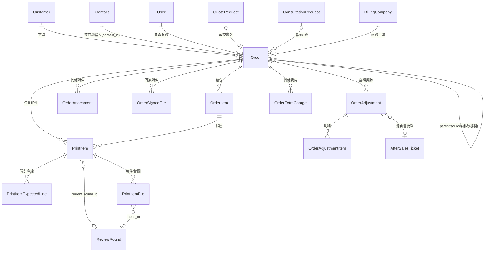

## Purpose

訂單管理模組 -- 統一線上/線下訂單管理，支援多印件多工單結構，涵蓋訂單建立、印件管理、付款記錄、電子發票、出貨單管理全流程。
取代現有 EC + Ragic 雙平台組合。

**問題**：
- EC + Ragic 雙平台管理訂單，線上/線下資料結構不同無法互通
- EC 一訂單僅對應一張工單，無法支援「一訂單→多印件→各自多工單」
- 分批出貨無系統化統計與防呆，審稿兼任工單開立導致職責錯位

**目標**：
- 主要：建立統一訂單管理平台，支援線上/線下訂單，完成 EC + Ragic 系統轉換，支援多印件多工單結構
- 次要：建立 Dashboard / Forecast 的資料基礎

- 來源 BRD：[訂單 BRD](https://www.notion.so/32c3886511fa806bad41d755349b0567)（v0.5）
- Prototype：`sens-erp-prototype/src/components/order/`
- 相依模組：需求單（線下單轉入）、EC 平台（線上單）、工單管理、統一金流、第三方物流

---
## Requirements
### Requirement: 訂單建立

系統 SHALL 支援以下訂單建立路徑（按 `order_type` 分類）：

**`order_type = 線下`（一般訂單）**：

1. 業務於需求單「成交」狀態點擊「轉訂單」，自動帶入印件規格、客戶資料、交期、報價金額。若需求單來源為 ConsultationRequest（`linked_consultation_request_id` 非空），主訂單建立時 SHALL 自動：(a) 在主訂單建立 OrderExtraCharge(charge_type=consultation_fee, amount=諮詢費)、(b) 將 Payment 從 ConsultationRequest 轉移至主訂單（修改 Payment 的 polymorphic 關聯）。**諮詢費 BillingInstallment 由業務於主訂單既有發票時程規劃流程自行加入，系統 MUST NOT 自動建立諮詢費 BillingInstallment 於主訂單**。`consultation_invoice_option` 作為客戶意向參考保留於 ConsultationRequest 實體，業務可參考決定主訂單發票時程，但不驅動系統行為。

**`order_type = 線上`（EC 訂單）**：

2. EC 線上單：Phase 1 暫不實作自動同步（狀態機已預留進入節點），納入 Phase 2。

**`order_type = 諮詢`（諮詢訂單）**：

諮詢訂單只在以下**兩種**收尾情境之一才建立（webhook 階段不建）：

3. **不做大貨**：客戶最終沒做大貨製作，涵蓋兩個觸發點：
   - 3.1 諮詢人員於諮詢單階段點「結束諮詢 - 不做大貨」時建立
   - 3.2 諮詢結束做大貨後，需求單流失：系統將此事件歸類為「不做大貨」結局，自動建諮詢訂單收尾
4. **待諮詢取消（半額退費）**：諮詢人員 / 業務主管於待諮詢階段點「取消諮詢」並於 dialog 確認後建立，含退款 Payment 與 OrderAdjustment

**重要釐清**：非諮詢來源（`linked_consultation_request_id` 為空）的需求單流失與諮詢訂單無關，**不建任何訂單**；需求單流失走需求單自身的退款 / 流失流程。

兩種情境共同的建立動作：(a) 訂單金額 = 諮詢費全額（2000），(b) 建立 OrderExtraCharge(charge_type=consultation_fee, amount=諮詢費)，(c) Payment 從 ConsultationRequest 轉移至此諮詢訂單，(d) **不做大貨 / 需求單流失情境自動建立待開發票 1 筆作為提醒**（金額 2000）；**諮詢取消情境 MUST NOT 自動建待開發票**（留存 1000 收入由業務手動開票、未開票由對帳差額警示兜底），(e) 取消情境額外建立 OrderAdjustment(-1000, status=已核可, approved_by=system, executed_at=NULL) + 退款 Payment(-1000, 處理中)，(f) **MUST NOT 自動開立 Invoice 或 SalesAllowance**（廢止 `consultation_invoice_option` 對發票自動化的影響）。終態：不做大貨 / 需求單流失 = 訂單完成；諮詢取消 = 已取消（見 § Requirement: 諮詢取消諮詢訂單終態收斂 / 諮詢取消退費 OA 系統建已核可，於 state-machines spec）。

訂單實體 SHALL 包含 `order_type` 欄位（enum: `線下` / `線上` / `諮詢`，必填，建立時設定不可變更）。

#### Scenario: 線下單由需求單轉入

- **WHEN** 業務在「成交」需求單點擊「轉訂單」
- **THEN** 系統建立訂單草稿（`order_type = 線下`），自動帶入印件規格、客戶資料、交期
- **AND** 帶入規則詳見[商業流程 spec](../business-processes/spec.md) § 需求單轉訂單欄位帶入規則

#### Scenario: 諮詢來源主訂單建立時自動建 OrderExtraCharge 與轉移 Payment

- **GIVEN** 需求單 `linked_consultation_request_id` 非空，諮詢費 = 2000、印件費 = 4000
- **WHEN** 業務於「成交」需求單執行「轉訂單」
- **THEN** 系統 SHALL 建立主訂單（`order_type = 線下`）
- **AND** 系統 SHALL 自動建立 OrderExtraCharge（charge_type = consultation_fee、amount = 2000、description = 「諮詢費（諮詢單編號 [CR-XXX]）」）
- **AND** 系統 SHALL 將 Payment 從 ConsultationRequest 轉移至主訂單（修改 linked_entity_type 與 linked_entity_id）
- **AND** 系統 MUST NOT 自動建立諮詢費的 BillingInstallment（業務於主訂單既有發票時程規劃流程自行加入）
- **AND** 系統 MUST NOT 依 `consultation_invoice_option` 自動開立 Invoice（欄位降為客戶意向參考）
- **AND** 主訂單三方對帳：應收 = 6000 = 已收 2000 + 待繳 4000

#### Scenario: 諮詢結束不做大貨建諮詢訂單（觸發點 3.1）

- **WHEN** ConsultationRequest 諮詢結束，諮詢人員選「不做大貨」
- **THEN** 系統 SHALL 建立諮詢訂單（`order_type = 諮詢`、總額 = 諮詢費 2000）
- **AND** 系統 SHALL 在諮詢訂單上建立 OrderExtraCharge(consultation_fee, 2000)
- **AND** 系統 SHALL 將 Payment 從 ConsultationRequest 轉移至諮詢訂單
- **AND** 系統 SHALL 自動建立 BillingInstallment 1 筆（order_id = 諮詢訂單 ID、scheduled_amount = 2000、description = 「諮詢費」、due_date / scheduled_issue_date = 完成諮詢時點當天、source_type = consultation_end_no_production、invoicing_status = 未開立、created_by = system）
- **AND** 系統 MUST NOT 自動開立 Invoice（不論 `consultation_invoice_option` 值為何）

#### Scenario: 諮詢來源需求單流失歸類為「不做大貨」（觸發點 3.2）

- **GIVEN** ConsultationRequest 狀態 = 已轉需求單、Payment 綁 ConsultationRequest
- **AND** 對應需求單流失（流失事件由需求單模組觸發）
- **WHEN** 系統處理需求單流失事件，且需求單 `linked_consultation_request_id` 非空
- **THEN** 系統 SHALL 將此事件歸類為「不做大貨」結局
- **AND** 系統 SHALL 建立諮詢訂單（`order_type = 諮詢`、總額 = 諮詢費 2000）
- **AND** 系統 SHALL 在諮詢訂單上建立 OrderExtraCharge(consultation_fee, 2000)
- **AND** 系統 SHALL 將 Payment 從 ConsultationRequest 轉移至諮詢訂單
- **AND** 系統 SHALL 自動建立 BillingInstallment 1 筆（order_id = 諮詢訂單 ID、scheduled_amount = 2000、description = 「諮詢費」、due_date / scheduled_issue_date = 流失時點當天、source_type = quote_lost、invoicing_status = 未開立、created_by = system）
- **AND** 系統 MUST NOT 自動開立 Invoice

#### Scenario: 非諮詢來源的需求單流失不建諮詢訂單

- **GIVEN** 需求單 `linked_consultation_request_id` 為空（非諮詢來源）
- **WHEN** 需求單流失
- **THEN** 系統 MUST NOT 建立諮詢訂單
- **AND** 需求單流失走需求單自身的退款 / 流失流程，與諮詢訂單無關

#### Scenario: 待諮詢取消觸發建諮詢訂單與半額退費

- **GIVEN** ConsultationRequest 狀態 = 待諮詢、Payment(P0: +2000, 已完成) 綁 ConsultationRequest
- **WHEN** 諮詢人員 / 業務主管於取消 dialog 選定 cancel_reason_category 並點擊「確認取消諮詢」
- **THEN** 系統 SHALL 建立諮詢訂單（`order_type = 諮詢`、總額 = 諮詢費 2000）
- **AND** 系統 SHALL 在諮詢訂單上建立 OrderExtraCharge(consultation_fee, 2000)
- **AND** 系統 SHALL 將 Payment P0 從 ConsultationRequest 轉移至諮詢訂單（金額 +2000 不變、status 維持已完成）
- **AND** 系統 SHALL 自動建立 OrderAdjustment（amount = -1000、adjustment_type = `諮詢取消退費`、status = 已核可、approved_by = system、executed_at = NULL、requires_supervisor_approval = false、linked_after_sales_ticket_id = NULL、reason = 「諮詢取消退費（50%）」）
- **AND** 系統 SHALL 自動建立退款 Payment（amount = -1000、paymentMethod = 退款、paymentStatus = 處理中、linkedOrderAdjustmentId = 上述訂單異動.id、linked_entity_type = Order、linked_entity_id = 諮詢訂單 ID）
- **AND** 應收認列已核可訂單異動(-1000)（公式 = 訂單額外費用(2000) + ∑已執行或已核可訂單異動(-1000) = 1000）；退款 Payment 切「已完成」累計達 -1000 後推進訂單異動「已執行」
- **AND** 系統 MUST NOT 為諮詢取消自動建待開發票（留存 1000 收入由業務手動開票、未開票由對帳差額警示兜底）
- **AND** 系統 MUST NOT 自動開立 Invoice
- **AND** 系統 MUST NOT 自動開立 SalesAllowance
- **AND** 諮詢訂單 SHALL 直接推進至「已取消」終態（見 § Requirement: 諮詢取消諮詢訂單終態收斂，於 state-machines spec）
- **AND** 諮詢訂單應收 = 訂單額外費用(2000) + 訂單異動(-1000) = 1000

#### Scenario: EC 訂單進入節點預留

- **WHEN** EC 訂單同步功能上線（Phase 2）
- **THEN** 系統透過 API 全自動同步 EC 訂單（`order_type = 線上`），進入已有狀態機節點

#### Scenario: US-ORD-001 建立線下訂單（回簽觸發）

- **WHEN** 業務在需求單執行「轉建訂單」
- **THEN** 系統 SHALL 建立訂單並使其進入「草稿」狀態（線下單以草稿為初始狀態，業務調整帶入內容後點「送主管審核」推進；見 § 業務送出訂單審核）；活動紀錄 MUST 記錄操作人與時間戳

### Requirement: 訂單確認觸發

系統 SHALL 支援訂單確認觸發，線下單採「OR 觸發」設計，任一觸發條件成立即推進：

- **線下單觸發條件 A（手動）**：業務於訂單詳情頁點擊「確認回簽」按鈕
- **線下單觸發條件 B（自動）**：業務於訂單詳情頁「回簽檔案上傳區」成功上傳至少一份回簽檔案（建立 OrderSignedFile 紀錄）
- **線上單（含客製單）**：付款完成自動觸發（Phase 2，由 EC 同步）

任一觸發成立時，系統 SHALL 寫入 `Order.signed_at` = 觸發時間並推進狀態。

Prototype 補強：原實作為每個訂單狀態配一個手動推進按鈕，與[狀態機 spec](../state-machines/spec.md) 不符。修正為 OrderDetail SHALL 僅提供「確認回簽」與「取消訂單」兩個人工操作按鈕；審稿段之後的狀態推進（稿件未上傳 → 等待審稿 → 製作等待中 → ... → 訂單完成）SHALL 由下層模組 bubble-up 驅動。

#### Scenario: 線下單業務手動確認

- **WHEN** 客戶印回簽後，業務在訂單頁面標記「已回簽」
- **THEN** 訂單狀態從草稿轉為已確認
- **AND** 系統 SHALL 寫入 `Order.signed_at` = 操作時間

#### Scenario: 線下單上傳回簽檔案自動推進

- **GIVEN** 訂單狀態 = 報價待回簽
- **WHEN** 業務於訂單詳情頁「回簽檔案上傳區」上傳檔案，系統 SHALL 建立 OrderSignedFile 紀錄
- **THEN** 系統 SHALL 自動推進訂單狀態（依「正常路徑」或「免審稿快速路徑」決定下個狀態）
- **AND** 系統 SHALL 寫入 `Order.signed_at` = 上傳完成時間
- **AND** ActivityLog MUST 記錄「上傳回簽檔案自動推進」與操作人

#### Scenario: US-ORD-001 回簽後訂單確認推進

- **WHEN** 客戶印回簽後，業務在訂單頁面手動點擊「標記回簽」
- **THEN** 訂單狀態 SHALL 從「報價待回簽」推進至「訂單確認」；活動紀錄 MUST 記錄操作人、操作類型與時間戳

#### Scenario: 線下訂單確認回簽（正常路徑）

- **WHEN** 業務在 OrderDetail 點擊「確認回簽」或上傳回簽檔案
- **AND** 訂單下有印件的 reviewStatus 不為「合格」且不為「免審稿」
- **THEN** 訂單狀態 SHALL 從「報價待回簽」推進至「稿件未上傳」

#### Scenario: 線下訂單確認回簽（免審稿快速路徑）

- **WHEN** 業務在 OrderDetail 點擊「確認回簽」或上傳回簽檔案
- **AND** 訂單下所有印件的 reviewStatus 皆為「合格」或「免審稿」
- **THEN** 訂單狀態 SHALL 從「報價待回簽」直接推進至「製作等待中」，跳過「稿件未上傳」與「等待審稿」

#### Scenario: 審稿段之後無手動推進按鈕

- **WHEN** 訂單狀態為「稿件未上傳」或之後的任何狀態
- **THEN** OrderDetail 頁面 MUST NOT 顯示狀態推進按鈕
- **AND** 狀態推進 SHALL 等待下層模組（印件審稿、工單、出貨）的 bubble-up 觸發

### Requirement: 多印件管理
系統 SHALL 支援 1 訂單 -> N 印件結構，區分打樣印件與大貨印件。業務/諮詢業務在建立印件時可設定「免審稿」，免審稿設定後審稿狀態直接為「合格」（主要場景：線下追加大貨）。

#### Scenario: 訂單包含多筆印件
- **WHEN** 訂單包含打樣印件與大貨印件
- **THEN** 系統分別管理各印件的審稿狀態、工單狀態、生產進度

#### Scenario: 業務設定免審稿印件
- **WHEN** 業務建立線下追加大貨印件並勾選「免審稿」
- **THEN** 系統將該印件審稿狀態直接設為「合格」，跳過審稿流程

### Requirement: 稿件上傳
系統 SHALL 提供統一的稿件上傳入口，打樣與大貨印件的稿件上傳在訂單管理頁的印件區塊操作。

#### Scenario: 業務上傳印件稿件
- **WHEN** 業務在訂單詳情頁的印件區塊上傳稿件
- **THEN** 系統儲存稿件並觸發對應的審稿流程（除非已設定免審稿）

### Requirement: 打樣決策點
系統 SHALL 支援打樣結果確認流程，業務取得打樣成品後與客戶確認，依據確認結果推進後續流程。

#### Scenario: US-PI-001 打樣結果確認 -- OK 進入大貨
- **WHEN** 業務取得打樣成品，與客戶確認結果為 OK
- **THEN** 系統 SHALL 將打樣印件標記為「打樣通過」，並允許業務觸發大貨生產流程

#### Scenario: US-PI-001 打樣結果確認 -- NG 製程問題重新打樣
- **WHEN** 業務取得打樣成品，與客戶確認結果為 NG（製程問題）
- **THEN** 系統 SHALL 允許業務發起「重新打樣」，建立新一輪打樣工單並推進對應流程

#### Scenario: US-PI-001 打樣結果確認 -- NG 稿件問題作廢重建
- **WHEN** 業務取得打樣成品，與客戶確認結果為 NG（稿件問題）
- **THEN** 系統 SHALL 將該打樣印件作廢，並允許業務重新建立印件與稿件上傳流程

### Requirement: 訂單狀態機
系統 SHALL 依照[狀態機 spec](../state-machines/spec.md) § 訂單定義的規則進行狀態轉換，支援線下/線上 EC 訂單的完整狀態流程。

#### Scenario: 訂單完整生命週期
- **WHEN** 訂單從建立到完成經歷所有狀態
- **THEN** 狀態依序轉換：草稿 -> 已確認 -> 生產中 -> 出貨中 -> 已完成

### Requirement: 工單清單顯示
系統 SHALL 在訂單詳情頁顯示各印件對應的工單狀態，提供生產進度可見性。工單詳情連結至工單模組。

#### Scenario: 業務查看訂單生產進度
- **WHEN** 業務在訂單詳情頁查看工單區塊
- **THEN** 系統顯示各印件對應的工單清單與狀態，可點擊連結至工單詳情

### Requirement: 訂單取消流程
系統 SHALL 支援任何狀態均可取消訂單。取消後進入「已取消」終態（不可逆）。連動：所屬工單全數轉「取消」終態，所屬生產任務轉「報廢」。已完成報工數量 MUST 計算成本（不退回）。

#### Scenario: 業務取消進行中的訂單
- **WHEN** 業務在任何狀態下取消訂單
- **THEN** 訂單進入「已取消」終態；所屬工單自動轉「已取消」；生產任務轉「報廢」；已報工數量計入成本

#### Scenario: 取消後退款流程
- **WHEN** 已取消訂單需要退款
- **THEN** 系統啟動退款流程：退款申請 -> 退款處理中 -> 已退款（以 EC 狀態機為設計基準）

#### Scenario: US-ORD-002 訂單取消與 top-down 連鎖
- **WHEN** 業務點擊「取消訂單」
- **THEN** 訂單 SHALL 進入「已取消」終態（不可逆）；系統 MUST 自動執行 top-down 連鎖：工單全數轉「已取消」→ 任務全數轉「已作廢」→ 生產任務依當前狀態轉「已作廢」或「報廢」；退款流程 SHALL 依序推進：退款申請 → 退款處理中 → 已退款

### Requirement: 出貨單管理

系統 SHALL 支援分批出貨、訂單內多印件合併出貨，並實施木桶原則出貨防呆：出貨數 <= 印件層累計 QC 入庫數。出貨單 MUST 一對一綁定單一訂單；跨訂單同收件人的合併寄出由揀貨人員於出貨作業階段自行處理，系統不提供跨訂單合併出貨單的資料模型支援。

#### Scenario: 分批出貨

- **WHEN** 印件部分完成，業務建立第一批出貨單
- **THEN** 系統允許出貨數量不超過該印件已入庫數量，記錄累計已出貨量

#### Scenario: 出貨防呆攔截

- **WHEN** 出貨人員填入的出貨數量超過印件可出貨數量
- **THEN** 系統阻擋並提示「出貨數量不可超過可出貨數量（QC 入庫數 - 已出貨數）」

#### Scenario: 出貨單一對一綁訂單

- **WHEN** 業務或揀貨人員嘗試於同一出貨單加入跨訂單的印件
- **THEN** 系統 SHALL 阻擋並提示「出貨單僅可包含同一訂單的印件；跨訂單合併寄出請於揀貨作業時自行整批處理」

#### Scenario: US-SH-001 自行出貨完整流程

- **WHEN** 業務建立出貨單並選擇「自行出貨」方式，新增出貨明細
- **THEN** 出貨單 SHALL 依序推進狀態：備料打包完成 → 車輛出發出貨中 → 確認送達（已送達）；系統 MUST 支援同訂單合併出貨（多印件同一出貨單）及分批出貨（同印件多次出貨）

#### Scenario: US-SH-002 第三方物流出貨完整流程

- **WHEN** 業務建立出貨單並選擇「第三方物流」方式，完成備料打包後移交物流商
- **THEN** 系統 SHALL 透過 API 自動接收物流商狀態更新：運送中 → 已送達；物流異常時系統 MUST 通知業務介入處理

### Requirement: 訂單列表權限與可見範圍

訂單列表 SHALL 依使用者角色決定可見訂單範圍：業務與諮詢（業務平台語境）SHALL 僅見自己負責（`order.salesPerson` 等於當前使用者）或被分享（`sharedMembers` 含當前使用者）的訂單；訂單管理人與業務主管（中台語境）SHALL 見全公司訂單。此範圍過濾 SHALL 一併套用於印件子層——印件子層可見的印件繼承過濾後的訂單範圍，業務 SHALL NOT 透過子層看到其他業務未分享訂單的印件。

分享機制同需求單（授予他人檢視/編輯權限）。訂單分享成員（`sharedMembers`）的維護沿用訂單詳情頁既有分享機制，列表層僅消費該資料做過濾。

訂單列表 SHALL 在角色可見訂單集之上，提供多維度篩選（業務負責人、訂單狀態、訂單類型、付款狀態、售後狀態、交期起訖區間、關鍵字）與一鍵清空篩選。

##### Scenario: 業務僅見自己負責與被分享的訂單
- **WHEN** 業務角色開啟訂單列表
- **THEN** 列表僅顯示該業務負責的訂單，以及被分享給該業務的訂單；其他業務的未分享訂單不顯示

##### Scenario: 諮詢角色比照業務套用範圍過濾
- **WHEN** 諮詢角色開啟訂單列表
- **THEN** 套用與業務相同的範圍過濾（自己負責 ∪ 被分享）

##### Scenario: 訂單管理人查看全公司訂單
- **WHEN** 訂單管理人登入查看訂單列表
- **THEN** 系統顯示全公司所有訂單

##### Scenario: 業務主管見全公司訂單
- **WHEN** 業務主管角色開啟訂單列表
- **THEN** 列表顯示全公司所有訂單，不套用角色範圍過濾

##### Scenario: US-ORD-009 訂單管理人全公司訂單檢視與篩選
- **WHEN** 訂單管理人登入系統後進入訂單列表
- **THEN** 系統 SHALL 預設顯示全公司所有訂單；業務角色登入時 SHALL 預設僅顯示自己負責的訂單
- **AND** 系統 MUST 提供下列篩選維度，作用於「當前角色可見訂單集」：業務負責人、訂單狀態、訂單類型、付款狀態、售後狀態、交期起訖區間、關鍵字（訂單編號 / 客戶名稱 / 案名 / 印件名稱 / 印件編號）
- **AND** 「業務負責人」篩選 SHALL 對當前可見訂單集依訂單負責業務收斂（不擴大可見範圍）；「交期」篩選 SHALL 以訂單交期為比較基準（不跨印件聚合）
- **AND** 「訂單狀態」篩選選項 SHALL 涵蓋所選「訂單類型」適用的**完整**狀態集（前段依類型分流 + 共用段 + 終態，對齊訂單狀態機），**不限於現有資料已出現的狀態**；線下單 = 線下前段 + 共用段 + 已取消、線上單與客製單 = 線上前段 + 共用段 + 已取消、諮詢訂單僅終態（訂單完成 / 已取消、不含共用段）；未選類型時涵蓋全部；切換訂單類型 SHALL 重置已選訂單狀態
- **AND** 「付款狀態」篩選 SHALL 以訂單層付款狀態（未付款 / 部分付款 / 已付款 / 已退款）為比較基準

##### Scenario: 角色範圍過濾套用於印件子層
- **WHEN** 業務展開訂單列表的印件子層
- **THEN** 僅能展開其可見訂單（自己負責或被分享）的印件子層，無法看到其他業務未分享訂單的印件

##### Scenario: 清空訂單列表篩選
- **WHEN** 使用者在訂單列表點擊「清空篩選」
- **THEN** 系統 SHALL 將所有篩選條件（含關鍵字與交期起訖）重置為預設，並回到列表第一頁

##### Scenario: US-ORD-004 訂單分享與代理授權
- **WHEN** 業務在訂單詳情頁進入「權限管理」Tab，搜尋同事並授予「檢視」或「編輯」權限
- **THEN** 被授權同事 SHALL 可依授予的權限等級存取該訂單；分享機制 MUST 與需求單權限管理機制一致

### Requirement: 活動紀錄
系統 SHALL 記錄訂單的所有操作歷程，供稽核與追溯。

#### Scenario: 查閱訂單活動紀錄
- **WHEN** 使用者在訂單詳情頁查看活動紀錄
- **THEN** 系統顯示完整的操作歷程，包含操作人、操作時間、操作內容

### Requirement: 印件預計產線

系統 SHALL 支援在印件層填寫「預計產線」，為多選欄位，記錄該印件預計涉及的產線。

#### Scenario: 印務為印件設定預計產線

- **WHEN** 印務在印件詳情頁填寫預計產線
- **THEN** 系統 SHALL 顯示所有產線供多選
- **AND** 選取結果 SHALL 儲存至 PrintItemExpectedLine junction

#### Scenario: 訂單印件清單顯示預計產線

- **WHEN** 使用者在訂單詳情頁查看印件清單
- **THEN** 每筆印件 SHALL 顯示其預計產線（以標籤形式呈現，多個並列）

#### Scenario: 印件總覽顯示預計產線

- **WHEN** 使用者在印件總覽查看印件列表
- **THEN** 系統 SHALL 顯示每筆印件的預計產線（以標籤形式呈現，多個並列）

### Requirement: 印件成品縮圖上傳

系統 SHALL 支援審稿人員為印件上傳成品縮圖。成品縮圖獨立於稿件檔案，代表最終成品的視覺呈現。

#### Scenario: 審稿人員上傳成品縮圖

- **WHEN** 審稿人員在印件詳情頁上傳成品縮圖
- **THEN** 系統 SHALL 儲存縮圖並更新 PrintItem.thumbnail_url
- **AND** 印件詳情頁與相關生產任務詳情頁 SHALL 顯示此縮圖

#### Scenario: 印件詳情顯示稿件與縮圖

- **WHEN** 使用者開啟印件詳情頁
- **THEN** 系統 SHALL 顯示稿件檔案列表（區分最終版與歷史版本）
- **AND** 系統 SHALL 在醒目位置顯示成品縮圖（若已上傳）

---

### Requirement: 成交轉訂單

系統 SHALL 支援從需求單一鍵轉訂單，自動帶入印件規格、客戶資料、交期。

#### Scenario: 需求單成交後建立訂單

- **WHEN** 業務在成交狀態的需求單點擊「建立訂單」
- **THEN** 系統 SHALL 建立新訂單，自動從 quote.printItems 映射為 OrderPrintItem[]
- **AND** 設定 quote.linkedOrderId = 新訂單 ID、quote.status = '成交'
- **AND** 新訂單狀態 SHALL 為「報價待回簽」
- **AND** 操作完成後導航至新訂單頁面

### Requirement: 訂單印件難易度繼承

訂單中每一筆印件 SHALL 具備 `difficulty_level` 欄位，值域 1-10。其值依訂單來源自動帶入：

- **B2B 訂單**（自需求單成交建立）：自對應需求單印件的 `difficulty_level` 繼承
- **B2C 訂單**（自 EC 商品下單建立）：自 EC 商品主檔的 `difficulty_level` 繼承
- **EC 商品主檔**：`difficulty_level` 由 EC 商品管理角色於商品建立時填寫，值域 1-10，必填

訂單印件 `difficulty_level` 本身於本 change 範疇內 SHALL **不**允許業務或其他角色於訂單層覆寫，以確保自動分配依據穩定。

#### Scenario: B2B 訂單印件繼承需求單難易度

- **GIVEN** 需求單印件 `difficulty_level = 7`
- **WHEN** 需求單成交轉為訂單
- **THEN** 訂單印件 SHALL 自動繼承 `difficulty_level = 7`

#### Scenario: B2C 訂單印件繼承商品主檔難易度

- **GIVEN** EC 商品主檔 `difficulty_level = 5`
- **WHEN** 會員下單成功並建立 B2C 訂單
- **THEN** 訂單印件 SHALL 自動繼承 `difficulty_level = 5`

#### Scenario: EC 商品主檔難易度必填

- **WHEN** EC 商品管理角色建立新商品
- **THEN** 系統 SHALL 要求輸入 `difficulty_level`（1-10）
- **AND** 未填寫時不可儲存為上架狀態

---

### Requirement: 訂單詳情頁印件補件入口

當訂單中的印件審稿維度狀態為「不合格」且訂單來源為 B2B 時，訂單詳情頁 SHALL 於該筆印件列表旁提供「補件」入口。業務 SHALL 可點選該入口上傳新的印件檔案，作為客戶端補件的代理操作。

業務 SHALL 僅能檢視到訂單層級，不可直接操作工單或生產任務。補件操作不可跨訂單範圍。

**本 change 新增**：補件入口 SHALL 顯示**歷史輪次 `review_note` 清單**，讓業務於補件前可參照審稿意見並轉達客戶。歷史清單內容與呈現方式對齊 [prepress-review spec § B2B 業務補件](../prepress-review/spec.md)。

#### Scenario: 不合格印件顯示補件入口

- **GIVEN** B2B 訂單中的印件 X 審稿維度狀態為「不合格」
- **WHEN** 業務進入該訂單詳情頁
- **THEN** 系統 SHALL 於印件 X 列顯示「補件」按鈕或入口

#### Scenario: 業務點選補件上傳檔案

- **WHEN** 業務點選印件 X 的「補件」入口
- **THEN** 系統 SHALL 彈出上傳元件
- **AND** 業務上傳檔案後，系統 SHALL 建立新的補件檔案紀錄
- **AND** 印件 X 審稿維度狀態 SHALL 轉為「已補件」
- **AND** 原審稿人員的待審列表 SHALL 重新出現此印件

#### Scenario: 非不合格狀態不顯示補件入口

- **WHEN** 印件審稿維度狀態不為「不合格」
- **THEN** 系統 SHALL **不**於訂單詳情頁顯示該印件的「補件」入口

#### Scenario: 補件入口顯示歷史審稿備註清單

- **WHEN** 業務點選印件 X 的「補件」入口
- **THEN** 系統 SHALL 於上傳元件同頁顯示**歷史輪次 `review_note` 清單**（最新在上）
- **AND** 清單 SHALL 含每輪 round_no、result、reject_reason_category、review_note 與時間
- **AND** 業務可參照清單修正或轉達客戶後再上傳補件

### Requirement: 印件 ReviewRound 整合

訂單印件 SHALL 與 `prepress-review` capability 定義的 ReviewRound 模型整合。

**PrintItem 層新增欄位**：
- `current_round_id`：FK ReviewRound（unique）。指向當前合格輪次，作為印件摘要呈現的單一指針。尚未合格時為 NULL。

**PrintItemFile 欄位調整**：
- 新增 `round_id`：FK ReviewRound
- 新增 `file_role`：enum（印件檔 / 縮圖；PI-003 定案兩值）
- 保留 `review_status` 但標為衍生值
- **移除** `is_final`：由 `PrintItem.current_round_id → Round → File` 指針鏈取代

印件詳情頁 SHALL 呈現所有歷史 ReviewRound（時間、輪次、審稿人員、結果、備註、當時的檔案），最新在上。印件摘要（訂單層呈現）SHALL 透過 `current_round_id` 指針查詢合格輪次的加工檔與縮圖。

#### Scenario: 印件詳情頁呈現歷史輪次

- **WHEN** 任一角色檢視訂單下的印件詳情頁
- **THEN** 系統 SHALL 列出該印件所有 ReviewRound 輪次
- **AND** 每一輪可展開檢視當時的原稿、加工檔、縮圖與結果

#### Scenario: 訂單層透過 current_round_id 呈現合格輪檔案

- **WHEN** 訂單詳情頁呈現印件摘要縮圖
- **THEN** 系統 SHALL 透過 `PrintItem.current_round_id → Round → File (file_role=縮圖)` 查詢顯示
- **AND** current_round_id 為 NULL 的印件 SHALL 顯示「待審稿」狀態而非舊輪檔案

#### Scenario: is_final 移除後既有查詢改由指針鏈

- **GIVEN** 本 change 上線前的既有印件已存在 PrintItemFile 紀錄
- **WHEN** 執行資料遷移
- **THEN** 系統 SHALL 為每個既有印件建立 `round_no = 1` 的 ReviewRound（result 依原 review_status 對應）
- **AND** 原 `is_final = TRUE` 的檔案綁入該 Round
- **AND** 若原 review_status = 合格，設 PrintItem.current_round_id 指向該 Round

### Requirement: B2C 會員上傳印件稿件備註

B2C 會員於 EC 前台上傳印件時 SHALL 可選擇性填寫 `client_note`，作為給審稿人員的稿件說明。EC 系統 SHALL 呼叫 ERP 介面將 `client_note` 隨印件一併回寫。

**欄位定義對齊** [prepress-review spec § 稿件備註欄位](../prepress-review/spec.md)：
- `client_note`：text（最長 500 字，非必填）
- 層級：印件 1:1，跟著印件走
- 方向：會員 → 審稿

**整合邊界**：EC 整合介面擴充與 `difficulty_level` 同路徑；本 change 僅規範 `client_note` 欄位語意與 Prototype demo，實際 EC API 欄位擴充由 EC 整合 change 處理。

#### Scenario: 會員於 EC 上傳印件附稿件備註

- **WHEN** 會員於 EC 下單頁上傳印件並填寫 `client_note`
- **THEN** EC 系統 SHALL 呼叫 ERP 補件 / 上傳介面，欄位含 `client_note`
- **AND** ERP SHALL 將 `client_note` 存至對應 PrintItem
- **AND** 審稿人員於工作台接收此印件時 SHALL 可見 `client_note` 內容

#### Scenario: 會員未填寫稿件備註仍可送出

- **WHEN** 會員於 EC 下單頁上傳印件但未填寫 `client_note`
- **THEN** 系統 SHALL 允許送出，PrintItem.client_note 存為 NULL

#### Scenario: 稿件備註超過字數上限被拒

- **WHEN** 會員填寫 `client_note` 超過 500 字
- **THEN** EC 前端 SHALL 於送出前顯示字數超出提示
- **AND** 若略過前端檢查直接呼叫 ERP API，ERP SHALL 於介面回應錯誤拒絕寫入

### Requirement: 訂單詳情頁 Tabs 化版型

訂單詳情頁 SHALL 採用 Tabs 化版型，包含 6 個 Tab：資訊 → 印件清單 → 付款記錄 → 補收款 → 出貨單 → 活動紀錄。Tab 順序、資訊卡排列、條件顯示規則見 DESIGN.md §10.1.1。

### Requirement: 訂單詳情頁業務負責人 row 簡化

業務負責人 row 依視角分流：業務視角僅顯示姓名純文字，業務主管視角顯示「改派負責人」入口（見 § 訂單負責業務改派）。UI 呈現細節見 DESIGN.md §10.1.2。

### Requirement: 訂單詳情頁印件清單表格結構

訂單詳情頁「印件清單」Tab 的表格 SHALL 採單層 row 結構共 14 欄。欄位定義、操作欄按鈕條件顯示規則見 DESIGN.md §10.1.3。

### Requirement: 印件詳情 Side Panel（PrintItemDetailSidePanel）

印件清單「檢視」按鈕 SHALL 開啟右側 Side Panel，承載印件資訊 / 印件檔案 / 相關工單 / 審稿紀錄四區塊。Panel 結構與呈現規則見 DESIGN.md §10.1.4。

### Requirement: 訂單業務主管審核欄位

Order 資料模型 SHALL 新增以下業務主管審核相關欄位：

| 欄位 | 英文名稱 | 型別 | 必填 | 唯讀 | 說明 |
|------|---------|------|------|------|------|
| 審核業務主管 | approved_by_sales_manager_id | FK | Y（線下單）| | FK->使用者；訂單**草稿建立時**指派；草稿 / 待業務主管審核階段可由 Supervisor 重新指定（見 § Supervisor 重新指定訂單業務主管，解卡待審訂單）；進入「審核通過」後鎖定為實際核可者歷史紀錄、不再重指派 |
| 是否需審核 | approval_required | boolean | Y | Y | 系統設定，Phase 1 線下單預設 true、線上 / 諮詢訂單預設 false |
| 收款條件備註 | payment_terms_note | text(500) | | | 從來源 QuoteRequest 帶入；業務於草稿 / 待業務主管審核態可編輯、業務主管於審核時查看作為決策依據；**進入「審核通過」後鎖定**（核准當下即鎖，避免核准後外發前被改動繞過把關） |
| 上次核准備註快照 | lastApprovedPaymentTermsNote | text(500) | | Y | 業務主管核准時系統寫入 `payment_terms_note` 快照；用於後續若訂單退回需重審時的條件對照 |
| 送審時間 | submitted_for_review_at | datetime | | Y | 業務點「送主管審核」（草稿 → 待業務主管審核）時寫入；供訂單審核待辦頁「進入待審核時間」排序依據 |
| 報價單外發時間 | quote_sent_at | datetime | | Y | 業務點「已送報價單」（審核通過 → 報價待回簽）時寫入；與 `signed_at` 對稱，供「核准到外發」「外發到回簽」落差量測 |

`approved_by_sales_manager_id` 欄位的可選範圍 MUST 限定為具業務主管角色的用戶。

#### Scenario: 線下訂單草稿建立時自動指派業務主管

- **WHEN** 業務於需求單成交後點擊「轉訂單」建立線下訂單（初始狀態 = 草稿）
- **THEN** 系統 SHALL 自動將 `approved_by_sales_manager_id` 設為預設業務主管（Phase 1 第一位）
- **AND** 系統 SHALL 將 `approval_required` 設為 `true`
- **AND** 系統 SHALL 將來源需求單的 `payment_terms_note` 內容寫入訂單同名欄位
- **AND** 系統 SHALL 將 `lastApprovedPaymentTermsNote` 預設為 `null`

#### Scenario: 進入審核通過後業務主管欄位與成交條件鎖定

- **GIVEN** 訂單狀態為「審核通過」或更後狀態
- **WHEN** 一般使用者（業務、業務主管、印務主管）嘗試修改 `approved_by_sales_manager_id` 或 `payment_terms_note`
- **THEN** 系統 MUST 拒絕變更
- **AND** UI MUST 將該等欄位顯示為唯讀
- **AND** Supervisor「重新指定業務主管」機制僅作用於核可前的「待業務主管審核」階段（解卡待審訂單，見 § Supervisor 重新指定訂單業務主管）；進入審核通過後 `approved_by_sales_manager_id` 為實際核可者歷史紀錄、不再重指派

### Requirement: 業務主管核准訂單

線下訂單從「待業務主管審核」推進至「審核通過」 SHALL 由指定的業務主管（`approved_by_sales_manager_id`）執行核准，前提為 `approval_required = true`。業務角色 MUST NOT 直接執行此狀態推進。

業務主管核准 MUST 為單向狀態轉換動作。業務主管不核准時，訂單維持「待業務主管審核」狀態，業務主管 / 業務之間的討論 SHALL 透過 Slack thread 進行；本 Requirement MUST NOT 提供「退回討論」按鈕（避免 ERP 內 / Slack 內雙軌討論造成資訊分散）。

業務主管核准時 MUST：
- 寫入 `lastApprovedPaymentTermsNote = payment_terms_note`（快照）
- 寫入 `Order.approved_at = 當前時間`（提供 PaymentPlan 分階段稽核判斷依據）
- 寫入 OrderActivityLog（事件描述 = 「核准訂單（成交條件審核）」）
- 將訂單狀態推進至「**審核通過**」（不再直接推進至「報價待回簽」）

業務主管核可後業務 SHALL 於外部管道（line / email / 紙本）寄送報價單給客戶，並於訂單詳情頁手動點擊「已送報價單」推進訂單狀態至「報價待回簽」（詳見「業務送出報價單給客戶」Requirement）。

業務主管核准時若 `payment_terms_note` 欄位為空，UI MUST 觸發 Confirm Dialog「此訂單無收款條件備註，確認已與業務口頭對齊？」需業務主管二次確認後才推進狀態，並於 ActivityLog 記錄「業務主管確認口頭對齊（無書面備註）」。

#### Scenario: 業務主管核准訂單推進至審核通過

- **GIVEN** 訂單狀態為「待業務主管審核」、`approval_required = true`、`payment_terms_note` 非空
- **AND** 該訂單 `approved_by_sales_manager_id` 等於當前業務主管
- **WHEN** 業務主管於訂單詳情頁點擊「核准訂單」
- **THEN** 訂單狀態 SHALL 變更為「審核通過」
- **AND** 系統 MUST 寫入 `lastApprovedPaymentTermsNote = payment_terms_note`
- **AND** 系統 MUST 寫入 `Order.approved_at` = 當前時間
- **AND** 系統 MUST 寫入 ActivityLog（操作者 = 業務主管、事件描述 = 「核准訂單（成交條件審核）」）
- **AND** 業務 SHALL 看到「已送報價單」按鈕可推進至「報價待回簽」

#### Scenario: 空收款備註核准需二次確認

- **GIVEN** 訂單狀態為「待業務主管審核」、`payment_terms_note` 為空
- **WHEN** 業務主管點擊「核准訂單」
- **THEN** UI MUST 跳出 Confirm Dialog「此訂單無收款條件備註，確認已與業務口頭對齊？」
- **AND** 業務主管點擊確認後，訂單狀態 SHALL 變更為「審核通過」
- **AND** 系統 MUST 寫入 ActivityLog（事件描述 = 「核准訂單（業務主管確認口頭對齊，無書面備註）」）
- **AND** 業務主管點擊取消後，訂單狀態 MUST 維持「待業務主管審核」

#### Scenario: 業務主管不核准透過 Slack thread 溝通

- **GIVEN** 訂單狀態為「待業務主管審核」
- **AND** 業務主管認為需重新討論收款條件或成交條件
- **WHEN** 業務主管選擇暫不核准
- **THEN** 業務主管 MUST NOT 於 ERP 內留 comment 或執行「退回」動作
- **AND** 業務主管 SHALL 透過 Slack thread 與業務直接討論
- **AND** 訂單狀態 MUST 維持「待業務主管審核」直到業務主管核准

#### Scenario: 業務不可從待業務主管審核直接推進

- **GIVEN** 訂單狀態為「待業務主管審核」、`approval_required = true`
- **WHEN** 業務（非指定業務主管）開啟訂單詳情頁
- **THEN** 系統 MUST NOT 顯示「核准訂單」按鈕給業務
- **AND** UI SHALL 顯示「等待 [業務主管姓名] 審核中（已等待 X 天）」資訊
- **AND** 任何 API 請求嘗試由業務直接推進至「審核通過」 MUST 回傳權限不足錯誤

#### Scenario: 非指定業務主管不可核准

- **GIVEN** 訂單狀態為「待業務主管審核」
- **AND** 該訂單 `approved_by_sales_manager_id` 不等於當前業務主管
- **WHEN** 業務主管嘗試於訂單詳情頁點擊「核准訂單」
- **THEN** 系統 MUST NOT 顯示該按鈕
- **AND** 該訂單 MUST NOT 出現在當前業務主管的「訂單審核」待辦清單

### Requirement: 業務主管於訂單模組的資料可見範圍

業務主管 SHALL 於訂單模組的可見範圍依頁面區分：

| 頁面 | 業務主管可見範圍 |
|------|----------------|
| 訂單列表頁（`/orders`）| 所有訂單（提供部門總覽能力）|
| 訂單審核待辦頁（`/sales-manager/approvals`）| `approved_by_sales_manager_id = self` AND `status ∈ {待業務主管審核, 審核通過, 報價待回簽, 已回簽, 已取消}`（草稿態屬業務側未送審、MUST NOT 出現於主管待辦頁）|
| 訂單詳情頁（`/orders/{id}`）| 所有訂單可瀏覽；「核准訂單」按鈕僅在 `approved_by_sales_manager_id = self` 時顯示 |

預設篩選 `status = 待業務主管審核`，按 `submitted_for_review_at` ASC 排序（最久未審優先）；「審核通過」於待辦頁僅供主管追蹤已核准未外發訂單，不需主管再操作。

#### Scenario: 業務主管於訂單審核頁僅見自己被指派的訂單

- **GIVEN** 訂單 `approved_by_sales_manager_id` 不等於當前業務主管
- **WHEN** 業務主管登入並開啟 `/sales-manager/approvals`
- **THEN** 系統 MUST NOT 在審核清單中顯示此訂單

#### Scenario: 草稿態訂單不出現於業務主管待辦頁

- **GIVEN** 線下訂單狀態為「草稿」、`approved_by_sales_manager_id = self`
- **WHEN** 業務主管開啟 `/sales-manager/approvals`
- **THEN** 系統 MUST NOT 顯示此訂單（業務尚未點「送主管審核」）

#### Scenario: 業務主管於訂單列表頁可見全部

- **WHEN** 業務主管登入並開啟 `/orders`
- **THEN** 列表 SHALL 顯示所有訂單（含其他業務主管被指定、含未進入審核的訂單）
- **AND** 業務主管點開非自己被指定的訂單詳情頁，MUST NOT 顯示「核准訂單」按鈕

### Requirement: Supervisor 重新指定訂單業務主管

Supervisor SHALL 擁有「解鎖並重新指定訂單 `approved_by_sales_manager_id`」的權限，作為業務主管離職 / 請假 / 異動時的 Phase 1 處理機制，避免訂單卡在「待業務主管審核」狀態。

此操作 MUST 寫入 OrderActivityLog 記錄解鎖動作（操作者 = Supervisor、舊業務主管、新業務主管、解鎖原因 free text 必填）。新業務主管 MUST 為具業務主管角色的用戶。

#### Scenario: Supervisor 重新指定訂單業務主管

- **GIVEN** 訂單狀態為「待業務主管審核」
- **AND** 原指定業務主管因離職 / 請假 / 異動無法核准
- **WHEN** Supervisor 於訂單詳情頁執行「重新指定業務主管」並填寫解鎖原因
- **THEN** 系統 SHALL 允許 Supervisor 變更 `approved_by_sales_manager_id`
- **AND** 新業務主管 MUST 為具業務主管角色的用戶
- **AND** 系統 MUST 寫入 OrderActivityLog（操作者 = Supervisor、事件描述 = 「重新指定訂單業務主管」、舊值、新值、原因）
- **AND** 新業務主管 SHALL 於自己的訂單審核待辦頁看到此訂單

#### Scenario: 一般使用者不可重新指定訂單業務主管

- **WHEN** 業務、業務主管、印務主管或其他非 Supervisor 角色嘗試執行「重新指定訂單業務主管」
- **THEN** 系統 MUST NOT 顯示此操作入口
- **AND** 任何 API 請求嘗試變更 `approved_by_sales_manager_id` MUST 回傳權限不足錯誤

> 帳務相關 Requirement（發票 / 折讓 / 收款 / 期次 / 對帳 / KPI）已搬遷至 [order-billing/spec.md](../order-billing/spec.md)。

### Requirement: 訂單異動（OrderAdjustment）建立與審核

業務 / 諮詢 SHALL 可於訂單詳情頁建立訂單異動，記錄訂單成立後因規格變更 / 加印追加 / 退印 / 折扣 / 加運費 / 急件費 / 其他原因導致的金額異動（可正可負）。OrderAdjustment 有獨立狀態機（草稿 → 待主管審核 → 已核可 / 已退回 → 已執行 / 已取消，詳見 [state-machines spec](../state-machines/spec.md)），不影響主訂單狀態。OrderAdjustment「已執行」時觸發應收總額更新，但 BillingInstallment（請款期次）SHALL NOT 自動變動，由業務手動調整。

**OrderAdjustment 回歸純金額異動載具**：本 change（add-after-sales-ticket）廢止原 v1.2 「雙重身份」設計（`adjustment_phase` 欄位 + UI 「售後服務單」雙重表述）。OrderAdjustment 不再依 Order.status 自動推算 phase，所有 `adjustment_type` 皆可於任何 Order 狀態下選用（規格變更 / 加印追加 / 退印 / 折扣 / 加運費 / 急件費 / 補退 / 其他）。

OrderAdjustment 新增 `linked_after_sales_ticket_id`（FK -> AfterSalesTicket，nullable）欄位：

- **NULL**：訂單期間業務直接建立的金額異動（原 during_order 路徑），無關聯售後 ticket
- **非 NULL**：源自 AfterSalesTicket 內部建立的關聯異動（退款、補印收費）

訂單已完成後（Order.status = 已完成）的售後事件改走 AfterSalesTicket（見 [after-sales-ticket spec](../after-sales-ticket/spec.md)）。業務不再於訂單詳情頁直接建「售後服務單」OrderAdjustment，而是於 AfterSalesTicket 內部建關聯 OrderAdjustment。

**新增閘門（訂單詳情頁訂單異動區）**：訂單詳情頁「訂單異動」區的「新增訂單異動單」入口 SHALL 僅於 `Order.status ∉ {訂單完成、已取消}` 時可用。已完成訂單的售後金額異動改走 AfterSalesTicket；已取消訂單一律唯讀（對齊 § 訂單詳情頁編輯型 Section 統一編輯時機與角色 之已取消規則）。既有 OrderAdjustment（完成前建立的存量）SHALL NOT 受此閘門影響，仍可檢視、審核、編輯金額、管理關聯 Payment（沿用獨立狀態機，不影響 task 5.9 已完成訂單存量待審 OA 走完流程）。

OrderAdjustment SHALL 支援多筆明細項（OrderAdjustmentItem 子實體），每筆明細記錄 `item_type`（print_item / fee）、描述、金額。OrderAdjustment.amount 為所有明細金額加總（系統自動計算）。

**[refine-after-sales-refund 既有] 編輯閘門規則**（不動）：

OrderAdjustment 金額編輯閘門按 status 分階段：

| status | 業務可改金額？ | 改後狀態流轉 | 主管動作 |
|--------|--------------|-------------|---------|
| 草稿 | 可（不限次數）| 維持「草稿」 | 無 |
| 待主管審核 | 不可（已送出，待主管動作）| — | 主管核可 / 退回 |
| 已退回 | 可（業務修正後重送）| 改後維持「已退回」直至業務重新送出 → 進入「待主管審核」 | 業務送出後主管重新審核 |
| 已核可 | 可（業務退款前最後校正）| 維持「已核可」（不需重新送審）| 對照欄位即時顯示業務調整 |
| 已執行 | 不可（金錢已實際發生，鎖定）| — | 無 |
| 已取消 | 不可（終態）| — | 無 |

**[refine-after-sales-refund 既有] 主管核可金額對照欄位 + audit log 必欄位**（不動）：

OrderAdjustment 卡片於 `status = 已核可` 時 SHALL 顯示「主管核可金額 vs 當前金額」對照欄位（沿用 refine-after-sales-refund 設計）；金額異動 audit log 必欄位（adjusted_at / adjusted_by / previous_amount / new_amount / status_at_adjustment）沿用。

**[本 change 變更] 「已執行」推進機制 — 從「建立 Payment 自動推進」改為「Payment 切已完成累計達 OA.amount 自動推進」**：

OrderAdjustment 的 `status = 已執行` 推進條件 MODIFY 為：

- 觸發事件：任一關聯 Payment（linkedOrderAdjustmentId = OA.id）從 paymentStatus = '處理中' 切為 '已完成'
- 推進條件：對應 OA 的所有已完成 Payment 累計 amount（含符號比較）= OA.amount
- 推進動作：同 transaction 將 OA.status → '已執行'、executedAt = 該 Payment 切「已完成」的時點

對稱適用退款 OA（amount < 0，配對 paymentMethod = '退款' 的負值 Payment）與補收 OA（amount > 0，配對 paymentMethod ≠ '退款' 的正值 Payment）。詳見 [state-machines spec § 訂單異動狀態機](../state-machines/spec.md)。

**[本 change BREAKING] 棄用「執行 OA 自動建補收 Payment」既有設計**：

既有 spec 對補收 OA（如加印追加 / 加運費 / 急件費）的處理流程（L1719「OrderAdjustment 經核可並執行後系統 SHALL 同步更新 PrintItem.ordered_qty 並建立補收 Payment」、L1734「系統 SHALL 建立對應補收 / 退款 Payment（或提示業務手動建）」）SHALL 廢止。

新設計：所有 OA（退款 + 補收）核可後，由業務於 OA 編輯介面手動建立關聯 Payment（處理中態），補齊資料切「已完成」後自動推進 OA「已執行」。兩條路徑完全對稱。

**Migration 影響**：既有實作中若有「OA 已執行自動建 Payment」邏輯 MUST 移除，相關 UI（如加印追加流程的提示）改為「業務應至 OA 編輯介面建立補收 Payment」。

**[本 change 新增] OA 編輯介面入口（取代既有「建立退款 Payment」按鈕）**：

OrderAdjustment 卡片 / Table row 點「編輯」開啟 OA 編輯 dialog，dialog 內結構：

- 上半：OA 欄位（adjustmentType / amount / reason）依 OA.status 決定可改否
- 下半：關聯 Payment 列表（Table，列出 linkedOrderAdjustmentId = OA.id 的所有 Payment、含 paymentStatus 與金額顯示）
- 下半底部：「新增 Payment」button（僅 OA.status = '已核可' 時可用）
  - OA 為退款型（amount < 0）：自動預填 paymentMethod = '退款'、amount 必須 ≤ 0
  - OA 為補收型（amount > 0）：自動預填 paymentMethod 為非「退款」項（如「銀行轉帳」）、amount 必須 ≥ 0
- 每筆關聯 Payment row 操作欄：「編輯」單一按鈕（點開另一 dialog 編輯該 Payment、含切換 paymentStatus、補齊資料、取消）

OA 編輯介面 SHALL NOT 提供「執行」按鈕（沿用 refine-after-sales-refund 對 UI 入口的處置）。

#### Scenario: 業務建立加印追加異動（不變，沿用既有）

- **GIVEN** 訂單 SO-001 狀態 = 生產中
- **WHEN** 客戶要求加印 200 份，業務於訂單詳情頁點擊「建立訂單異動單」
- **THEN** 系統 SHALL 建立 OrderAdjustment、UI 標題顯示「訂單異動單」
- **AND** 業務 SHALL 可選 `adjustment_type = 加印追加`
- **AND** 業務新增明細「item_type = print_item，描述 = 加印 200 份，金額 = +20,000」
- **AND** OrderAdjustment.amount SHALL 自動加總為 +20,000
- **AND** OrderAdjustment.status SHALL = 草稿
- **AND** OrderAdjustment.linked_after_sales_ticket_id SHALL = NULL
- **AND** 業務點擊「提交審核」後 status SHALL → 待主管審核

#### Scenario: 業務於 AfterSalesTicket 內建關聯 OrderAdjustment（不變，沿用既有）

- **GIVEN** AfterSalesTicket AS-001 status = 處理中、resolution = 退款
- **WHEN** 業務於 ticket 內點「建立退款異動單」
- **THEN** 系統 SHALL 建立 OrderAdjustment、預填 adjustment_type = 退印、linked_after_sales_ticket_id = AS-001
- **AND** 業務填入 amount = -5000、明細描述
- **AND** OrderAdjustment.status SHALL = 草稿，後續走原狀態機（提交審核 → 主管核可 → 業務於 OA 編輯介面建立關聯 Payment 並切「已完成」累計達 OA.amount 自動推進已執行）

#### Scenario: 已完成 / 已取消訂單禁止於訂單詳情頁新增訂單異動單（add-after-sales-ticket 補驗收）

- **GIVEN** Order.status ∈ {訂單完成、已取消}
- **AND** 使用者為業務 / 諮詢
- **WHEN** 使用者進入訂單詳情頁「訂單異動」Tab
- **THEN** 「新增訂單異動單」按鈕 SHALL disabled
- **AND** 按鈕 SHALL 顯示引導提示（Tooltip / title）：已完成 → 「訂單已完成，售後異動請至『售後服務』Tab 建立售後服務單」；已取消 → 「訂單已取消，無法新增訂單異動」
- **AND** 既有 OrderAdjustment（完成前建立的存量）SHALL 仍可檢視、審核、編輯金額、管理關聯 Payment（不受新增閘門影響）
- **AND** 訂單完成後的金額異動 SHALL 改於 AfterSalesTicket 內建立（見 [after-sales-ticket spec](../after-sales-ticket/spec.md)）

#### Scenario: 業務主管核可 OrderAdjustment（不變，沿用既有）

- **GIVEN** OrderAdjustment.status = 待主管審核、amount = -5000
- **WHEN** 業務主管於訂單詳情頁的異動清單點擊「核可」
- **THEN** OrderAdjustment.status SHALL → 已核可
- **AND** 系統 MUST 記錄 approved_by、approved_at、approved_amount = -5000

#### Scenario: 業務主管退回 OrderAdjustment（不變，沿用既有）

- **GIVEN** OrderAdjustment.status = 待主管審核
- **WHEN** 業務主管點擊「退回」並填入退回原因
- **THEN** OrderAdjustment.status SHALL → 已退回
- **AND** 業務 SHALL 可修改後重交審核

#### Scenario: 業務於已核可狀態調整金額（沿用 refine-after-sales-refund 設計）

- **GIVEN** OrderAdjustment.status = 已核可、approved_amount = -5000、current_amount = -5000
- **WHEN** 業務發現實際退款金額應為 -4800（客戶談判），於 OA 編輯介面點擊「編輯金額」
- **THEN** 系統 SHALL 允許業務修改 current_amount = -4800
- **AND** OrderAdjustment.status SHALL 維持「已核可」（不需重新送審）
- **AND** 對照欄位 SHALL 顯示「主管核可金額 -$5,000（{approved_at}）｜當前金額 -$4,800｜業務已調整 +$200」
- **AND** audit log SHALL 記錄此異動（previous_amount = -5000, new_amount = -4800, status_at_adjustment = 已核可）

#### Scenario: Payment 切已完成累計達 OA.amount 自動推進 OA 已執行（MODIFY 既有「建立即推進」）

- **GIVEN** OrderAdjustment.status = 已核可、current_amount = -5000、linked_after_sales_ticket_id = AS-001
- **AND** 業務已在 OA 編輯介面建立關聯 Payment P-001（amount = -5000, paymentMethod = '退款', paymentStatus = '處理中'）
- **WHEN** 業務於 P-001 編輯 dialog 補 paidAt、上傳對帳附件、切 paymentStatus → '已完成'、點擊「儲存」
- **THEN** 系統 SHALL 通過驗證並寫入 P-001.paymentStatus = '已完成'、completedAt = now
- **AND** 系統 SHALL 重算 OA 對應已完成 Payment 累計 = -5000 = OA.amount
- **AND** 系統 SHALL 同 transaction 推進 OrderAdjustment.status → '已執行'、executedAt = now
- **AND** 訂單應收總額 MUST 更新（∑ 印件費 + ∑ OrderExtraCharge.amount + ∑(已執行 OrderAdjustment.amount)）
- **AND** BillingInstallment（請款期次）SHALL NOT 自動變動
- **AND** OA 編輯介面內「關聯 Payment 卡片」SHALL 顯示「已執行（透過 Payment-{payment_no} 推進）」

#### Scenario: 補收 OA 對稱化建立 Payment + 切已完成自動推進（對稱化新規）

- **GIVEN** OrderAdjustment OA-002（status = 已核可、amount = +20000、adjustment_type = 加印追加）
- **WHEN** 業務於 OA-002 編輯介面點「新增 Payment」（OA 補收型 → 預填 paymentMethod = '銀行轉帳'）、填入 amount = +20000、點擊「儲存」
- **THEN** 系統 SHALL 建立 Payment P-002（amount = +20000, paymentStatus = '處理中', linkedOrderAdjustmentId = OA-002.id）
- **AND** OA-002.status SHALL 維持「已核可」
- **WHEN** 客戶匯款後業務補 paidAt + attachments、切 P-002 paymentStatus → '已完成'、點擊「儲存」
- **THEN** 系統 SHALL 重算 OA-002 對應已完成 Payment 累計 = +20000 = OA-002.amount
- **AND** 系統 SHALL 推進 OA-002.status → '已執行'

#### Scenario: 棄用「執行 OA 自動建補收 Payment」舊行為驗證

- **GIVEN** 業務建立 OrderAdjustment OA-003（adjustment_type = 加印追加, amount = +20000, status = 草稿）→ 提交審核 → 主管核可（status = 已核可）
- **WHEN** 系統處理該 OA 核可事件
- **THEN** 系統 SHALL NOT 自動建立補收 Payment（既有 spec L1719 / L1734 行為已廢止）
- **AND** OA 編輯介面 SHALL 顯示「新增 Payment」入口供業務手動建補收 Payment
- **AND** 業務 SHALL 在 OA 編輯介面手動建 + 補齊 + 切已完成才能推進 OA 至已執行

#### Scenario: OA 上找不到「執行」按鈕（沿用 refine-after-sales-refund 設計）

- **GIVEN** OrderAdjustment.status = 已核可
- **WHEN** 業務打開 OA 編輯介面
- **THEN** 系統 SHALL NOT 顯示「執行」按鈕
- **AND** 系統 SHALL 顯示「新增 Payment」按鈕（OA 編輯介面 dialog 內、退款型 / 補收型皆顯示）

#### Scenario: 已執行 OA 鎖定金額（不變，沿用既有）

- **GIVEN** OrderAdjustment.status = 已執行
- **WHEN** 業務嘗試打開 OA 編輯金額
- **THEN** 系統 SHALL NOT 顯示「編輯金額」按鈕
- **AND** 金額欄位 SHALL 為唯讀（disabled）

#### Scenario: 訂單異動不阻擋主訂單推進（不變，沿用既有）

- **GIVEN** OrderAdjustment.status = 待主管審核
- **AND** 訂單主狀態 = 生產中
- **WHEN** 工單 / 印件層級觸發 bubble-up 推進主訂單至「出貨中」
- **THEN** 系統 SHALL 允許主訂單推進，OrderAdjustment 仍維持其獨立狀態

#### Scenario: 訂單異動執行後生產內容變更提示（修訂觸發機制描述）

- **GIVEN** OrderAdjustment 含 print_item 類型明細（例如加印追加、規格變更）
- **WHEN** 透過關聯 Payment 切「已完成」累計達 OA.amount 自動推進 OA 至「已執行」
- **THEN** 系統 SHALL 顯示提示「此異動涉及生產內容，請至訂單詳情頁編輯印件以接續審稿 / 工單流程」
- **AND** 提示為非阻擋式（業務可關閉提示繼續），系統 NOT 自動建立或修改 PrintItem

---

### Requirement: OrderAdjustment.adjustment_type 完整 enum

`OrderAdjustment.adjustment_type` SHALL 採用以下完整 enum 列舉，不再依 phase 限制可選範圍：

| adjustment_type | 適用情境 | 建立方式 |
|----------------|---------|---------|
| 規格變更 | 訂單期間客戶變更印件規格導致金額調整 | 業務手動 |
| 加印追加 | 訂單期間客戶要求加印 | 業務手動 |
| 退印 | 退印 / 退款（訂單期間或售後皆可）| 業務手動 |
| 折扣 | 業務給予客戶折扣 | 業務手動 |
| 加運費 | 訂單成立後補收運費 | 業務手動 |
| 急件費 | 訂單成立後補收急件費 | 業務手動 |
| 補退 | 售後補印收費 / 訂單期間補退 | 業務手動 |
| **諮詢取消退費** | **諮詢取消觸發的半額退款（諮詢費 × 50%）；僅由系統於諮詢取消觸發點自動建立**| **系統內生（業務 UI 不顯示此選項）**|
| 其他 | 不屬上述類別 | 業務手動 |

業務透過 UI 與 API 皆 SHALL 可選用「業務手動」類別的任一 adjustment_type，系統不再依 Order.status 推算限制。「諮詢取消退費」為系統內生 type — 業務 UI 的 adjustment_type 下拉選單 MUST NOT 包含此選項，僅由系統於 [consultation-request spec § 諮詢取消觸發建諮詢訂單與退費](../consultation-request/spec.md) 流程自動建立。

當業務於 AfterSalesTicket 內建關聯 OrderAdjustment 時，UI 仍 SHALL 預填合理的 adjustment_type（例：resolution=退款 → 預填退印；resolution=補印 → 預填補退），但業務可改選（限「業務手動」類別內選項）。

#### Scenario: 業務於 AfterSalesTicket 內建關聯 OrderAdjustment 預填 adjustment_type

- **GIVEN** AfterSalesTicket.resolution = 退款
- **WHEN** 業務於 ticket 內點「建立退款異動單」
- **THEN** 系統 SHALL 預填 adjustment_type = 退印
- **AND** 業務可改選為 折扣 / 補退 / 其他（「業務手動」類別內）
- **AND** 業務下拉選單 MUST NOT 顯示「諮詢取消退費」選項

#### Scenario: 業務於訂單期間自由選 adjustment_type

- **GIVEN** Order.status = 生產中
- **WHEN** 業務建立 OrderAdjustment
- **THEN** 業務 SHALL 可從「業務手動」8 個 enum（規格變更 / 加印追加 / 退印 / 折扣 / 加運費 / 急件費 / 補退 / 其他）選擇
- **AND** 業務下拉選單 MUST NOT 顯示「諮詢取消退費」選項

#### Scenario: 系統自動建立諮詢取消退費 OA

- **GIVEN** ConsultationRequest 狀態 = 待諮詢、諮詢人員觸發取消諮詢確認流程
- **WHEN** 系統執行「諮詢取消觸發建諮詢訂單與半額退費」流程
- **THEN** 系統 SHALL 自動建立 OrderAdjustment（adjustment_type = `諮詢取消退費`、amount = -1000、status = 已核可、approved_by = system、executed_at = NULL、requires_supervisor_approval = false）
- **AND** OA 建立 MUST NOT 經過業務 / 主管的 UI 操作
- **AND** 業務 SHALL 可於 OA 已核可狀態調整退款金額（沿用既有「已核可後修改不需重審」）；退款 Payment 切已完成累計達 -1000 推進 OA 已執行
- **AND** 應收認列已核可 OA(-1000)，應收公式 = OEC(2000) + ∑已執行或已核可 OA(-1000) = 1000

### Requirement: 業務主管批次審核 OrderAdjustment（user story）

業務主管 SHALL 可於後台「待審核訂單異動」頁批次查看所有 status = 待主管審核 的 OrderAdjustment，依負責業務 / adjustment_type / 訂單編號篩選，逐筆核可 / 退回。

#### Scenario: 業務主管查看待審核異動清單

- **WHEN** 業務主管登入後台進入「待審核訂單異動」頁
- **THEN** 系統 SHALL 列出所有 status = 待主管審核 的 OrderAdjustment
- **AND** 主管 SHALL 可依 adjustment_type 篩選

### Requirement: 訂單其他費用明細（OrderExtraCharge）

訂單 SHALL 支援「其他費用」明細項目，作為訂單應收金額構成的一部分（與印件費並列）。OrderExtraCharge 實體用於記錄訂單建立時即確定、非屬印件規格的費用項目。

**OrderExtraCharge 欄位**：

| 欄位 | 類型 | 必填 | 說明 |
|------|------|------|------|
| `id` | PK | Y | 主鍵 |
| `order_id` | FK -> Order | Y | 所屬訂單 |
| `charge_type` | enum | Y | `consultation_fee` / `shipping_fee` / `rush_fee` / `other` |
| `amount` | decimal | Y | 金額（一般為正數） |
| `description` | string | N | 描述（如「諮詢費（諮詢單編號 CR-XXX）」） |
| `created_at` | timestamp | Y | 建立時間 |
| `created_by` | FK -> 使用者 | N | 建立者（系統自動建立時可為 null） |

**與 OrderAdjustment 的語意分離**：

| 概念 | OrderExtraCharge | OrderAdjustment |
|------|-----------------|-----------------|
| 何時建立 | 訂單成立時即確定 | 訂單成立後因規格變更 / 加印 / 退印 / 折扣等異動 |
| 是否需要審核 | 否（屬訂單明細的一部分） | 是（草稿 → 待主管審核 → 已核可 → 已執行） |
| 業務語意 | 應收明細項目 | 應收金額異動 |

**諮詢費的特殊路徑**：當訂單 `order_type = 諮詢` 或主訂單來自 ConsultationRequest 時（`linked_consultation_request_id` 非空），系統 SHALL 自動建立 OrderExtraCharge(charge_type=consultation_fee, amount=諮詢費)，業務無需手動建立。

**編輯時機**（v1.13 明文化）：
- 製作前（訂單狀態 ∈ 製作前狀態）：業務 SHALL 可於訂單詳情頁「新增其他費用」/「編輯」/「刪除」OrderExtraCharge
- 製作後（訂單狀態 ∈ 製作等待中 / 工單已交付 / 製作中 / 製作完成 / 出貨中 / 訂單完成）：「新增其他費用」與既有 OrderExtraCharge 編輯按鈕 SHALL disabled；UI MUST NOT 再顯示「點下後 toast 提示走訂單異動」引導；金額異動 SHALL 走「訂單異動」Tab 建立 OrderAdjustment
- 已取消：所有操作 disabled

#### Scenario: 諮詢來源主訂單自動建 consultation_fee OrderExtraCharge

- **GIVEN** 需求單 `linked_consultation_request_id = CR-202605-0001`、諮詢費 = 1000
- **WHEN** 業務於「成交」需求單執行「轉訂單」
- **THEN** 系統 SHALL 在主訂單上建立 OrderExtraCharge：
  - `charge_type = consultation_fee`
  - `amount = 1000`
  - `description = 「諮詢費（諮詢單編號 CR-202605-0001）」`
  - `created_by = null`（系統自動建立）

#### Scenario: 諮詢訂單自動建 consultation_fee OrderExtraCharge

- **WHEN** 系統在「諮詢結束不做大貨 / 需求單流失 / 諮詢取消」三種收尾情境之一建立諮詢訂單
- **THEN** 系統 SHALL 同步建立 OrderExtraCharge(charge_type=consultation_fee, amount=諮詢費)，使諮詢訂單應收 = 諮詢費

#### Scenario: 業務製作前手動加運費

- **WHEN** 業務於主訂單詳情頁（製作前）點擊「新增其他費用」、選擇 `charge_type = shipping_fee`、填入 amount = 200、description = 「黑貓宅配」
- **THEN** 系統 SHALL 建立 OrderExtraCharge 記錄
- **AND** 主訂單應收總額 SHALL 增加 200

#### Scenario: 製作後 OrderExtraCharge 編輯按鈕 disabled（v1.13 移除 toast）

- **GIVEN** 訂單 SO-001 狀態 = 製作等待中
- **WHEN** 業務於訂單詳情頁查看其他費用區
- **THEN** 「新增其他費用」按鈕 SHALL disabled
- **AND** 既有 OrderExtraCharge 編輯按鈕 SHALL disabled
- **AND** Tooltip 提示「訂單已進入製作階段，金額異動需走『訂單異動』Tab 建立補收 / 折讓單」+ 點此跳轉 link
- **AND** UI MUST NOT 出現「點下後 toast」引導模式

### Requirement: OrderExtraCharge vs OrderAdjustment.fee 時間邊界

訂單額外費用（資料模型實體 `OrderExtraCharge`）SHALL 限於「訂單未進入終態」時使用。凍結錨點為 **`Order.status` 進入終態集合 {訂單完成, 已取消}**（與印件金額同步，鎖定點統一為訂單完成終態；取代舊版「線下自審核通過起凍結」——審核通過完全不鎖定明細金額）：

- **線下訂單**：訂單額外費用可於訂單完成前任一狀態（草稿 / 待業務主管審核 / 審核通過 / 報價待回簽 / 已回簽 / 製作中 / 出貨中等）由業務 / 諮詢直接新增 / 編輯 / 刪除（含調降 amount，運費 / 急件費等），不需業務主管審核；**自進入「訂單完成 / 已取消」終態起凍結**，之後費用異動走訂單異動的 `item_type = fee` 明細。
- **線上訂單**：訂單額外費用由 EC 結帳帶入、無業務手動新增視窗；訂單完成後新增費用走訂單異動。
- **諮詢訂單**：訂單額外費用為建立時的諮詢費；進入終態後費用變更走訂單異動。

OrderExtraCharge 調降（amount 減少 / 刪除致應收減少）時 MUST 寫 OrderActivityLog `pre_completion_amount_decrease`（弱把關、不阻擋）。

UI SHALL 在訂單進入終態後隱藏「新增訂單額外費用」按鈕，引導走訂單異動。系統 SHALL 在 API 層拒絕終態後的訂單額外費用寫入請求。

#### Scenario: 業務於製作中加運費走訂單額外費用

- **GIVEN** 線下訂單 SO-001 處於「製作中」狀態（未進入終態）
- **WHEN** 業務新增 200 元運費
- **THEN** 系統 SHALL 建立 OrderExtraCharge(charge_type = shipping_fee, amount = 200)、應收即時 +200
- **AND** 不需業務主管審核

#### Scenario: 訂單完成後加運費走訂單異動

- **GIVEN** 線下訂單 SO-001 處於「訂單完成」終態
- **WHEN** 業務需補收 200 元運費
- **THEN** UI SHALL 隱藏「新增訂單額外費用」按鈕
- **AND** 業務 SHALL 建立 OrderAdjustment(adjustment_type = 加運費，明細：item_type = fee，amount = 200)

#### Scenario: API 拒絕終態後新增訂單額外費用

- **GIVEN** 線下訂單 SO-001 處於「訂單完成」或「已取消」終態
- **WHEN** 系統收到訂單額外費用寫入請求
- **THEN** 系統 SHALL 拒絕並回傳 400 錯誤
- **AND** 錯誤訊息 SHALL 為「訂單已進入終態，新增費用請走訂單異動單流程」

---

### Requirement: 訂單聯絡人

訂單 SHALL 帶單一窗口聯絡人（`Order.contact_id` FK → 廠客模組聯絡人主檔）。線下單於成交轉訂單時自動帶入需求單指定的窗口聯絡人；線上單由 EC 帶入後不可編輯（廠客 / EC CRM 無連動）。

廠客模組的「公司抬頭統編 + 多窗口聯絡人」兩層結構不在訂單層複現，訂單僅指向其中一個窗口的 contact_id。

#### Scenario: 線下單成交轉訂單帶入聯絡人

- **GIVEN** 需求單 QR-001 已指定窗口聯絡人 contact_id = C-100
- **WHEN** 業務點擊「轉訂單」
- **THEN** 系統 SHALL 將 Order.contact_id 設為 C-100
- **AND** 訂單詳情頁 SHALL 顯示該聯絡人的姓名 / 電話 / Email

#### Scenario: 業務變更訂單聯絡人

- **GIVEN** 訂單 SO-001 狀態 = 報價待回簽、contact_id = C-100
- **WHEN** 業務於訂單詳情頁切換聯絡人至 C-101（同客戶下的另一窗口）
- **THEN** 系統 SHALL 更新 Order.contact_id = C-101
- **AND** ActivityLog MUST 記錄聯絡人變更（舊值 / 新值 / 操作人 / 時間）

#### Scenario: 線上單聯絡人不可編輯

- **GIVEN** 訂單為線上單（order_source ∈ {線上, 線上自定義}）
- **WHEN** 業務嘗試於訂單詳情頁切換聯絡人
- **THEN** 系統 SHALL 禁用聯絡人切換 UI（唯讀），原因提示「線上單聯絡資料由 EC 帶入，ERP 廠客與 EC CRM 未連動」

---

### Requirement: 訂單備註

#### 三類分欄（customer_note / internal_note / production_note）

訂單 SHALL 將備註拆為三個獨立欄位：

| 欄位 | 適用 | 用途 |
|------|------|------|
| `customer_note` | 僅線上單 | EC 前台購物車客戶下單時填寫的備註 |
| `internal_note` | 線上 / 線下皆有 | 內部員工備註，客戶不可見 |
| `production_note` | 僅線下單 | 訂單製作備註（製作 / 交易 / 出貨備註的彙整） |

UI 上 SHALL 依 order_source 條件顯示適用欄位，避免業務混淆。

##### Scenario: 線上單顯示客戶端備註

- **WHEN** 訂單為線上單
- **THEN** 訂單詳情頁 SHALL 顯示 `customer_note`（唯讀，自 EC 帶入）與 `internal_note`（可編輯）
- **AND** MUST NOT 顯示 `production_note`

##### Scenario: 線下單顯示製作備註

- **WHEN** 訂單為線下單
- **THEN** 訂單詳情頁 SHALL 顯示 `internal_note`（可編輯）與 `production_note`（可編輯）
- **AND** MUST NOT 顯示 `customer_note`

##### Scenario: 內部備註客戶端不可見

- **WHEN** EC 前台或任何客戶端介面查詢訂單
- **THEN** 系統 MUST NOT 暴露 `internal_note` 內容

#### 訂單階段備註（order_note / delivery_note / payment_note）Data Model

Order 實體 SHALL 新增以下三個 free-text 欄位：

| 欄位 | type | 長度上限 | 預設值 | 用途 |
|------|------|---------|--------|------|
| `order_note` | text | 500 | `''` | 訂單條件備註（印刷須知 / 不打樣聲明 / 印刷風險告知等對客戶說明的整體訂單條款） |
| `delivery_note` | text | 500 | `''` | 交貨條件備註（工作天估算 / 急件處理 / 外島運費 / 規格調整交期順延等對客戶說明的交貨條款） |
| `payment_note` | text | 500 | `''` | 付款條件備註（全額 vs 頭尾款 / 指定日期付款 / 發票開立等對客戶說明的付款補充說明） |

三個欄位皆為 optional，預設空字串。儲存時 SHALL trim 前後空白；長度超過 500 字 SHALL 由 UI 顯示警告，但 spec 不強制截斷。

三個欄位與既有 5 個備註欄位（`payment_terms_note` / `payment_detail` / `customer_note` / `internal_note` / `production_note`）並存，**MUST NOT 合併或覆蓋既有欄位**。

##### Scenario: 新訂單初始化三個備註欄位為空

- **WHEN** 新訂單建立
- **THEN** order_note / delivery_note / payment_note SHALL 預設為空字串

##### Scenario: 三個欄位獨立儲存

- **GIVEN** Order.order_note = "已知悉印刷須知"
- **AND** Order.delivery_note = "預估 15-18 工作天"
- **AND** Order.payment_note = "全額付款 3-5 工作天"
- **WHEN** 業務僅更新 payment_note 為新內容
- **THEN** 系統 SHALL 只更新 payment_note 欄位
- **AND** order_note 與 delivery_note 保持原值

#### 編輯權限與時機

訂單階段的三個備註欄位（`order_note` / `delivery_note` / `payment_note`）編輯權限 SHALL 對齊 user-roles spec 粗粒度模組權限（[user-roles spec § 模組存取權限模型](../user-roles/spec.md)）。各角色的編輯權限 MUST 依下表配置：

| 角色 | 訂單模組粗粒度 | 訂單備註編輯權限 | 備註 |
|------|-------------|---------------|------|
| Supervisor | R/W | **唯讀模式** | 沿用 user-roles spec § Supervisor 角色行為限制（line 112-125），所有編輯按鈕 disabled |
| 訂單管理人 | R/W | 可編輯 | — |
| 業務 | R/W | 可編輯（限 `Order.sales_id = currentUser.id` 自己負責的訂單或被分享編輯權限的訂單） | — |
| 諮詢 | R/W | 可編輯（沿用業務範圍規則） | — |
| 會計 | R/W（細粒度為讀取） | **唯讀** | 沿用 user-roles spec § 會計角色職責「報價單 / 訂單模組（讀取）+ 對帳檢視」 |
| 業務主管 | X | **無權限編輯** | v1.13 移除既有「業務主管代編訂單備註」破例（對齊 user-roles spec 業務主管訂單模組 X 邊界）；如需協助由 Supervisor 重新指定訂單業務主管或業務分享編輯權限 |
| 其他角色（審稿主管 / 審稿 / 印務主管 / 印務 / 生管 / 師傅 / QC / 出貨 / 外包 / 中國廠商 / EC商品管理） | X | 路由禁止進入 | — |

編輯時機 SHALL 遵守以下規則：

- 訂單未取消（`order.status !== '已取消'`）：三個欄位皆可編輯（v1.13 放寬：不再受 `completed_at IS NULL` 限制；訂單完成後仍可編輯）
- 訂單已取消（`order.status === '已取消'`）：三個欄位 SHALL 鎖定為唯讀，避免取消後改備註影響歷史對帳

對應「插入常用備註」按鈕 SHALL 與 textarea 編輯權限同步（textarea 唯讀時按鈕 disabled）。

##### Scenario: 業務於訂單未完成階段編輯訂單備註

- **GIVEN** Order.status = 製作等待中
- **AND** 使用者為訂單 sales_id 對應的業務
- **WHEN** 業務點訂單備註 section 右上「編輯」按鈕並於 dialog 內修改
- **THEN** 系統 SHALL 允許編輯並於儲存後寫入

##### Scenario: 業務於訂單完成後編輯訂單備註（v1.13 放寬）

- **GIVEN** Order.status = 訂單完成、Order.completed_at IS NOT NULL
- **AND** 使用者為業務 / 諮詢 / 訂單管理人
- **WHEN** 該角色於訂單詳情頁查看訂單備註 section
- **THEN** Section header 右上「編輯」按鈕 SHALL 啟用
- **AND** 角色 SHALL 可開啟 OrderNotesEditDialog 並修改三個欄位
- **AND** ActivityLog MUST 記錄變更內容

##### Scenario: 已取消訂單鎖定訂單備註

- **GIVEN** Order.status = 已取消
- **WHEN** 業務於訂單詳情頁查看訂單備註 section
- **THEN** Section header 右上的「編輯」按鈕 SHALL disabled
- **AND** Section header 右側 SHALL 顯示鎖定原因（「訂單已取消，無法編輯」）
- **AND** Section body 仍以 read-only 顯示既有填寫內容

##### Scenario: 業務主管查看訂單備註（v1.13 移除代編破例）

- **GIVEN** Order.status = 製作中
- **AND** 使用者為業務主管
- **WHEN** 業務主管於訂單詳情頁查看訂單備註 section
- **THEN** Section header 右上的「編輯」按鈕 SHALL disabled 或不顯示
- **AND** 業務主管 MUST NOT 透過任何路徑修改三個欄位（對齊 user-roles spec 業務主管訂單模組 X 邊界）
- **AND** 如需協助補備註，業務主管 SHALL 透過 Supervisor 重新指定訂單業務主管或請業務分享編輯權限

##### Scenario: Supervisor 查看訂單備註

- **GIVEN** 使用者為 Supervisor
- **WHEN** Supervisor 進入訂單詳情頁
- **THEN** 訂單備註 section 編輯按鈕 SHALL disabled（沿用 user-roles spec § Supervisor 角色行為限制）
- **AND** Section body 仍以 read-only 顯示

##### Scenario: 會計查看訂單備註

- **GIVEN** 使用者為會計
- **WHEN** 會計進入訂單詳情頁
- **THEN** 訂單備註 section 編輯按鈕 SHALL disabled（沿用 user-roles spec § 會計角色職責「報價單 / 訂單模組（讀取）」）
- **AND** Section body 仍以 read-only 顯示

---

### Requirement: 訂單階段印件規格編輯時機

訂單階段的印件規格（`spec_note`）/ 購買數量（`pi_ordered_qty`）/ 單位（`unit`）/ 難易度（`difficulty_level`）/ 報價單價（`price_per_unit`）的可編輯性 SHALL 依 `Order.status` **以「訂單完成 / 已取消」終態為界**區分兩階段（明細時點分界 = 訂單狀態終態集合，取代舊「報價單價製作後 disabled」與「金額 / 印件規格分開操作」門控）：

**階段一：訂單未進入終態（status ∉ {訂單完成, 已取消}）**

業務 / 諮詢 / 訂單管理人 SHALL 可於訂單詳情頁印件清單操作欄點「編輯印件」開啟 `EditOrderPrintItemPanel` 直接編輯下列欄位：`spec_note` / `pi_ordered_qty` / `unit` / `difficulty_level` / `price_per_unit`（**含調降**）。系統 SHALL 直接更新 PrintItem / OrderItem 對應值，印件費（`pi_ordered_qty × price_per_unit`）與訂單應收即時重算；ActivityLog MUST 記錄變更內容（before / after）。

- **金額調降留痕**：`price_per_unit` 或 `pi_ordered_qty` 調降（致印件費減少）時，系統 MUST 寫 OrderActivityLog 事件類型 `pre_completion_amount_decrease`（含 timestamp / 操作者 / before-after / 印件識別）。調降為弱把關（不阻擋、不送業務主管核可；主管事後可於活動紀錄查見）。
- **製作後規格異動通知**：製作後（status ∈ 製作等待中 / 工單已交付 / 製作中 / 製作完成 / 出貨中）業務於 Side Panel 編輯規格類欄位（含金額類）時，系統 SHALL 推送 in-app 通知 + 寫 ActivityLog（詳見 § Requirement: 製作後印件規格異動系統自動通知）。

**階段二：訂單進入終態（status ∈ {訂單完成, 已取消}）**

所有印件欄位（含金額類）MUST 為唯讀；金額異動一律走「訂單異動」Tab 建立 OrderAdjustment（補收正 / 退款負）。訂單完成後的退款 OA 經 AfterSalesTicket 容器；補收 OA 為訂單完成後對客戶加收（極少，公司多吸收）。

**權責邊界**：
- 業務 / 諮詢：負責訂單中的資訊（含 PrintItem 金額與規格）— 訂單詳情頁 Side Panel 為單一寫入入口
- 印務：負責工單中的資訊（ProductionTask / 製程 / 材料規格）— 工單異動流程不寫回 PrintItem 規格

**廢止**：原「印件售價 / 訂單其他費用變更含金額影響時 SHALL 走訂單異動 Tab」（金額 / 規格分離、議題 5 拍板）於訂單完成前**廢止**——完成前金額可直接改、不需走 OA；金額異動走 OA 僅適用訂單完成後。

#### Scenario: 製作中業務直接加印（調高數量）

- **GIVEN** 訂單 SO-001 狀態 = 製作中、某印件 pi_ordered_qty = 500、price_per_unit = 100（印件費 50000）
- **WHEN** 業務於 Side Panel 改 pi_ordered_qty = 800
- **THEN** 系統 SHALL 直接更新 PrintItem，印件費即時重算 = 80000，訂單應收即時 +30000
- **AND** ActivityLog MUST 記錄變更（before 500 / after 800）
- **AND** 系統 SHALL 推送 in-app 通知給印務（製作後規格異動通知）
- **AND** 對帳面板 SHALL 出現「應收 > 發票淨額 / 收款淨額」待開票 + 待收差額

#### Scenario: 製作中業務調降單價（含調降留痕）

- **GIVEN** 訂單 SO-001 狀態 = 製作中、某印件 price_per_unit = 100
- **WHEN** 業務於 Side Panel 改 price_per_unit = 90（調降）
- **THEN** 系統 SHALL 直接更新 PrintItem，印件費與應收即時減少
- **AND** 系統 MUST 寫 OrderActivityLog 事件 `pre_completion_amount_decrease`（含 before 100 / after 90 / 操作者 / 時間）
- **AND** 調降 MUST NOT 阻擋、MUST NOT 送業務主管核可（弱把關）

#### Scenario: 訂單完成後印件金額唯讀走 OA

- **GIVEN** 訂單 SO-001 狀態 = 訂單完成
- **WHEN** 業務於印件清單嘗試編輯 price_per_unit
- **THEN** 系統 SHALL disabled 金額欄位、顯示 Tooltip「訂單已完成，金額變更需走『訂單異動』Tab」
- **AND** 金額異動 SHALL 走 OrderAdjustment（補收 / 退款）

#### Scenario: 諮詢取消訂單（已取消終態）印件唯讀

- **GIVEN** 諮詢取消後諮詢訂單 status = 已取消
- **THEN** 所有印件欄位 MUST 為唯讀（已取消為終態，與訂單完成同屬鎖定終態集合）

---

### Requirement: 訂單類型 enum 範圍

`Order.order_type` SHALL 僅採以下 enum 值：

- `一般`：線下 / 線上一般訂單，需處理印件與出貨
- `諮詢`：諮詢訂單（不需印製，詳見 [consultation-request spec](../consultation-request/spec.md)）
- `點數`：EC 會員儲值訂單

月結訂單（EC 月結單）/ 訂閱制訂單不在 Phase 1 / 2 / 3 範圍。

`Order.order_source` SHALL 採以下 enum 值：`線下` / `線上` / `線上自定義`。

#### Scenario: 系統拒絕不在 enum 內的訂單類型

- **WHEN** 任何來源（API / Prototype / 資料遷移）嘗試建立 order_type = `月結` 或 `訂閱` 的訂單
- **THEN** 系統 SHALL 拒絕並回報「訂單類型不在 Phase 1 / 2 / 3 範圍」

---

### Requirement: 印件單位與難易度於訂單階段可編輯

`PrintItem.unit` 與 `PrintItem.difficulty_level` 於訂單階段 SHALL 為「自動帶入（可編輯）」：

- 線下單：自需求單繼承
- 線上單：自 EC 商品主檔繼承
- 業務於訂單階段（依本 spec § 訂單階段印件規格編輯時機規範）SHALL 可手動覆寫
- 覆寫 SHALL 記錄於 ActivityLog（舊值 / 新值 / 操作人 / 時間）

#### Scenario: 業務調整印件單位

- **GIVEN** 印件 PI-001 自需求單帶入 unit = 「冊」、訂單 SO-001 狀態 = 報價待回簽
- **WHEN** 業務於印件詳情頁將 unit 改為 「式」
- **THEN** 系統 SHALL 更新 PrintItem.unit = 「式」
- **AND** ActivityLog MUST 記錄變更

#### Scenario: 業務調整印件難易度

- **GIVEN** 印件 PI-001 自需求單帶入 difficulty_level = 5、訂單 SO-001 狀態 = 報價待回簽
- **WHEN** 業務於印件詳情頁將 difficulty_level 改為 7
- **THEN** 系統 SHALL 更新 PrintItem.difficulty_level = 7
- **AND** ActivityLog MUST 記錄變更（包含繼承來源值 5 與新值 7）

---

### Requirement: OrderSignedFile 訂單回簽附件

每筆訂單 SHALL 支援多檔回簽檔案上傳，透過子表 `OrderSignedFile` 儲存。檔案用途為客戶印 / 簽名後回傳的報價 / 訂單確認文件。

`OrderSignedFile` 欄位結構同 § SalesAllowanceFile（父實體 FK 改為 `order_id`）。

**上傳時機**（v1.13 放寬）：訂單未取消（`order.status !== '已取消'`）皆可上傳。首次上傳於「報價待回簽」狀態時 SHALL 觸發訂單狀態自動推進（詳見 § 訂單確認觸發），並寫入 `Order.signed_at` = 第一份上傳完成時間。後續追加上傳走「append」模式，MUST NOT 覆寫既有檔案，MUST NOT 重複觸發狀態推進，MUST NOT 覆寫 `signed_at`。

#### Scenario: 業務於報價待回簽狀態首次上傳回簽檔案觸發狀態推進

- **GIVEN** 訂單 SO-001 狀態 = 報價待回簽、無 OrderSignedFile
- **WHEN** 業務上傳「客戶回簽報價單.pdf」
- **THEN** 系統 SHALL 建立 OrderSignedFile 紀錄
- **AND** 系統 SHALL 推進訂單狀態（依正常 / 免審稿快速路徑）
- **AND** 系統 SHALL 寫入 Order.signed_at = 上傳完成時間

#### Scenario: 已回簽訂單追加上傳檔案

- **GIVEN** 訂單 SO-001 狀態 = 製作中、已有 OrderSignedFile
- **WHEN** 業務再上傳補充回簽文件
- **THEN** 系統 SHALL 建立新 OrderSignedFile 紀錄
- **AND** 訂單狀態 MUST NOT 變更（避免向後推進）
- **AND** Order.signed_at MUST NOT 覆寫

#### Scenario: 製作後 / 訂單完成後追加上傳回簽檔案（v1.13 UI 對齊）

- **GIVEN** 訂單 SO-001 狀態 ∈ {製作中、製作完成、出貨中、訂單完成}
- **AND** 訂單已有 OrderSignedFile
- **WHEN** 業務於 Tab 9 檔案點「上傳回簽檔案」按鈕
- **THEN** 系統 SHALL 顯示上傳按鈕（v1.13 UI 對齊既有 spec：上傳按鈕不再限「報價待回簽」單一狀態）
- **AND** 業務上傳後系統 SHALL 建立新 OrderSignedFile 紀錄
- **AND** 訂單狀態 MUST NOT 變更
- **AND** Order.signed_at MUST NOT 覆寫
- **AND** ActivityLog MUST 記錄上傳

#### Scenario: 已取消訂單禁止上傳回簽檔案

- **GIVEN** 訂單 SO-001 狀態 = 已取消
- **WHEN** 業務查看 Tab 9 檔案
- **THEN** 「上傳回簽檔案」按鈕 SHALL disabled
- **AND** Tooltip 提示「訂單已取消，無法上傳」

---

### Requirement: 內部製作截止日定義

系統 SHALL 將 `Order.internal_complete_date` 定義為內部出貨端寄出日期，預設值為 `delivery_date − 1 day`（客戶預計收件日的前一天）。

業務或印務 SHALL 可手動覆寫此預設值；ActivityLog MUST 記錄覆寫紀錄。

棄用欄位提示：原「工單印件完成時間」（位於工單層）已棄用，不再作為內部完工日期判斷依據；統一以本欄位作為印務與出貨溝通的時間基準。

#### Scenario: 系統依交期推算內部製作截止日

- **GIVEN** 訂單 SO-001 delivery_date = 2026-06-10、internal_complete_date 為空
- **WHEN** 業務儲存訂單
- **THEN** 系統 SHALL 自動寫入 Order.internal_complete_date = 2026-06-09

#### Scenario: 業務手動覆寫內部製作截止日

- **GIVEN** 訂單 SO-001 系統預設 internal_complete_date = 2026-06-09
- **WHEN** 業務手動改為 2026-06-08
- **THEN** 系統 SHALL 更新 Order.internal_complete_date = 2026-06-08
- **AND** ActivityLog MUST 記錄覆寫（系統預設值 / 業務覆寫值 / 操作人 / 時間）

---

### Requirement: 訂單詳情頁售後服務 Tab 入口

訂單詳情頁 SHALL 新增「售後服務」Tab。Tab 的具體 UI 與行為見 [after-sales-ticket spec](../after-sales-ticket/spec.md)。訂單列表 SHALL 新增「售後」欄位，依關聯 AfterSalesTicket 狀態推導徽章（無 / 售後處理中 / 售後逾期 / 售後已結案）。UI 呈現見 DESIGN.md §10.1.16。

### Requirement: 印件詳情頁工單與生產任務區塊

系統 SHALL 在印件詳情頁新增「工單與生產任務」區塊，呈現該印件下所有工單與其下生產任務的進度，作為印務追蹤跨工單印件狀況的戰情室視角。

區塊 SHALL 包含以下呈現規則：
- 依工單分組（預設展開）：每組顯示工單編號、工單負責印務、工單狀態
- 工單下列出所有生產任務，每筆 SHALL 顯示以下齊套性視圖欄位（與 work-order spec § 工單詳情頁印件區塊三欄一致）：
  - 預計數量（pt_target_qty）
  - 完成數量（pt_produced_qty，累計報工數）
  - 入庫數量（pt_warehouse_qty，QC 通過後依齊套性邏輯計算結果）
  - QC 狀態徽章（最近一次 QC 結果：通過 / 不合格 / 未檢；多筆 QC 時取最新一筆）
  - 生產任務狀態（依 state-machines spec）
- 跨工單可見性：印件下所有工單與生產任務資訊 SHALL 對開啟此頁的印務 / 印務主管完整可見，不因工單負責人不同而隱藏
- 進度呈現方式：採用印製狀態詞（state-machines spec § 印件狀態機 / 工單狀態機 / 生產任務狀態機所定義），不另計算百分比或總任務完成數

齊套性視圖目的：讓使用者透過介面直接看到「預計 → 完成 → 入庫」三欄的數字流向，搭配狀態機 bubble-up 規則（state-machines spec），印務 SHALL 可判讀印件層的齊套性與瓶頸所在。

#### Scenario: 印務開啟印件詳情頁查看工單與生產任務區塊

- **WHEN** 印務從印件總覽（`/work-orders/print-items`）點擊一筆印件進入詳情頁
- **THEN** 系統 SHALL 顯示「工單與生產任務」區塊
- **AND** 區塊 SHALL 依工單分組列出該印件下所有工單
- **AND** 每個工單組 SHALL 顯示工單編號、負責印務、工單狀態
- **AND** 各工單下 SHALL 列出所屬生產任務的編號、工序、預計數量、完成數量、入庫數量、QC 狀態徽章、生產任務狀態

#### Scenario: 跨印務印件呈現他人負責工單

- **WHEN** 印件 B 同時包含工單 #3（印務甲負責）與工單 #4（印務乙負責），印務甲開啟印件 B 詳情頁
- **THEN** 「工單與生產任務」區塊 SHALL 同時顯示工單 #3 與工單 #4 的所有資訊
- **AND** 工單 #4 下的生產任務 SHALL 顯示完整明細（編號、工序、預計 / 完成 / 入庫數量、QC 狀態、生產任務狀態）
- **AND** 工單 #4 下的生產任務 MUST NOT 提供報工操作入口（依 user-roles spec 規則）

#### Scenario: 進度以狀態詞 + 齊套性三欄呈現

- **WHEN** 印務在印件詳情頁查看工單與生產任務區塊
- **THEN** 印件層級 SHALL 顯示印件印製狀態（依 state-machines spec § 印件狀態機）
- **AND** 工單層級 SHALL 顯示工單狀態
- **AND** 生產任務層級 SHALL 顯示生產任務狀態 + 預計 / 完成 / 入庫三欄數字 + QC 狀態徽章
- **AND** 系統 MUST NOT 顯示百分比或聚合完成度數字

#### Scenario: 已完成生產任務的 QC 失敗顯示

- **WHEN** 工單 #3 的 PT-6 印刷已報工完成數量達到目標數量（pt_produced_qty == pt_target_qty）但 QC 抽檢出 200 張不合格
- **THEN** 印件詳情頁 SHALL 在 PT-6 列顯示完成數 1000、入庫數 800、QC 狀態徽章「不合格」
- **AND** 印務 SHALL 可從齊套性三欄差距（完成 1000 - 入庫 800 = 200）判讀重印缺口

### Requirement: 印件詳情頁批次報工入口

系統 SHALL 在印件詳情頁「工單與生產任務」區塊提供批次報工操作。批次報工 SHALL 重用工單詳情頁既有的批次報工元件，且權限守門依「工單負責人」規則執行。

#### Scenario: 印務批次選取自己負責工單下的生產任務

- **WHEN** 印務甲在印件 B 詳情頁勾選工單 #3（自己負責）下的 PT-6、PT-9 兩筆生產任務，點擊「批次報工」
- **THEN** 系統 SHALL 開啟批次報工面板（重用工單詳情頁元件）
- **AND** 面板中每筆生產任務 SHALL 標示其所屬工單編號，避免報錯
- **AND** 提交後 SHALL 為每筆生產任務各建立一筆 ProductionTaskWorkRecord（依 production-task spec § 批次報工操作）

#### Scenario: 非自己負責工單下的生產任務勾選框禁用

- **WHEN** 印務甲在印件 B 詳情頁查看工單 #4（印務乙負責）下的生產任務
- **THEN** 該批次報工勾選框 MUST 為禁用狀態
- **AND** 系統 SHALL 提供禁用原因提示（hover / 標籤）：「此工單由其他印務負責，無法在此報工」

#### Scenario: 單筆報工入口

- **WHEN** 印務甲在印件詳情頁某筆自己負責工單下的生產任務點擊「報工」按鈕
- **THEN** 系統 SHALL 開啟單筆報工面板（重用工單詳情頁元件）
- **AND** 面板 SHALL 顯示該生產任務所屬工單編號

### Requirement: 印件狀態讀取路徑統一

印件總覽列表與印件詳情頁顯示的印件印製狀態 MUST 來自同一讀取路徑（同一查詢函式或同一 cache 來源），確保兩處顯示一致。

任一處狀態變更（例如生產任務報工觸發 bubble-up）後，兩處 SHALL 在合理延遲內（同一交易週期內）顯示同步結果，MUST NOT 出現「總覽顯示等待中、詳情顯示製作中」的不一致情境。

#### Scenario: 印件狀態變更後兩處同步

- **WHEN** 某印件下首筆生產任務報工觸發狀態 bubble-up，印件印製狀態從「等待中」變為「製作中」
- **THEN** 印件總覽列表 SHALL 顯示「製作中」
- **AND** 印件詳情頁同步顯示「製作中」
- **AND** 兩處狀態 MUST NOT 不一致

### Requirement: 訂單詳情頁印件區「印件類型」欄位

訂單詳情頁印件區 SHALL 顯示「印件類型」欄位（打樣 / 大貨 / 補印），補印與大貨混合排列不獨立分組。UI 呈現見 DESIGN.md §10.1.5。

### Requirement: 訂單詳情頁訂單備註 section

訂單詳情頁「資訊 Tab」SHALL 含「訂單備註」section，容納 order_note / delivery_note / payment_note 三欄位。編輯走獨立 Dialog（非沿用 OrderInfoEditDialog）。UI 呈現見 DESIGN.md §10.1.6。

### Requirement: 訂單備註與 payment_terms_note 共存策略

payment_note 與 payment_terms_note 同時顯示、位置與 Label 區分。payment_terms_note 唯讀，payment_note 依角色與時機開放編輯。UI 呈現見 DESIGN.md §10.1.7。

---

### Requirement: 訂單詳情頁編輯型 Section 統一編輯時機與角色

訂單詳情頁「資訊」Tab 內 4 個編輯型 Section（**訂單資訊** / **訂單備註** / **出貨資訊** / **發票設定**）SHALL 採統一編輯時機與角色規則：

**統一編輯時機**：`order.status !== '已取消'` 即可編輯（v1.13 放寬：取代既有 `isBeforeProduction(status)` 與 `completed_at IS NULL` 雙閘門控）。

**廢止 UX**：v1.7 既有「製作後點下編輯按鈕 toast 提示『需走訂單異動流程』」MUST 移除。製作後直接 Dialog 編輯，無 toast 引導。

**統一角色規則**（對齊 user-roles spec 粗粒度模組權限）：

| 角色 | 訂單模組粗粒度 | 4 個 Section 編輯權限 | 備註 |
|------|-------------|---------------------|------|
| Supervisor | R/W | **唯讀**（編輯按鈕 disabled） | 沿用 user-roles spec § Supervisor 角色行為限制 |
| 訂單管理人 | R/W | 可編輯 | — |
| 業務 | R/W | 可編輯（限負責訂單或被分享編輯權限的訂單） | — |
| 諮詢 | R/W | 可編輯（沿用業務範圍規則） | — |
| 會計 | R/W（細粒度為讀取） | **唯讀** | 沿用 user-roles spec § 會計角色職責 |
| 業務主管 / 其他模組 X 角色 | X | 路由禁止進入 OrderDetail | — |

UI 呈現（Dialog 對應、helper function、條件顯示）見 DESIGN.md §10.1.15。

#### Scenario: 已取消訂單 4 個 Section 編輯按鈕 disabled

- **GIVEN** Order.status = 已取消
- **WHEN** 任何使用者進入訂單詳情頁查看 4 個 Section
- **THEN** 編輯按鈕 SHALL disabled
- **AND** Tooltip 提示「訂單已取消，無法編輯」

---

### Requirement: 訂單其他附件上傳

訂單 SHALL 支援「其他附件」上傳功能，透過子表 `OrderAttachment` 儲存，與既有 `OrderSignedFile`（回簽檔案）並存於訂單詳情頁 Tab 9「檔案」。

`OrderAttachment` 用途為承載非回簽用途的訂單相關文件（如合約掃描 / 規格說明書 / 客戶聲明 / 其他補充文件），業務上傳時 SHALL 填寫「用途」free-text 欄位（200 字上限），用於日後查找辨識。

**附件分類策略**（議題 2 拍板方案 A）：採「統一一個附件清單 + 上傳時填用途 free-text」，不分桶（不採合約 / 規格說明 / 聲明 / 其他四桶分類）。理由：prototype 階段優先驗證上傳功能本身被使用的頻率，分類功能待真實使用累積樣本後再升級為 LOV（見 [[ORD-019]] OQ）。

**邊界規則**（議題反向挑戰 3 拍板「不訂明、來源並存」）：訂單完成後客訴相關附件 SHALL 由業務自由判斷上傳位置（訂單其他附件區 / 售後 ticket 附件區皆可）；spec 不約束邊界規則。

#### Scenario: 業務於訂單未取消階段上傳其他附件

- **GIVEN** Order.status ∈ {報價待回簽、製作中、訂單完成} 任一非已取消狀態
- **AND** 使用者為業務 / 諮詢 / 訂單管理人
- **WHEN** 該角色於訂單詳情頁 Tab 9 點「上傳其他附件」按鈕
- **THEN** 系統 SHALL 開啟 OrderAttachmentUploadDialog
- **AND** Dialog 內 SHALL 包含檔案選擇器 + 「用途」textarea（200 字上限、必填）
- **AND** 業務填寫用途並選擇檔案後點儲存
- **AND** 系統 SHALL 建立 OrderAttachment 紀錄（含 file_url / file_name / purpose_note / uploaded_by / uploaded_at）
- **AND** Toast 顯示「附件已上傳」+ ActivityLog 記錄

#### Scenario: 其他附件清單顯示

- **GIVEN** 訂單有多筆 OrderAttachment
- **WHEN** 業務開啟訂單詳情頁 Tab 9
- **THEN** 系統 SHALL 顯示「其他附件」區（與回簽檔案區分開）
- **AND** 附件清單 SHALL 依 uploaded_at 倒序排列
- **AND** 每筆 SHALL 顯示 file_name + purpose_note + uploaded_by + uploaded_at + 下載 link
- **AND** 統一一個清單，MUST NOT 依用途分桶

#### Scenario: 已取消訂單禁止上傳其他附件

- **GIVEN** Order.status = 已取消
- **WHEN** 業務查看訂單詳情頁 Tab 9
- **THEN** 「上傳其他附件」按鈕 SHALL disabled
- **AND** Tooltip 提示「訂單已取消，無法上傳」
- **AND** 既有 OrderAttachment 清單 SHALL 仍可下載檢視

#### Scenario: 售後 ticket 附件並存

- **GIVEN** 訂單已完成、有關聯 AfterSalesTicket
- **WHEN** 業務需上傳客戶客訴照片
- **THEN** 業務 SHALL 可選擇上傳到「訂單其他附件區」或「售後 ticket 附件區」
- **AND** 系統 MUST NOT 約束上傳位置（不訂邊界、來源並存）

---

### Requirement: 製作後印件規格異動系統自動通知

訂單狀態 ∈ 製作後狀態（製作等待中 / 工單已交付 / 製作中 / 製作完成 / 出貨中 / 訂單完成）時，業務於 Side Panel 編輯印件規格類欄位（`spec_note` / `pi_ordered_qty` / `unit` / `difficulty_level`）並儲存後，系統 SHALL 自動推送通知 + 寫入 ActivityLog，承擔印務感知責任。

**通知對象**（標準路徑）：
- 工單負責印務（PrintItem 關聯 WorkOrder.printing_owner_id 對應使用者）
- 印務主管
- 訂單管理人（Order.order_manager_id 對應使用者）

**Fallback 規則**（訂單管理人為空時）：通知對象退化為「業務（Order.sales_id 對應使用者）+ 工單負責印務 + 印務主管」。理由：業務是訂單建立者，對訂單異動有第一手感知責任。

**通知形式**：in-app 通知（既有通知元件複用），通知內容含：
- 操作者姓名
- 印件編號 + 名稱
- 變更欄位 diff 摘要（before → after）
- 跳轉印件詳情 link

**ActivityLog**：
- `action_type = print_item_spec_modified_in_production`
- `payload` 含：`before`（變更前欄位值快照）、`after`（變更後欄位值快照）、`notified_recipients`（實際通知對象 user_id 陣列，含 fallback 觸發紀錄）、`triggered_by`（操作者 user_id）

**何時不觸發通知**：
- 訂單狀態 ∈ 製作前狀態：直接更新 PrintItem，不推通知（無印務介入需要）
- 訂單狀態 = 已取消：所有編輯禁止（按鈕 disabled），不會觸發通知
- 編輯非規格類欄位（如 `price_per_unit` 不在規格類；製作後本就 disabled 不會觸發）：不推通知

#### Scenario: 製作中業務改 spec_note 觸發三組通知

- **GIVEN** 訂單 SO-001 狀態 = 製作中
- **AND** Order.order_manager_id 已指派
- **AND** PrintItem PI-001 關聯工單 WO-001（printing_owner_id = 印務 A）
- **WHEN** 業務於 Side Panel 改 PrintItem PI-001 `spec_note` 從「500g 銅版紙」→「350g 雪銅」並儲存
- **THEN** 系統 SHALL 更新 PrintItem.spec_note
- **AND** 系統 SHALL 推送 in-app 通知給：印務 A + 印務主管 + 訂單管理人
- **AND** ActivityLog 寫入 `action_type = print_item_spec_modified_in_production`，payload 含 before / after / notified_recipients
- **AND** Toast 顯示「已更新印件規格，已通知印務 A / 印務主管 / 訂單管理人」

#### Scenario: 製作後訂單管理人為空觸發 fallback 通知

- **GIVEN** 訂單 SO-002 狀態 = 製作中
- **AND** Order.order_manager_id IS NULL
- **AND** Order.sales_id = 業務 B
- **AND** PrintItem PI-002 關聯工單 WO-002（printing_owner_id = 印務 C）
- **WHEN** 業務 B 於 Side Panel 改 PrintItem PI-002 `pi_ordered_qty` 從 500 → 600 並儲存
- **THEN** 系統 SHALL 更新 PrintItem.pi_ordered_qty
- **AND** 系統 SHALL 推送 in-app 通知給：業務 B（fallback）+ 印務 C + 印務主管
- **AND** ActivityLog payload.notified_recipients SHALL 含 fallback 觸發紀錄（標記 `order_manager_fallback_to_sales = true`）
- **AND** Toast 顯示「已更新印件規格，已通知業務 / 印務 C / 印務主管（訂單管理人未指派）」

#### Scenario: 工單負責印務未指派時通知對象退化

- **GIVEN** 訂單 SO-003 狀態 = 製作等待中
- **AND** PrintItem PI-003 關聯工單 WO-003（printing_owner_id IS NULL）
- **WHEN** 業務於 Side Panel 改 PrintItem PI-003 規格類欄位
- **THEN** 系統 SHALL 更新 PrintItem
- **AND** 系統 SHALL 推送 in-app 通知給：印務主管 + 訂單管理人（fallback 略過工單負責印務）
- **AND** ActivityLog payload.notified_recipients SHALL 含 fallback 紀錄

#### Scenario: 印務點通知跳轉至印件詳情頁

- **GIVEN** 印務 A 收到「業務改了印件 PI-001 規格」通知
- **WHEN** 印務 A 點通知 link
- **THEN** 系統 SHALL 跳轉至印件詳情頁 `/print-items/PI-001`
- **AND** 印件詳情頁 SHALL 顯示最新 spec_note + ActivityLog 歷史
- **AND** 印務 SHALL 可在工單模組依需求調整生產任務 / 製程 / 材料規格

#### Scenario: 製作前業務改規格不觸發通知

- **GIVEN** 訂單 SO-004 狀態 = 報價待回簽
- **WHEN** 業務於 Side Panel 改 PrintItem 規格類欄位
- **THEN** 系統 SHALL 更新 PrintItem
- **AND** 系統 MUST NOT 推送通知
- **AND** ActivityLog `action_type = print_item_spec_modified`（製作前事件型別，與製作後事件型別 `print_item_spec_modified_in_production` 區分）

### Requirement: 訂單列表印件子層展開

訂單列表 SHALL 支援 inline expandable row 展開印件子層（5 欄：印件名稱 / 審稿狀態 / 印件狀態 / 交期 / 操作），支援搜尋命中自動展開。UI 呈現見 DESIGN.md §10.1.10。

### Requirement: 訂單負責業務改派

業務主管 SHALL 可於訂單詳情頁改派訂單負責業務（`sales_id`）。改派為改 owner 的管理動作，與「分享」（不改 owner、業務可做、US-ORD-004）為兩種獨立機制。改派的通用規則（理由分類五值必填、五要素留痕、候選人以 Role 模組權限篩選、全公司範圍、改派不改狀態）沿用 [user-roles § 業務主管改派負責業務職責](../user-roles/spec.md)。本 Requirement 定義訂單模組特有規則。

**允許改派狀態**：訂單 `status ≠ 已取消` 即可改派（含已完成），對齊「訂單未取消即可編輯」粗粒度規則。理由：售後服務的負責人衍生自訂單負責人，業務離職後完成訂單的售後須能改派接手。已取消訂單禁改派（無售後意義）。

**售後負責人衍生**：售後服務的負責業務衍生自訂單負責業務（非獨立欄位）。改派訂單 `sales_id` SHALL 連帶轉移該訂單後續售後事件的歸屬至新負責業務。

**電商訂單防呆**：電商來源訂單若無負責業務（`sales_id` 為空），改派入口 SHALL disabled（電商訂單負責人機制後階段才開發）。

#### Scenario: 業務主管改派進行中訂單負責業務

- **GIVEN** 訂單 `status ∉ {已取消}`、有 `sales_id`
- **WHEN** 業務主管點「改派負責人」、選新負責人（候選 = 具訂單管理權限的使用者）、必選理由分類、確認
- **THEN** 系統 SHALL 更新 `sales_id` 為新負責人
- **AND** SHALL 寫入活動紀錄五要素（原 / 新負責人、改派時間、理由分類與補述、操作主管）
- **AND** MUST NOT 改變訂單狀態

#### Scenario: 業務主管改派已完成訂單（售後歸屬連帶轉移）

- **GIVEN** 訂單 `status = 訂單完成`、原業務已離職
- **WHEN** 業務主管以理由分類「離職交接」改派負責業務給接手業務
- **THEN** 系統 SHALL 允許改派（完成訂單未取消）
- **AND** 該訂單後續售後事件的負責業務 SHALL 衍生為新負責人
- **AND** SHALL 寫入活動紀錄五要素

#### Scenario: 已取消訂單禁止改派

- **GIVEN** 訂單 `status = 已取消`
- **WHEN** 業務主管開啟該訂單詳情頁
- **THEN** 「改派負責人」入口 SHALL disabled
- **AND** SHALL 顯示提示（已取消訂單無法改派）

#### Scenario: 電商訂單無負責業務時改派 disabled

- **GIVEN** 電商來源訂單 `sales_id` 為空
- **WHEN** 業務主管開啟該訂單詳情頁
- **THEN** 「改派負責人」入口 SHALL disabled
- **AND** SHALL 顯示提示（電商訂單尚無負責業務，無法改派）

#### Scenario: 改派理由分類驅動分享成員與通知

- **WHEN** 業務主管以不同理由分類改派訂單
- **THEN** 理由 = 離職交接時，系統 SHALL 清空該訂單既有分享成員（sharedMembers）、且 SHALL NOT 通知原負責人（已離職）
- **AND** 理由 ∈ {長假代理、工作負荷平衡、客戶要求換窗口、其他} 時，系統 SHALL 保留既有分享成員、且 SHALL 知會原負責人
- **AND** 任一理由皆 SHALL 通知新負責人（Slack mock + 活動紀錄）

### Requirement: 業務送出報價單給客戶

訂單於業務主管核准後 SHALL 進入「審核通過」狀態（**僅適用 `order_type = 線下`**；線上訂單與諮詢訂單路徑不進入此狀態）。業務 / 諮詢 SHALL 透過外部管道（line / email / 紙本）將報價單寄送給客戶後，於訂單詳情頁手動點擊「已送報價單」按鈕，系統 SHALL 將訂單狀態從「審核通過」推進至「報價待回簽」。

此設計目的為明確區分訂單三種前段階段：
- 「待業務主管審核」：等待主管內部核准
- 「審核通過」：主管已核可、業務未送報價單給客戶
- 「報價待回簽」：已送報價單、等待客戶回簽

業務於「審核通過」狀態 MUST NOT 直接進入「報價待回簽」未經此手動推進動作。系統 MUST 記錄送出時間與操作者於 ActivityLog。

#### Scenario: 業務點擊已送報價單推進狀態

- **GIVEN** 訂單狀態為「審核通過」
- **AND** 業務已透過外部管道將報價單寄送給客戶
- **WHEN** 業務於訂單詳情頁點擊「已送報價單」按鈕
- **THEN** 訂單狀態 SHALL 推進至「報價待回簽」
- **AND** 系統 MUST 記錄送出時間
- **AND** ActivityLog MUST 記載「業務送出報價單」與操作者

#### Scenario: 審核通過狀態下業務可追蹤待送清單

- **GIVEN** 訂單狀態為「審核通過」
- **WHEN** 業務開啟訂單列表頁並篩選此狀態
- **THEN** 系統 SHALL 顯示所有「審完未送」訂單供業務追蹤

### Requirement: 審核通過狀態下訂單修改

訂單於「審核通過」狀態下，業務 / 諮詢 SHALL 可直接修改訂單內容（如印件規格細節、印件金額 / 報價總額、訂單須知 / 交貨備註等一般備註、配送資訊等），修改 MUST NOT 觸發回業務主管重新審核（審核通過不再鎖定明細金額 / 報價總額，鎖定點移至訂單完成終態）。

**鎖定欄位（進入審核通過起唯讀，非金額類成交條件保護，訂單收退款模型重構 不放開）**：`payment_terms_note`（收款條件備註）與 `approved_by_sales_manager_id`（審核業務主管）自進入「審核通過」起鎖定為唯讀，**MUST NOT** 於審核通過後被業務直接修改（避免核准後外發前竄改業務主管已審視的收款條件 / 核可者軌跡繞過把關）。`approved_by_sales_manager_id` 進入審核通過後即為「實際核可者」歷史紀錄、鎖定唯讀。

**客戶變更**：客戶（廠客）變更直接影響成交對象，MUST 走訂單異動 / 重審（保留，非訂單收退款模型重構 報價鎖定範疇）。

**移除（訂單收退款模型重構）**：原「核心欄位變更例外」中「報價總額（含 OrderExtraCharge 加總）」「付款條件結構（PaymentPlan 期次金額 / 期數）」**移出鎖定**——報價總額由印件金額 / OEC 完成前可直接改涵蓋（應收即時重算）；期次結構變更沿用「廢止付款計畫變更觸發回審」既有 Requirement（ActivityLog 留軌、不回審）。

業務直接修改 MUST 於訂單 ActivityLog 記載「審核通過狀態下訂單修改：欄位 X 由 A 變更為 B」；金額調降另寫 `pre_completion_amount_decrease`。

#### Scenario: 業務於審核通過狀態直接修改報價總額（訂單收退款模型重構）

- **GIVEN** 訂單狀態為「審核通過」
- **WHEN** 業務於印件清單直接改 price_per_unit（影響報價總額）
- **THEN** 系統 SHALL 直接儲存、應收即時重算
- **AND** 訂單狀態 MUST 維持「審核通過」（不回審）
- **AND** ActivityLog MUST 記載修改

#### Scenario: 業務於審核通過狀態直接修改備註

- **GIVEN** 訂單狀態為「審核通過」
- **WHEN** 業務修改「訂單須知」備註
- **THEN** 系統 SHALL 直接儲存、訂單狀態維持「審核通過」、ActivityLog 記載

#### Scenario: 收款條件備註審核通過後鎖定

- **GIVEN** 訂單狀態為「審核通過」
- **WHEN** 業務嘗試修改 payment_terms_note
- **THEN** 系統 MUST 阻擋（唯讀），提示「收款條件已於審核通過鎖定」

---

### Requirement: 訂單複製功能

業務 / 諮詢 SHALL 可於訂單列表頁對既有訂單執行「複製訂單」操作，系統 SHALL 建立新訂單並帶入下列資料：客戶、印件規格、價格、付款條件。新訂單 MUST 標記 `source_order_id` 指向原訂單以追蹤 reorder 關係。

新訂單 SHALL 進入正常訂單流程起點（草稿 → 待業務主管審核），業務可調整差異欄位（交期、數量、規格變動等）後送出。系統 MUST 於新訂單與來源訂單同時寫入 ActivityLog（事件描述 = 「訂單複製：來源 / 衍生」）。

**Data Model**：

| 欄位 | 型別 | 預設值 | 必填 | 說明 |
|------|------|--------|------|------|
| `source_order_id` | FK Order | NULL | N | 訂單複製來源；複製建立時系統自動填入；nullable（一般訂單可為空）；不可指向自己 |

**複製範圍**：
- MUST 複製：客戶資料、印件項目與規格、價格、付款條件、開票公司 / 抬頭 / 統編、配送地址 / 方式、訂單三種備註
- MUST NOT 複製：工單 / 生產任務（工單由印務主管按新訂單需求重新拆分）、稿件檔案（業務需重新確認客戶最新版稿件）、ActivityLog（新訂單從複製事件開始記錄）

#### Scenario: 老客戶重複下單一鍵複製

- **GIVEN** 業務遇到老客戶要求「照上次一樣」的重複下單
- **AND** 原訂單存在於系統
- **WHEN** 業務於訂單列表選原訂單執行「複製訂單」
- **THEN** 系統 SHALL 建立新訂單並帶入客戶 / 印件規格 / 價格 / 付款條件
- **AND** 新訂單 `source_order_id` MUST 指向原訂單
- **AND** 新訂單狀態 SHALL 為「草稿」
- **AND** 系統 MUST 於新訂單寫入 ActivityLog（事件描述 = 「訂單複製：來源訂單 #XXX」）
- **AND** 系統 MUST 於來源訂單寫入 ActivityLog（事件描述 = 「衍生訂單 #YYY」）

#### Scenario: 業務調整差異欄位後送出

- **GIVEN** 新訂單已從原訂單複製建立
- **WHEN** 業務修改交期、數量或某印件規格
- **THEN** 修改僅影響新訂單
- **AND** 原訂單 MUST NOT 受影響

#### Scenario: 複製不帶工單與稿件

- **GIVEN** 原訂單已有工單與印件稿件
- **WHEN** 業務複製此訂單
- **THEN** 新訂單 MUST NOT 帶入工單（待新訂單審核通過後印務主管重新拆分）
- **AND** 新訂單印件 MUST NOT 帶入稿件（業務需重新確認客戶最新版稿件）

### Requirement: 訂單客戶資料關聯帶出

訂單的客戶資料 SHALL 以 Customer entity relation 形式關聯（非 snapshot 快照）。廠客資料異動（公司改名、統編變更、地址變更等）後 SHALL 自動同步至既有訂單顯示。

**鎖定點**：訂單進入「製作中」狀態或已建立任一出貨單後，客戶資料變更 MUST NOT 自動同步至該訂單，以避免出貨單 / 紙本工單與系統訂單客戶名稱不一致。

**例外規則**：已開立發票 MUST 保留當時的客戶資料快照（buyer_name、buyer_ubn、buyer_address），不隨廠客資料異動。此例外依中華民國稅務規則要求（發票一旦開立其買受人資訊為法定紀錄）。

系統 MUST 於客戶資料同步至訂單顯示時於訂單 ActivityLog 記載「客戶資料同步：欄位 X 由 A 變更為 B」。

#### Scenario: 客戶改名後既有訂單同步更新

- **GIVEN** 訂單狀態為「草稿」～「審核通過」，已關聯廠客
- **WHEN** 廠客資料中公司名稱由「A 公司」改為「A 集團」
- **THEN** 此訂單的客戶顯示 SHALL 同步為「A 集團」
- **AND** ActivityLog MUST 記載「客戶資料同步：名稱由 A 公司變更為 A 集團」
- **AND** 同步動作 MUST NOT 觸發訂單回業務主管審核

#### Scenario: 訂單進入製作中後停止同步

- **GIVEN** 訂單狀態為「製作中」或之後
- **WHEN** 廠客資料中公司名稱由「A 公司」改為「A 集團」
- **THEN** 此訂單 MUST 保留「A 公司」（製作段不同步）
- **AND** 該訂單詳情頁 MUST 顯示提示「客戶資料已於 YYYY-MM-DD 變更為 A 集團，本訂單因已進入製作不同步」
- **AND** 新建訂單 SHALL 使用「A 集團」

#### Scenario: 已開發票保留客戶資料快照

- **GIVEN** 訂單已開立發票（買受人 = 「A 公司」）
- **WHEN** 廠客資料中公司名稱由「A 公司」改為「A 集團」
- **THEN** 已開發票上的買受人名稱 MUST 保留「A 公司」（開立當時快照）
- **AND** 新開立的發票 SHALL 使用「A 集團」

### Requirement: 多印件分次出貨追蹤

訂單下的每個印件 SHALL 有獨立的 `shipment_quantity` 累計欄位記錄已出貨數量。印件出貨狀態 SHALL 依入庫量與已出貨量自動推進：

- 已出貨量 = 0：印件出貨狀態 = 「未出貨」
- 0 < 已出貨量 < 訂單需求量：印件出貨狀態 = 「部分出貨」
- 已出貨量 = 訂單需求量：印件出貨狀態 = 「已出貨」

出貨單列表 SHALL 呈現印件級分次出貨進度，業務 / 客戶可看到各印件已出貨 / 未出貨狀態。

**訂單整體狀態**：訂單狀態 SHALL 維持齊套性邏輯（所有印件完成製作後才推進「製作完成」、所有印件完成出貨後才推進「訂單完成」），不另設訂單「部分出貨」狀態。部分出貨進度透過印件列表呈現。

**Data Model**：

| 欄位 | 型別 | 預設值 | 必填 | 說明 |
|------|------|--------|------|------|
| `shipment_quantity` | integer | 0 | Y | NOT NULL；累計已出貨數量；MUST NOT 超過 `warehouse_qty`（入庫量） |

#### Scenario: 印件部分出貨後狀態自動推進

- **GIVEN** 印件 A 訂單需求量 = 100、入庫量 = 100、`shipment_quantity` = 0
- **WHEN** 業務建立出貨單包含印件 A 30 件
- **THEN** 印件 A 的 `shipment_quantity` SHALL 累計為 30
- **AND** 印件 A 出貨狀態 SHALL 為「部分出貨」

#### Scenario: 多印件分次出貨進度展示

- **GIVEN** 訂單含印件 A（已出貨 100/100）、印件 B（已出貨 50/100）、印件 C（已出貨 0/100）
- **WHEN** 業務於訂單詳情頁查看出貨進度
- **THEN** 系統 SHALL 顯示「印件 A 已出貨、印件 B 部分出貨、印件 C 未出貨」
- **AND** 訂單整體狀態 SHALL 為「出貨中」（依齊套性邏輯）

#### Scenario: 出貨量不可超過入庫量

- **GIVEN** 印件 A 入庫量 = 100、`shipment_quantity` = 80
- **WHEN** 業務嘗試建立出貨單包含印件 A 30 件（會使 `shipment_quantity` = 110）
- **THEN** 系統 MUST 阻擋此動作並顯示錯誤「出貨數量不可超過入庫量」

### Requirement: 業務送出訂單審核（草稿 → 待業務主管審核）

線下訂單由需求單「成交」轉入後 SHALL 以「草稿」為初始狀態（僅適用 `order_type = 線下`；線上訂單由 EC 付款自動推進、諮詢訂單為短路徑收尾，皆不進入草稿態）。**本 Requirement 取代既有「訂單建立」§ Scenario US-ORD-001 與 state-machines § 訂單狀態機 線下路徑列舉中「轉訂單直接進入報價待回簽 / 待業務主管審核」的描述**（既有主 spec 該兩處已由本 change MODIFIED § 訂單建立 與 state-machines § 訂單狀態機 整條取代校正，archive sync 自動完成）。

業務 SHALL 於草稿態調整自需求單帶入的內容（交期、印件規格、報價金額、收款條件備註等），確認無誤後於訂單詳情頁點擊「送主管審核」，系統 SHALL 將訂單狀態自「草稿」推進至「待業務主管審核」並寫入 `submitted_for_review_at = 當前時間`。

業務於「草稿」與「待業務主管審核」兩態 SHALL 皆可自由編輯訂單全部內容（業務主管核准前訂單視為內部初版，修改 MUST NOT 要求改走訂單異動單、MUST NOT 觸發回審）；自進入「審核通過」起鎖定成交條件（見「訂單業務主管審核欄位」與既有「審核通過狀態下訂單修改」Requirement）。業務主管不核准時訂單維持「待業務主管審核」、業務可持續修改後等待主管再次審視，**無需「退回草稿」動作**（沿用不設退回鈕、Slack 討論之既有設計；新增「送主管審核」為業務前向動作，不涉及主管退回）。

業務主管（`approved_by_sales_manager_id`）SHALL 於「草稿」建立時即自動指派（見「訂單業務主管審核欄位」Requirement）；「送主管審核」僅推進狀態、不重新指派。

#### Scenario: 業務於草稿態送主管審核

- **GIVEN** 線下訂單狀態為「草稿」、`approval_required = true`
- **WHEN** 業務於訂單詳情頁點擊「送主管審核」
- **THEN** 訂單狀態 SHALL 自「草稿」推進至「待業務主管審核」
- **AND** 系統 MUST 寫入 `submitted_for_review_at` = 當前時間
- **AND** 系統 MUST 寫入 OrderActivityLog（操作者 = 業務、事件描述 = 「送主管審核」）
- **AND** 該訂單 SHALL 出現在指定業務主管的訂單審核待辦頁

#### Scenario: 僅訂單可編輯角色可送主管審核

- **GIVEN** 線下訂單狀態為「草稿」
- **WHEN** 系統判斷「送主管審核」按鈕顯示對象
- **THEN** 系統 SHALL 僅對訂單可編輯角色（建立 / 負責該訂單的業務 / 諮詢人員）顯示「送主管審核」按鈕
- **AND** 業務主管（審核者）、印務主管、會計等非訂單可編輯角色 MUST NOT 看到「送主管審核」按鈕
- **AND** 任何由非可編輯角色發起的送審 API 請求 MUST 回傳權限不足錯誤

- **GIVEN** 線下訂單狀態為「草稿」或「待業務主管審核」
- **WHEN** 業務修改訂單內容（含核心欄位：報價金額 / 付款條件 / 收款條件備註，及一般欄位：交期 / 印件規格 / 備註）
- **THEN** 系統 SHALL 直接儲存修改、MUST NOT 要求改走訂單異動單
- **AND** 訂單狀態 MUST 維持原狀（草稿維持草稿、待審核維持待審核，不觸發回審）
- **AND** OrderActivityLog MUST 記載修改

#### Scenario: 線下訂單轉入初始狀態為草稿

- **WHEN** 業務於「成交」需求單執行「轉訂單」（`order_type = 線下`）
- **THEN** 系統 SHALL 建立訂單並使其進入「草稿」狀態（取代既有「直接進入報價待回簽 / 待業務主管審核」描述）
- **AND** 系統 SHALL 依「訂單業務主管審核欄位」Requirement 於建立時自動指派業務主管、設定 `approval_required = true`、帶入 `payment_terms_note`

## Data Model

> 來源：本 spec § Data Model 為正本；Notion [資料欄位 DB](https://www.notion.so/32c3886511fa803e9f30edbb020d10ce) 為發布版本

### 實體關聯圖（ERD）

> 訂單核心實體關聯圖。帳務實體（Invoice / Payment / BillingInstallment / SalesAllowance / PaymentAllocation 等）見 [order-billing ERD](../order-billing/spec.md#實體關聯圖erd)；訂單異動實體（OrderAdjustment / OrderAdjustmentItem）待拆至 order-adjustment spec。
> 外部實體（Customer / Contact / User / QuoteRequest / ConsultationRequest / BillingCompany / ReviewRound / AfterSalesTicket）僅畫邊界 FK，完整欄位在各自模組。Shipment / ShipmentItem 出貨實體見 [prototype-data-store spec](../prototype-data-store/spec.md)。

### Order

| 欄位 | 英文名稱 | 型別 | 必填 | 唯讀 | 說明 |
|------|---------|------|------|------|------|
| 識別碼 | id | UUID | Y | Y | |
| 訂單編號 | order_no | 字串 | Y | Y | 系統自動產生 |
| 訂單類型 | order_type | 單選 | Y | | 線下 / 線上(EC) / 諮詢 |
| 狀態 | status | 單選 | Y | | 依狀態機 |
| 客戶 | customer_id | FK | Y | | FK -> 客戶 |
| 負責業務 | sales_id | FK | | | FK -> 使用者；非必填（線下 / 諮詢訂單由建立業務帶入，實務上必有；線上(EC) 訂單可為空——客戶自助、無負責業務，EC 負責人機制後階段才開發，見 § 訂單負責業務改派 電商防呆）|
| 來源需求單 | quote_request_id | FK | | | FK -> 需求單；線上訂單 / 諮詢訂單可無 |
| 來源諮詢單 | linked_consultation_request_id | FK | | | FK -> ConsultationRequest；非空表示來自諮詢流程；諮詢訂單建立時寫入，需求單轉訂單時若需求單來源為諮詢單也寫入 |
| 帳務公司 | billing_company_id | FK | Y | | FK -> BillingCompany；對應發票主體（藍新 MerchantID_）；從來源需求單帶入，訂單建立後不可變更 |
| 案名 | case_name | 字串 | | | 從需求單 title 帶入，可編輯 |
| 審核業務主管 | approved_by_sales_manager_id | FK | Y（線下單）| | FK -> 使用者；訂單**草稿建立時**指派；草稿 / 待業務主管審核階段可由 Supervisor 重新指定（解卡待審訂單，見 § Supervisor 重新指定訂單業務主管）；**進入「審核通過」後鎖定**為實際核可者歷史紀錄、不再重指派（原為「進入報價待回簽後鎖定」） |
| 是否需審核 | approval_required | 布林值 | Y | Y | 系統設定，Phase 1 線下單預設 true、線上 / 諮詢訂單預設 false |
| 收款條件備註 | payment_terms_note | 文字 | | | 從來源需求單帶入；最長 500 字；業務於草稿 / 待業務主管審核態可編輯、業務主管於審核時查看作為決策依據；**進入「審核通過」後鎖定**（核准當下即鎖；原為「進入報價待回簽後鎖定」） |
| 上次核准備註快照 | lastApprovedPaymentTermsNote | 文字 | | Y | 業務主管核准時系統寫入 `payment_terms_note` 快照；用於後續退回需重審時的條件對照 |
| 送審時間 | submitted_for_review_at | 日期時間 | | Y | 新增；業務點「送主管審核」（草稿 → 待業務主管審核）時寫入；供訂單審核待辦頁排序 |
| 報價單外發時間 | quote_sent_at | 日期時間 | | Y | 新增；業務點「已送報價單」（審核通過 → 報價待回簽）時寫入；供「核准到外發」「外發到回簽」落差量測 |
| 訂單複製來源 | source_order_id | FK | | | 新增；FK -> 訂單；訂單複製來源，複製建立時系統自動填入；nullable（一般訂單可為空）；不可指向自己 |
| 客戶交期 | delivery_date | 日期 | | | 客戶確認的最終交期 |
| 審稿前預計出貨日 | expected_ship_date_pre_review | 日期 | | | 審稿前預計出貨 |
| 審稿後預計出貨日 | expected_ship_date_post_review | 日期 | | | 審稿後預計出貨 |
| 內部製作截止日 | internal_complete_date | 日期 | | | 內部製作截止日 |
| 付款狀態 | payment_status | 單選 | Y | | 未付款 / 已付款 / 部分退款 / 已退款 |
| 付款方式 | payment_method | 單選 | | | 訂單收退款模型重構遺留，新流程不寫入（付款事實見 § Payment）；既有值：現金 / 信用卡 / 銀行轉帳 / 支票 / 其他 |
| 付款備註 | payment_detail | 文字 | | | 訂單收退款模型重構遺留，新流程不寫入（見 § Payment / § BillingInstallment）；既有語意：分期資訊 / 發票備註 |
| 付款時間 | paid_at | 日期時間 | | | 訂單收退款模型重構遺留，新流程不寫入（收款時點見 § Payment.paid_at）；既有語意：線上訂單用 |
| 回簽時間 | signed_at | 日期時間 | | | 線下訂單回簽時間；上傳 OrderSignedFile 首份檔案時自動寫入（與業務手動點按鈕並行，extend-order-fields-from-vendor-feedback change）|
| 發票統一編號 | invoice_unified_number | 字串 | | | 發票統一編號 |
| 商品含稅小計 | subtotal_with_tax | 小數 | | | 商品含稅小計（冗餘） |
| 折扣金額 | discount_amount | 小數 | | | 折扣金額（含稅） |
| 紅利金額 | bonus_amount | 小數 | | | 紅利金額（含稅） |
| 運費 | shipping_fee_with_tax | 小數 | | | 運費（含稅） |
| 訂單總額 | total_with_tax | 小數 | | | 訂單總額（含稅） |
| 可獲得紅利點數 | earned_bonus_points | 整數 | | | 可獲得紅利點數 |
| 是否急件 | is_urgent | 布林值 | | | 是否急件 |
| 主訂單 | parent_order_id | FK | | | 補收款主訂單（nullable） |
| 是否補收款訂單 | is_supplemental | 布林值 | Y | | 是否補收款訂單 |
| 最後稿件上傳時間 | file_uploaded_at | 日期時間 | | | 最後稿件上傳時間（統計） |
| 備註 | notes | 文字 | | | 既有欄位，extend-order-fields-from-vendor-feedback change 後語意對應「customer_note」（線上單客戶端備註） |
| 內部員工備註 | internal_note | 文字 | | | 線上 / 線下皆有；客戶不可見（既有 `staffNotes` 命名於 Prototype 沿用） |
| 訂單製作備註 | production_note | 文字 | | | 僅線下單；訂單製作 / 交易 / 出貨備註彙整（extend-order-fields-from-vendor-feedback change）|
| 窗口聯絡人 | contact_id | FK | | | FK → 廠客模組聯絡人主檔；線下單可切換、線上單唯讀（extend-order-fields-from-vendor-feedback change）|
| 商品小計（未稅）| subtotal_without_tax | 小數 | | | 雙欄計價未稅版本 |
| 其他費用（含稅）| other_fee_with_tax | 小數 | | | 雙欄計價含稅版本；預設 0（補齊 § Requirement: 訂單金額 Data Model 雙欄擴充 2193 行）|
| 其他費用（未稅）| other_fee_without_tax | 小數 | | | 雙欄計價未稅版本 |
| 運費（未稅）| shipping_fee_without_tax | 小數 | | | 雙欄計價未稅版本 |
| 諮詢費（含稅）| consult_fee_with_tax | 小數 | | | 雙欄計價含稅版本；預設 0（補齊 § Requirement: 訂單金額 Data Model 雙欄擴充 2195 行）|
| 諮詢費（未稅）| consult_fee_without_tax | 小數 | | | 雙欄計價未稅版本 |
| 折扣金額（未稅）| discount_without_tax | 小數 | | | 雙欄計價未稅版本 |
| 訂單總額（未稅）| total_without_tax | 小數 | | | 雙欄計價未稅版本；報表 / 對帳基準 |
| 訂單稅額 | tax_amount | 小數 | | | = total_with_tax − total_without_tax（extend-order-fields-from-vendor-feedback change）|
| 稅率 | tax_rate | 小數 | | | 訂單適用稅率（預設 0.05；零稅率 / 免稅為 0）|
| 建立時間 | created_at | 日期時間 | Y | Y | |
| 更新時間 | updated_at | 日期時間 | Y | Y | |

> **付款欄位遷移說明（訂單收退款模型重構後）**：`payment_status`（未付款 / 已付款 / 部分退款 / 已退款）為訂單層 derived 狀態，依未取消已完成 Payment 累計推導，保留。`payment_method` / `paid_at` / `payment_detail` 為 訂單收退款模型重構 前平面付款模型遺留欄位；實際收款金流已遷至 [order-billing § Payment](../order-billing/spec.md#payment收款紀錄)（store.payments），這三欄於新模型不再作為付款事實來源（兼容舊 mock 資料保留，新流程不寫入）。應收計算以 [order-billing](../order-billing/spec.md) § Payment + § PaymentAllocation + § BillingInstallment + 已執行 § OrderAdjustment 為準。

### OrderItem

| 欄位 | 英文名稱 | 型別 | 必填 | 唯讀 | 說明 |
|------|---------|------|------|------|------|
| 識別碼 | id | UUID | Y | Y | |
| 所屬訂單 | order_id | FK | Y | Y | FK -> 訂單 |
| 來源需求單印件項目 | quote_request_item_id | FK | | | FK -> 需求單印件項目 |
| 名稱 | name | 字串 | Y | | |
| 數量 | quantity | 整數 | Y | | |
| 成交單價 | unit_price | 小數 | Y | | 成交單價 |

### PrintItem

| 欄位 | 英文名稱 | 型別 | 必填 | 唯讀 | 說明 |
|------|---------|------|------|------|------|
| 識別碼 | id | UUID | Y | Y | |
| 所屬訂單 | order_id | FK | Y | Y | FK -> 訂單 |
| 所屬訂單項目 | order_item_id | FK | Y | Y | FK -> 訂單項目 |
| 來源需求單印件項目 | quote_request_item_id | FK | | | FK -> 需求單印件項目 |
| 名稱 | name | 字串 | Y | | |
| 類型 | type | 單選 | Y | | 打樣 / 大貨 |
| 規格備註 | spec_note | 文字 | | | 規格備註 |
| 單位 | unit | 單選 | | | 個 / 冊 / 張 / 式 |
| 購買數量 | pi_ordered_qty | 小數 | Y | | 購買數量 |
| 目標數量 | pi_target_qty | 整數 | | Y | 目標數量（跨工單加總） |
| 生產數量 | pi_produced_qty | 整數 | | Y | 生產數量（報工累計） |
| 入庫數量 | pi_warehouse_qty | 整數 | | Y | 入庫數量（QC 通過） |
| 出貨數量 | pi_shipped_qty | 整數 | | Y | 出貨數量 |
| 累計已出貨數量 | shipment_quantity | 整數 | Y | | 新增（多印件分次出貨追蹤 Requirement）；預設 0；NOT NULL；累計已出貨數量；MUST NOT 超過 `pi_warehouse_qty`（入庫量） |
| 預計產線 | expected_production_lines | M:N | | | 多選；FK -> ProductionLine（透過 PrintItemExpectedLine） |
| 審稿狀態 | review_status | 單選 | Y | | 稿件未上傳 / 等待審稿 / 已補件 / 合格 |
| 生產狀態 | production_status | 單選 | Y | | 等待中 / 工單已交付 / 部分工單製作中 / 製作中 / 製作完成 / 出貨中 / 已送達 / 已棄用 |
| 打樣結果 | sample_result | 單選 | | | 待確認 / OK / NG-製程問題 / NG-稿件問題（打樣印件專用） |
| 稿件上傳開放 | file_upload_enabled | 布林值 | Y | | 稿件上傳開放 |
| 首次稿件上傳時間 | file_uploaded_at | 日期時間 | | | 首次稿件上傳時間 |
| 稿件鎖定工單 | file_lock_wo_id | FK | | | 稿件鎖定工單 |
| 成品縮圖 | thumbnail_url | 字串 | | | 審稿人員獨立上傳的成品縮圖 |
| 難易度 | difficulty_level | 整數 | Y | | 印件審稿難易度（1-10），自需求單 / EC 商品主檔繼承（add-prepress-review D5） |
| 當前合格輪次 | current_round_id | FK | | Y | FK -> ReviewRound；指向目前合格的送審輪次，尚未合格時為 NULL；unique constraint 保證每印件至多一合格指針（add-prepress-review D4） |
| 建立時間 | created_at | 日期時間 | Y | Y | |
| 更新時間 | updated_at | 日期時間 | Y | Y | |

### PrintItemExpectedLine（印件預計產線 junction）

| 欄位 | 英文名稱 | 型別 | 必填 | 唯讀 | 說明 |
|------|---------|------|------|------|------|
| 識別碼 | id | UUID | Y | Y | 主鍵 |
| 印件 | print_item_id | FK | Y | Y | FK -> PrintItem |
| 產線 | production_line_id | FK | Y | Y | FK -> ProductionLine |

### PrintItemFile

> add-prepress-review D4 調整：以 `PrintItem.current_round_id` 指針 +
> `round_id` FK 取代原 `is_final` 旗標，避免並發切換下多列 TRUE 的 race condition；
> `review_status` 標為衍生值（= 所屬 ReviewRound.result 投影）。

| 欄位 | 英文名稱 | 型別 | 必填 | 唯讀 | 說明 |
|------|---------|------|------|------|------|
| 識別碼 | id | UUID | Y | Y | |
| 所屬印件 | print_item_id | FK | Y | Y | FK -> 印件 |
| 所屬審稿輪次 | round_id | FK | | | FK -> ReviewRound；補件上傳時 roundId 暫為 NULL，審稿人員下次送審時與新 Round 綁定（add-prepress-review D4） |
| 檔案角色 | file_role | 單選 | Y | | 印件檔 / 縮圖（PI-003 定案兩值：客戶內容合併為單一印件檔；縮圖為視覺摘要兼參考圖）|
| 檔案名稱 | filename | 字串 | Y | | |
| 檔案網址 | file_url | 字串 | | Y | |
| 檔案大小 | file_size_kb | 整數 | | Y | |
| 檔案類型 | file_type | 單選 | Y | | 稿件 / 刀模 / 其他 |
| 審稿狀態 | review_status | 單選 | | Y | 衍生值（= 所屬 ReviewRound.result 投影）：待審稿 / 合格 / 不合格 |
| 審稿備註 | review_note | 文字 | | | 不合格原因（若有）|
| 上傳者 | uploaded_by | FK | Y | Y | |
| 上傳時間 | uploaded_at | 日期時間 | Y | Y | |

出貨單相關資料表（Shipment、ShipmentItem）見出貨模組（待建立）。收款紀錄見 [order-billing § Payment](../order-billing/spec.md#payment收款紀錄)。

### OrderAttachment（訂單其他附件）

> relax-order-detail-edit-conditions change 新增。承載非回簽用途的訂單相關文件（合約 / 規格說明 / 客戶聲明 / 補充說明等）。
> 與 OrderSignedFile（回簽檔案）並存於訂單詳情頁 Tab 9，但 MUST NOT 觸發任何狀態推進。

| 欄位 | 英文名稱 | 型別 | 必填 | 唯讀 | 說明 |
|------|---------|------|------|------|------|
| 識別碼 | id | UUID | Y | Y | 主鍵 |
| 所屬訂單 | order_id | FK | Y | Y | FK -> Order |
| 檔案網址 | file_url | 字串 | Y | Y | 既有 mock file upload 機制 |
| 檔案名稱 | file_name | 字串 | Y | Y | 原始上傳檔名 |
| 用途說明 | purpose_note | 文字 | Y | | free-text，業務上傳時填寫；上限 200 字（例：「合約掃描」「規格說明書」「客戶聲明」）|
| 上傳者 | uploaded_by | FK | Y | Y | FK -> 使用者 |
| 上傳時間 | uploaded_at | 日期時間 | Y | Y | ISO 8601 |

**與 OrderSignedFile 的語意分離**：

| 概念 | OrderSignedFile | OrderAttachment |
|------|----------------|-----------------|
| 用途 | 客戶印 / 簽名後回傳的報價 / 訂單確認文件（既有設計）| 其他訂單相關文件（合約 / 規格說明 / 客戶聲明 / 補充說明 / 等）|
| 用途欄位 | 無（固定為「回簽」用途）| `purpose_note` free-text |
| 上傳觸發狀態推進 | 首次上傳於「報價待回簽」狀態時 SHALL 推進至「已回簽」| MUST NOT 觸發任何狀態推進 |
| 分桶 | 不分桶（單一用途）| 不分桶（v1.13 議題 2 拍板；新 OQ ORD-019 上線前驗證是否轉 LOV）|

**未來升級路徑**：累積 ≥ 20 筆 OrderAttachment.purpose_note 樣本後，若樣本可歸納為 5-7 個 LOV 選項，則上線前轉 `purpose_type` enum 欄位（保留 purpose_note 作補充說明）；見 [[ORD-019]] OQ。

> 帳務實體（Invoice / InvoiceItem / PlannedInvoice / SalesAllowance / SalesAllowanceFile / PaymentFile / Payment / PaymentPlan / PaymentAllocation / BillingInstallment / BillingActivityEvent）已搬遷至 [order-billing/spec.md](../order-billing/spec.md#data-model)。

### OrderSignedFile（訂單回簽附件）

> extend-order-fields-from-vendor-feedback change 新增。結構同 [order-billing § SalesAllowanceFile](../order-billing/spec.md#salesallowancefile折讓單回簽附件)，FK 改為 `order_id`。上傳首份檔案 SHALL 自動推進訂單狀態（詳見 § 訂單確認觸發）。

| 欄位 | 英文名稱 | 型別 | 必填 | 唯讀 | 說明 |
|------|---------|------|------|------|------|
| 識別碼 | id | UUID | Y | Y | 主鍵 |
| 所屬訂單 | order_id | FK | Y | Y | FK → 訂單 |
| 檔案名稱 | filename | 字串 | Y | | |
| 檔案網址 | file_url | 字串 | Y | Y | |
| 檔案大小 | file_size_kb | 整數 | Y | Y | |
| 檔案類型 | file_type | 字串 | Y | | MIME type |
| 上傳者 | uploaded_by | FK | Y | Y | |
| 上傳時間 | uploaded_at | 日期時間 | Y | Y | |

### OrderAdjustment（訂單異動）

> 訂單成立後因規格變更 / 加印追加 / 退印 / 折扣 / 加運費 / 急件費 / 補退 等導致的應收金額異動。獨立狀態機（不影響主訂單狀態）。amount = ∑ items[].amount。

| 欄位 | 英文名稱 | 型別 | 必填 | 唯讀 | 說明 |
|------|---------|------|------|------|------|
| 識別碼 | id | UUID | Y | Y | 主鍵 |
| 所屬訂單 | order_id | FK | Y | Y | FK → 訂單 |
| 關聯售後服務單 | linked_after_sales_ticket_id | FK | | | null = 訂單期間業務直接建；非 null = 源自售後服務單（退款 / 補印收費）；一經建立不可變動 |
| 異動類型 | adjustment_type | 單選 | Y | | 規格變更 / 加印追加 / 退印 / 折扣 / 加運費 / 急件費 / 補退 / 諮詢取消退費（系統內生，業務 UI MUST NOT 顯示）/ 其他 |
| 異動金額 | amount | 小數 | Y | | 含稅；可正可負；= ∑ items[].amount |
| 異動金額（未稅）| amount_without_tax | 小數 | | | 雙欄計價未稅 = ∑ items[].amount_without_tax |
| 異動原因 | reason | 文字 | Y | | |
| 狀態 | status | 單選 | Y | | 草稿 / 待主管審核 / 已核可 / 已退回 / 已執行 / 已取消（獨立狀態機）|
| 退回原因 | reject_reason | 文字 | | | status = 已退回 時填 |
| 建立人 | created_by | 字串 | Y | | 業務 / 諮詢 |
| 核可人 | approved_by | 字串 | | | 業務主管 |
| 核可時間 | approved_at | 日期時間 | | | |
| 核可金額快照 | approved_amount | 小數 | | | 主管核可當下 amount 快照；已核可後業務改 amount 此值不變（半透明監督對照欄位）|
| 金額異動歷史 | audit_log | 物件[] | | Y | OrderAdjustmentAuditLogEntry[]（adjusted_at / adjusted_by / previous_amount / new_amount / status_at_adjustment）；每次改 amount append；系統管理不可直編 |
| 執行時間 | executed_at | 日期時間 | | | status = 已執行 時填 |
| 建立時間 | created_at | 日期時間 | Y | Y | |
| 更新時間 | updated_at | 日期時間 | Y | Y | |

> 審核 derived 規則：退款（amount < 0）需業務主管核可；補收（amount > 0、業務手動 type）跳過審核中間態直達已執行；諮詢取消退費（系統內生）免審核。補收 OA amount > 50000（系統常數，待 [[OQ-BI-4]] 拍板）觸發大額事後監督（ActivityLog 紅標 + 通知業務主管）。「已執行」= 核可後應收即生效（訂單收退款模型重構：移除舊「綁 Payment 累計推進 + 回退機制」）。

### OrderAdjustmentItem（訂單異動明細項）

| 欄位 | 英文名稱 | 型別 | 必填 | 唯讀 | 說明 |
|------|---------|------|------|------|------|
| 識別碼 | id | UUID | Y | Y | 主鍵 |
| 所屬訂單異動 | order_adjustment_id | FK | Y | Y | FK → OrderAdjustment |
| 明細類型 | item_type | 單選 | Y | | print_item（涉及印件）/ fee（其他費用）|
| 描述 | description | 字串 | Y | | |
| 明細金額 | amount | 小數 | Y | | 含稅；可正可負 |
| 明細金額（未稅）| amount_without_tax | 小數 | | | 雙欄計價未稅 = amount / (1 + Order.tax_rate)，rounding 至小數 0 位 |
| 建立時間 | created_at | 日期時間 | Y | Y | |
| 更新時間 | updated_at | 日期時間 | Y | Y | |

### OrderExtraCharge（訂單其他費用明細）

> 訂單成立時即確定的其他費用 line items（不需審核）；與 OrderAdjustment（成立後需審核的金額異動）語意分離。應收 = ∑ 印件費 + ∑ OrderExtraCharge.amount + ∑ 已執行 OrderAdjustment.amount。

| 欄位 | 英文名稱 | 型別 | 必填 | 唯讀 | 說明 |
|------|---------|------|------|------|------|
| 識別碼 | id | UUID | Y | Y | 主鍵 |
| 所屬訂單 | order_id | FK | Y | Y | FK → 訂單 |
| 費用類型 | charge_type | 單選 | Y | | consultation_fee 諮詢費 / shipping_fee 運費 / rush_fee 急件費 / other 其他費用 |
| 金額 | amount | 小數 | Y | | 含稅；一般為正數 |
| 金額（未稅）| amount_without_tax | 小數 | | | 雙欄計價未稅 = amount / (1 + Order.tax_rate)，rounding 至小數 0 位 |
| 描述 | description | 字串 | | | 如「諮詢費（諮詢單編號 CR-202605-0001）」 |
| 建立時間 | created_at | 日期時間 | Y | Y | |
| 建立者 | created_by | FK | | | 系統自動建立時為 null |

## Phase 2 預留功能

- EC 訂單全自動 API 同步
- 準時出貨率/訂單週期 Dashboard
- 業務 Forecast（需求預測）
- 訂單獲利分析
