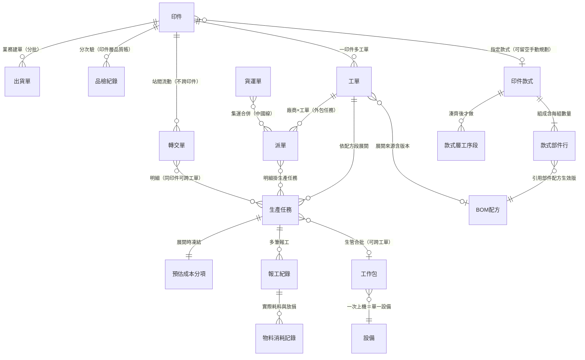
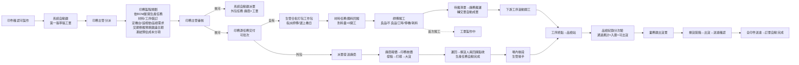

# 生產階段系統設計（High-level）

> 狀態：迭代中草稿（2026-07-28 起）。逐節與 Miles 拍板，定案後分層落正本（商業層→wiki、行為規格→openspec），本檔保留為決策記錄。
> 依據：`factory-business-current-state-2026-07-22.md`（15 步端到端流程＋13 角色 R&R）＋ wiki 商業現況卡；調研產物卡經 2026-07-28 逐張檢視定案（見 § 0.3）。

## 0. 設計原則與範圍

### 0.1 設計原則

1. **以 wiki 商業現況與需求為設計基準**：不帶入先前調研導向的設計；MES/ERP 業界做法與豐田式生產管理（TPS）為準則層（概念骨架），不引入業界複雜機制。
2. **最小可行、共用流程不拆兩條**：台灣外包與中國線共用派單流程；補生產走既有工單異動接力，不另設流程。
3. **不做 Phase 切分**：先定完整系統邊界與設計，功能清單完成後再依相依性規劃開發 Timeline。
4. **管理可視化是一等需求**：滿足工作流程之外，排程可視化（師傅／產線／設備三視角）、卡點與閒置識別、成本預實對照為本輪必做，作為後續優化工廠的參考。
5. **人腦決策不變，系統把看不見的變看得見**：排程＝手動排＋負荷可視化（超載提示不強制）；合批＝生管自主決定；系統不做產能演算法決策。唯一的系統預填：製程規劃時依印件交貨日、依 BOM 從最後一項生產任務逆推預填各任務建議日期，人工可修正（2026-07-28 拍板）。

### 0.2 範圍

- **納入**：工單管理（建立／審核／預估成本）、派工與現場執行（拉料／報工／轉交）、排程與工廠總覽（三視角＋五指標）、品檢與出貨、派單（外包協作，含回廠銜接）、補生產路徑。
- **掛點不展開**：物料庫存量帳（在手／預留／可用）、成品庫存、拼版功能、採購上游、性能稼動率（理論節拍）、OEE 完整三率。
- **不納入**：行動版介面設計（現場四角色行動版為既有拍板，本輪 Prototype 只做桌面）、EC 出貨（物流單）整合、審稿與訂單側流程（沿用既有）。

### 0.3 調研產物卡檢視定案（2026-07-28）

| 卡 | 處置 |
|---|---|
| 工作包、報工紀錄 | 保留（成本雙軌拍板的地基） |
| BOM配方 | 重構為三層（2026-07-30 拍板）：粒度由「商品款式」改為「部件」、可跨款式重用；上加 [[印件款式]] 承載部件組成與每組數量，配方工序段補回裝訂欄。展開與沉澱規則正本歸 [[配方展開規則]] |
| 設備、尺寸範本、數量換算規則 | 保留（純現況） |
| 計價快照 | 簡化：建單展開時依 BOM 凍金額分項（材料／工時／設備／外包），不凍參數組、不做主檔版本溯源 |
| 成本差異 | 改設計：不建差值拆解實體；預估與實際並排對照，重點是沉澱下次類似品的估算參考 |
| 在製品 | 棄：製作狀況從工單／生產任務進度與印件完工數看 |
| 物料消耗記錄 | 簡化保留：報工記實際耗料與放損；拉料操作設計於 § 3 展開（現況＝材料型生產任務） |
| 物料庫存 | 量帳留掛點不展開 |
| 成品庫存 | 棄（入庫＝品檢通過累計＝可出貨，沿用既有拍板） |
| 產線 | 沿用現況標籤模組（tag 產線標籤），不建獨立主檔、不掛外包決策 |
| 生產績效指標 | 簡化為五指標：時間稼動率、良率、折損率、毛利率、成本達成率（預實對照）；OEE 三率留掛點 |

### 0.4 成本設計拍板（2026-07-28）

- **預估成本**：工單建立、依 BOM 展開生產任務時，凍結金額分項——材料／工時／設備（開機＋折舊＋色數）／外包。
- **實際成本**：執行時由報工×BOM 計算（含正流程與補生產）；工時與設備成本經工作包歸集（跨印件併類似工作一次上機），外包成本來自派單報價與貨運單攤分。
- **對照目的**：預估與實際並排看升降，重點不是究責，是讓這次生產結果成為下次類似客製品的估算參考（例：某工序估 1050 個投入、實際 1100 個才達合格數 → 耗損率偏高的訊號留下來）。

---

## 1. 模組與功能清單（2a）

### 1.1 模組總覽（六模組＋沿用主檔）

| # | 模組 | 一句話職責 | 主要使用者 |
|---|------|-----------|-----------|
| M1 | 工單管理 | 從印件確認可製作到工單完工的生產中樞：建立、分派、製程規劃、審核、交付、預估成本、補生產承接 | 印務、印務主管 |
| M2 | 派工與現場執行 | 自有工廠的現場作業流：合批派工、拉料備料、報工、場內轉交 | 生管、師傅、廠務 |
| M3 | 排程與工廠總覽 | 管理可視化：三視角負荷、設備運作總覽、五指標、卡點與閒置 | 生管、印務、管理層 |
| M4 | 品檢與出貨 | 印件層品檢紀錄、缺口處置、揀貨裝箱、出貨與送達 | 品檢人員、業務、揀貨人員、出貨人員 |
| M5 | 派單（外包協作） | 外包生產任務的對外委託單：報價核價、發稿、打樣大貨追蹤、跨境運送、回廠點收、回寫原工單 | 印務、外包廠商、中國廠商、揀貨人員 |
| M6 | 配方管理 | 印件款式與部件配方的維護：款式的部件組成與每組數量、部件配方的工序段序列；供 EC 商品設定與線下單引用展開 | 印務 |
| — | BOM 三主檔／設備／尺寸範本／產線標籤 | 沿用現況主檔模組，僅欄位微調（放損兩成分、能力標籤、裝訂廠商欄等既有拍板） | 印務 |

成本預實對照不獨立成模組：單張工單的對照放 M1 工單詳情，跨工單彙總與估算參考放 M3 工廠總覽。

### 1.2 功能清單

**M1 工單管理**

| 功能 | 說明（對應現況流程步驟） |
|------|------------------------|
| 工單自動建立 | 印件確認可製作時系統自動建第一張草稿工單（線上線下一致）；印務主管可增開（#1） |
| 工單分派 | 印務主管統一分派，一工單一印務、主責移交（#2） |
| 製程規劃 | 依 BOM 配方展開生產任務（材料／工序／裝訂三類）；定機台（同能力多機比數量與成本）；設工序相依（預設線性、匯流手動、可跨工單）；寫品檢需求；產出可印紙本工單（#3） |
| 交期倒推建議日期 | 依印件交貨日、依 BOM 工期（主檔製作天數）沿工序相依鏈從最後一項生產任務逆推，預填各任務建議日期；人工可修正（2026-07-28 拍板） |
| 預估成本凍結 | 展開生產任務時依 BOM 凍結金額分項（材料／工時／設備／外包）；沿用訂單既有售價，不重算報價 |
| 製程審核 | 印務主管核可／退回；印務可收回（限任務未交付）（#4） |
| 任務交付 | 印務逐任務交付（可批次）：自有→通知生管進 M2、外包→自動產生派單進 M5（#5） |
| 補生產承接 | 品檢缺口一鍵補做：原任務下加開草稿、預帶全工序可刪、數量預填不通過數、走工單異動接力、是否送審由印務決定（#13） |
| 工單完工判定 | 旗下生產任務全完成自動判定；製作帳與品質帳脫鉤（#14） |
| 工單成本對照 | 工單詳情呈現預估 vs 實際四分項並排與升降 |

**M2 派工與現場執行**

| 功能 | 說明 |
|------|------|
| 待派任務接收 | 生管接收印務交付的自有廠生產任務（#6） |
| 合批打包（工作包） | 生管自主合批（常見同工法，可跨工單）、指派師傅、選上機日；一工作包＝一次上機＝單一設備（#6） |
| 拉料備料 | 材料型生產任務→備料清單（依 BOM 算拉什麼料、拉多少）；前置到料量 > 0 才可開工；操作設計見 § 3（#6） |
| 報工 | 師傅記實際產出（良品＋不良品＋原因＋照片）、實際工時、停機時數與原因、實際耗料與放損；生管／印務可代報；累計超目標警示不阻擋（#7） |
| 場內轉交 | 報工累積可轉交量→系統生成待搬清單→廠務搬運確認送達（附簽收照）即自動成轉交單→下游依已送達量滾動開工（#8） |

**M3 排程與工廠總覽**

| 功能 | 說明 |
|------|------|
| 三視角負荷 | 師傅／產線（標籤分組）／設備三視角的佇列與負荷：誰在做什麼、接下來排什麼、超載提示（不強制） |
| 設備運作總覽 | 每台設備目前工作包、佇列、停機狀態一覽 |
| 五指標 | 時間稼動率、良率、折損率、毛利率、成本達成率；全部由報工事實衍生即時算，不另存指標欄位 |
| 卡點與閒置 | 各站在站量與等待時間（報工＋轉交衍生）、設備閒置時段 |
| 估算參考 | 類似品歷史「預估 vs 實際」數據沉澱，供下次製程規劃與估算參考 |

**M4 品檢與出貨**

| 功能 | 說明 |
|------|------|
| 品檢紀錄 | 印件層、分次驗、隨驗隨入庫、一次一筆（通過數／不通過數／原因）；累計通過＝入庫＝可出貨（#12） |
| 缺口處置 | 兩決策組合：缺口補不補（補做→M1／不補→業務下修）× 瑕疵品去向（報廢／客戶照收）；放行操作與最終責任在印務（#13） |
| 出貨單 | 業務建出貨單（決定出多少何時出）；分批出貨依可出貨額度即時檢核（#15） |
| 揀貨裝箱 | 揀貨人員依出貨單揀貨、回報裝箱內容（含裝箱照）（#15） |
| 出貨與送達 | 出貨人員交寄拋單／發車／自取交付；送達確認（含憑證）；全部印件送達即訂單自動完成（#15） |

**M5 派單（外包協作）**

| 功能 | 說明 |
|------|------|
| 派單自動產生 | 製程審核完成時系統依「廠商×工單」自動產生派單（明細掛生產任務）；外包任務交付＝派單發送（#9） |
| 報價核價 | 廠商於派單回寫報價、印務談價核價；核定報價＝外包實際成本來源（#9） |
| 執行追蹤 | 發稿→打樣（業務判定、印務回寫）→大貨→NG 一律退原廠補印→填運單送回；中國線沿用 13 值狀態＋貨運單集運（#10） |
| 回廠點收 | 揀貨人員清點＋秤重（非品檢）、中國線現場支付物流費關稅留底；確認即生產任務自動完成、下游放行；運費關稅按重量攤回生產任務（#11） |
| 場內後段銜接 | 回廠後仍需場內加工時，後段任務由生管在 M2 接手追蹤（#11） |

**M6 配方管理**

| 功能 | 說明 |
|------|------|
| 印件款式維護 | 款式的部件組成：每行指定部件配方、每組數量、是否獨立開工單；款式層工序段記「湊齊後才做」的工序（整組裝盒）|
| 部件配方維護 | 一個部件的工序段序列（材料／工序／裝訂三主檔項目、能力需求、用量倍率、相依、是否計入完成度）；一份配方可被多個款式引用 |
| 配方改版 | 同部件再次沉澱＝版號＋1、舊版轉停用、不回溯已展開工單；印務直接改版、不另設審核 |
| 引用展開 | 印件選款式 → 依部件清單與合併旗標一次建好所有工單草稿；引用時可增刪部件、改數量再確認（不回寫款式）|
| 工單沉澱為配方 | 一張工單存成一份部件配方（指定屬哪個款式的哪個部件，款式可順手建）；只存可重用骨幹，不存數量／日期／機台／色數／成本 |

> 規則正本歸 wiki [[配方展開規則]]，欄位正本歸 [[印件款式]] 與 [[BOM配方]]。

### 1.3 與既有 openspec spec 的清整對照

| 既有 spec | 處置 | 去向 |
|-----------|------|------|
| work-order | 重寫 | M1 |
| production-task | 重寫 | 任務結構歸 M1、報工歸 M2 |
| work-package | 重寫 | M2（含上機日與設備，供 M3 視圖） |
| task-dispatch-board | 重寫合併 | M2 派工介面 |
| scheduling-center | 重寫 | M3（原待排區概念併入三視角） |
| schedule-backtrack | 廢棄重寫 | 倒推邏輯簡化後歸 M1「交期倒推建議日期」（沿工序相依鏈逆推，不另設階段概念）；spec 本身廢棄 |
| qc | 重寫 | M4（依 07-21 印件層品檢紀錄拍板） |
| equipment | 沿用微調 | 設備主檔沿用；排程相關段併 M3 |
| material-master／process-master／binding-master | 沿用微調 | BOM 三主檔（放損兩成分等既有拍板落點） |
| （無）出貨 | 新建 | M4（解 SHP-006） |
| （無）派單 | 新建 | M5 |
| （無）配方管理 | 新建 | M6（印件款式與部件配方兩實體、引用展開與沉澱）|
| prototype-data-store／prototype-shared-ui | 隨 Prototype 清整 | 技術 spec，非業務模組 |

## 2. 核心實體與資料結構＋狀態機（2b）

### 2.1 實體總圖

主檔（被引用，不入圖）：材料／工序／裝訂三主檔、設備、尺寸範本、產線標籤（tag 模組）。

### 2.2 實體清單與本輪異動

| 實體 | 本輪處置 | 說明（欄位正本在 wiki 卡，此處只記異動方向） |
|------|---------|------------------------------------------|
| 工單 | 沿用＋修 | 沿用現況卡；「區域（台灣／中國）」欄棄用（不拆廠已落卡）；工單類型二值 vs 中國線六值的收斂於 openspec 清整時定 |
| 生產任務 | 沿用＋修 | 沿用現況卡；外發在途段改「依派單自動映射」（07-22 裁決設計方向，取代印務手動同步）；新增「建議開工日」（交期倒推預填） |
| 工作包 | 沿用 | 生管自主合批、一次上機＝單一設備、開機費唯一發生點、分攤基礎預設拼版分攤 |
| 報工紀錄 | 沿用＋簡化 | 良品不良品分流、實際工時、停機時數與原因、所屬工作包；停機原因先單層選項（三分類 OEE 拆解留掛點） |
| 物料消耗記錄 | 簡化保留 | 掛報工之下記實際耗料與放損；不做批號、不做產出用途（產出量即報工數量）、不做庫存扣帳 |
| 轉交單 | 沿用 | 07-20 拍板全沿用（待搬清單、自動成單、暫存區合法站點） |
| 品檢紀錄 | 沿用 | 07-21 拍板全沿用（印件層、分次驗、隨驗隨入庫） |
| 派單 | 重構 | 粒度改廠商×工單、明細掛生產任務；製程審核完成自動產生（初始未送）、任務交付＝發送；報價核價與委外金流沿用現況欄位；13 值狀態沿用 |
| 貨運單 | 沿用 | 中國線現況；運費關稅按重量攤回生產任務 |
| 出貨單 | 沿用 | 7/20 拍板七態、揀貨裝箱、憑證；spec 待新建（M4） |
| 印件款式 | 新增 | 款式主表＋部件清單（部件配方／每組數量／是否獨立開工單）＋款式層工序段；沉澱時可順手建立，不要求先維護字典 |
| BOM配方 | 重構 | 粒度由商品款式改為部件、可跨款式重用；工序段補裝訂欄；款式指向現行生效版、改版不回溯已展開工單 |
| 預估成本分項 | 新增（簡化） | 生產任務展開時凍結金額分項（材料／工時／設備／外包），工單層彙總呈現；取代原計價快照設計 |
| 在製品、成品庫存、物料庫存 | 不建 | 見 § 0.3 |

### 2.3 狀態機

| 狀態機 | 本輪處置 |
|--------|---------|
| 工單狀態（8 值） | 沿用正本（草稿→製程確認中→重新確認製程→製程審核完成→工單已交付→製作中→已完成；異動鏡像；已取消） |
| 生產任務狀態（7 值、四路徑） | 沿用；外發在途段（已送集運商／運送中）改依派單狀態自動映射 |
| 派單狀態（13 值） | 沿用正本；建立時機＝製程審核完成（初始未送）、發送＝任務交付 |
| 轉交單狀態（3 值） | 沿用 |
| 出貨單狀態（七態） | 沿用 7/20 拍板 |
| 品檢紀錄 | 無狀態（只增紀錄），沿用 |
| 工作包 | 無狀態；「上機中」由旗下任務報工衍生呈現（M3 設備總覽用） |

### 2.4 結構決策點（2026-07-28 全數拍板）

1. **任務層拿掉**：外包分組唯一歸派單、場內派工分組唯一歸工作包；交付畫面以衍生分組（按廠商）呈現；狀態鏈三層（生產任務→工單→印件）；異動鏈直接生產任務→工單鏡像。
2. **拉料＝恢復材料型生產任務**（推翻 2026-07-27「材料僅為工單清單資訊」拍板）：材料行建為材料型生產任務（BOM 三類互斥沿用舊結構），完成＝備料到位＝下游工序到料放行的輸入；wiki 落卡時工單卡同步改回。
3. **外發在途自動映射**：生產任務外發段狀態由派單狀態自動映射（07-22 已裁決設計方向，本輪落地），印務免手動同步。

## 3. 端到端資料流與角色（2c）

### 3.1 正常流程（無異常）

以現況 15 步為基準，套用本輪結構定案（材料任務、拿掉任務層、派單自動產生與自動映射、預估成本凍結、交期倒推）：

角色×動作矩陣沿用現況彙整檔 § 一（13 角色 R&R），本輪異動：印務免手動同步外發在途（自動映射）；其餘不變。

### 3.2 拉料（材料型生產任務）操作設計

- **建立**：製程規劃依 BOM 展開時，材料行建為材料型生產任務；預設不計入完成度（純準備性，齊套邏輯沿用「是否計入完成度」欄排除）。
- **相依**：材料任務為對應工序任務的前置依賴（材料未備妥、首道工序到料量＝0 不可開工）。
- **執行與回報**：材料任務與一般生產任務相同——生管派工、師傅執行、報工即完成（2026-07-28 拍板），完成即下游放行；不另設備料回報流。
- **耗料記錄**：備料回報記「領用量」；工序報工時記「實際耗料與放損」（物料消耗記錄），兩者對照即超領訊號。庫存扣帳不做（量帳掛點）。

### 3.3 補生產（兩條路徑）

1. **品檢缺口補做**（場內）：品檢不通過累計 → 印務於品檢紀錄一鍵發起補做 → 原工單經異動加開生產任務（預帶全工序可刪、數量預填不通過數）→ 是否送審由印務決定 → 生管接排程（合批進工作包）→ 補做完成回原品檢累計複驗 → 工單自然重開再收斂。
2. **外包 NG 退原廠**（場外）：打樣或大貨 NG（業務判定）→ 一律退原廠補印 → 開新工單＋新派單另起進程（重打與補印以新單追蹤，沿用現況），原工單對應任務依異動處置（報廢／作廢）。

過程損耗（做壞）不是補生產：放損內師傅自行補做湊數、報工如實記；超放損口頭回報印務走異動（系統機制沿用 PT-014 議題，本輪以異動加開任務承接）。

### 3.4 外包回場銜接

派單發送（＝任務交付）→ 廠商回寫報價（印務談價核價）→ 發稿 → 打樣（業務判定、印務回寫派單）→ 大貨 → 中國線：分批出貨／集運／貨運單回台；台灣線：填運單送回 → 揀貨人員回廠點收（清點＋秤重，非品檢；中國線現場支付物流費關稅留底）→ **點收確認即對應生產任務自動完成** → 貨登記暫存區 → 若有場內後段：暫存區→產線轉交（待搬清單觸發）、生管接手追蹤；若為終點工序：暫存區→品檢站。派單 13 值狀態沿廠商回寫自動映射生產任務粗狀態（已送集運商／運送中）。運費關稅按重量攤回各生產任務實際成本。

## 4. 排程可視化、指標與成本（2d）

### 4.1 排程操作與三視角

- **排程動作**（人腦決策）：印務製程規劃時定機台與建議日期（倒推預填、可修）；生管合批打包工作包時定師傅與上機日。未入工作包的已交付任務顯示於待排區。
- **師傅視角**：每位師傅的工作包佇列（今日上機／接下來），含各包內生產任務與目標數量。
- **設備視角**：每台設備目前上機工作包（由報工衍生）、佇列（按上機日排）、停機狀態；超載提示＝同日佇列工時（依主檔製作天數／工時估）超過可用時數時標示，不強制。
- **產線視角**：以產線標籤分組彙總設備視角，看整條線的負荷與在站量。
- **卡點與閒置**：各站在站量（轉交單已送達未報工＝待做、報工完成未轉出＝待搬）與等待時長；設備無佇列時段＝閒置。

### 4.2 五指標（全部由報工事實即時衍生，不另存欄位）

| 指標 | 公式 | 資料來源（反推報工必填欄位） |
|------|------|---------------------------|
| 時間稼動率 | 實際運轉時數 ÷ 可用時數 | 報工實際工時、停機時數；設備可用時數（主檔班表） |
| 良率 | 良品數 ÷ 生產數量 | 報工良品數／報工數量 |
| 折損率 | （報廢＋放損）÷ 投入 | 報工不良品數（報廢處置）、物料消耗記錄放損量 |
| 毛利率 | （售價 − 實際成本）÷ 售價 | 印件售價；實際成本彙總 |
| 成本達成率 | 預估成本 ÷ 實際成本 | 預估成本分項；實際成本彙總 |

OEE 完整三率留掛點（缺理論節拍主檔，不做維護流程）。

### 4.3 成本雙軌

- **預估**（生產任務展開時凍結，工單層彙總）：材料（BOM 材料計價）／工時（工序計價）／設備（開機＋折舊攤提＋色數，設備主檔計價參數）／外包（工序主檔預估價）。
- **實際**（隨執行累積）：材料（物料消耗記錄×主檔價）／工時（報工工時×費率）／設備（工作包歸集開機費依分攤基礎攤回＋折舊）／外包（派單核定報價＋貨運單運費關稅攤回）。
- **對照呈現**：工單詳情四分項並排（預估｜實際｜升降）；不建差值實體、不拆併批維度。
- **估算參考沉澱**：M3 提供「類似品查詢」——依商品款式／配方／工序組合查歷史工單的預估 vs 實際（含投入 vs 合格數的耗損訊號），供印務下次製程規劃與數量拿捏參考。

## 5. Prototype 頁面組（桌面版、靜態 mock、單一分支；15 頁）

| 模組 | 頁面 | 內容重點 |
|------|------|---------|
| M1 | 工單列表 | 篩選＋表格（參考 orders 佈局）；狀態、負責印務、交期 |
| M1 | 工單詳情 | 頁首動作列＋Steps（狀態）＋Tabs：製程規劃（生產任務三類＋相依＋機台＋建議日期）／預估成本分項／成本對照（預估｜實際｜升降）／異動紀錄 |
| M2 | 派工看板 | 待派任務（衍生分組）＋合批打包工作包＋工作包列表（師傅／設備／上機日） |
| M2 | 報工與備料 | 桌面版報工介面（工作包內逐任務報工：良品不良品／工時／停機／耗料）；材料任務備料回報 |
| M2 | 待搬與轉交 | 待搬清單、轉交單列表與明細 |
| M3 | 排程總覽 | 三視角切換（師傅／產線／設備）：佇列、負荷、超載提示、待排區 |
| M3 | 工廠指標 | 五指標卡＋卡點在站量＋設備閒置＋類似品估算參考查詢 |
| M4 | 品檢站 | 待驗清單（在站量）＋品檢紀錄錄入＋缺口處置入口（一鍵補做／下修／報廢） |
| M4 | 出貨管理 | 出貨單列表／建單（可出貨額度檢核）／揀貨裝箱回報／送達確認 |
| M5 | 派單列表 | 廠商×工單粒度、13 值狀態、報價狀態 |
| M5 | 派單詳情 | 明細（生產任務）／報價核價／進程時間軸／運費紀錄／回廠點收 |
| M6 | 印件款式清單＋詳情 | 篩選＋表格；詳情含部件清單（部件配方／每組數量／是否獨立開工單）與款式層工序段 |
| M6 | 部件配方清單＋詳情 | 篩選＋表格（版本、狀態、被幾個款式引用）；詳情含工序段序列與三主檔項目 |
| M6 | 印件頁「選款式展開工單草稿」 | 選款式 → 預覽部件組合（可增刪部件、改數量）→ 確認後一次建好多張工單草稿 |
| M6 | 工單詳情「存成部件配方」 | 指定屬哪個款式的哪個部件（款式可順手建）→ 預覽將存入的骨幹 → 確認（同部件已有生效配方則改版）|

M1 工單詳情的製程規劃 Tab 已含生產任務三類的手動增刪修（2026-07-30 落地：BOM 三主檔選擇鏈、放損率主檔帶入、色數依設備色數模式、預估四分項概算）。
